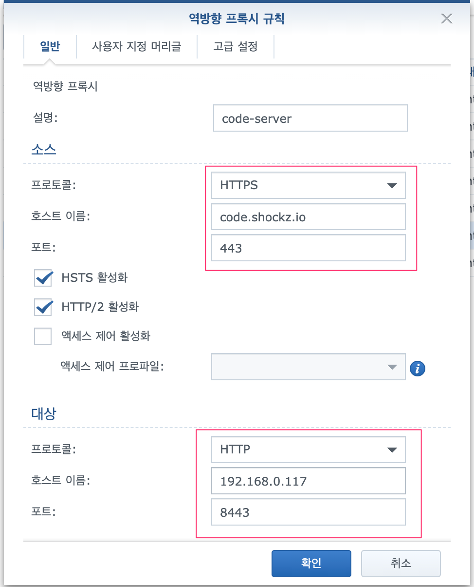
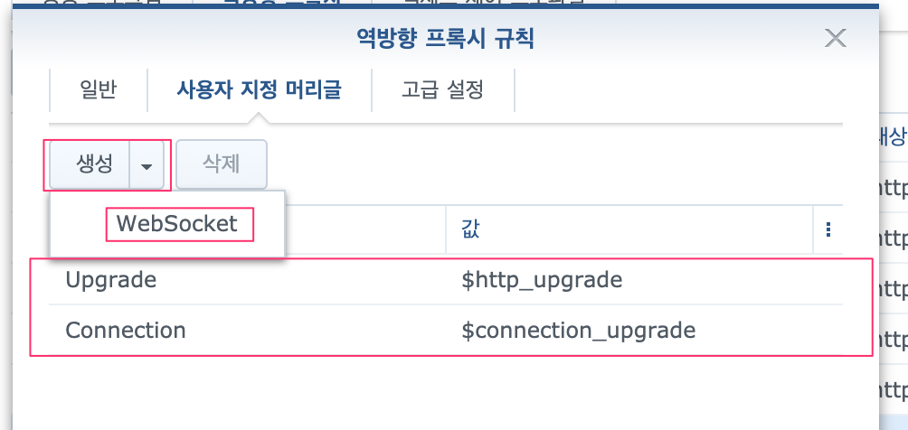

# code-server

<TagLinks />

[[toc]]

## 관련 링크

::: tip
[linuxserver/code-server](https://www.linuxserver.io/)
[cdr/code-server](https://github.com/cdr/code-server)

- 여기서는 linuxserver.io docker 이미지를 사용함
:::

## Docker run

```bash
$ sudo firewall-cmd --permanent --add-port=8443/tcp
$ docker create --name=code-server --net=host --env-file="./.env" -v /home/shockz/docker/code-server/config:/config --restart unless-stopped linuxserver/code-server
$ docker start code-server
```

## Synology reverse proxy 설정

- NAS 상에서 nginx reverse proxy 설정이 되어 있다는 가정하에 code-server 는 http 상으로 서비스하고, 인증서 처리는 NAS nginx 에 맡김.  


::: warning
- Synology NAS nginx 를 이용하여 reverse proxy 할 경우 아래 처럼 WebSocket 관련 헤더를 추가해줘야 함

:::
