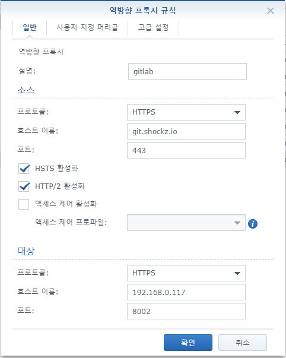
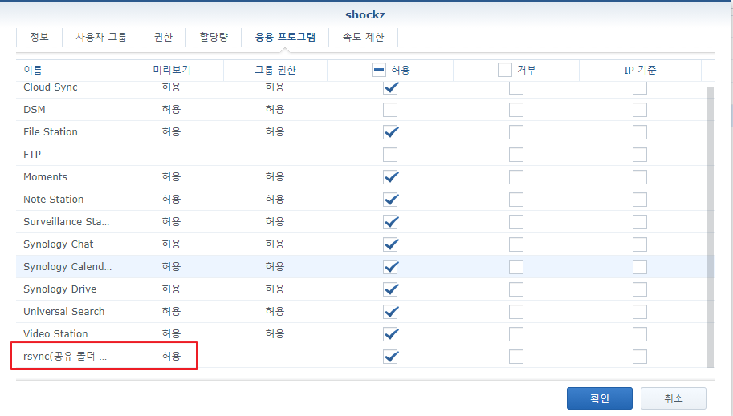
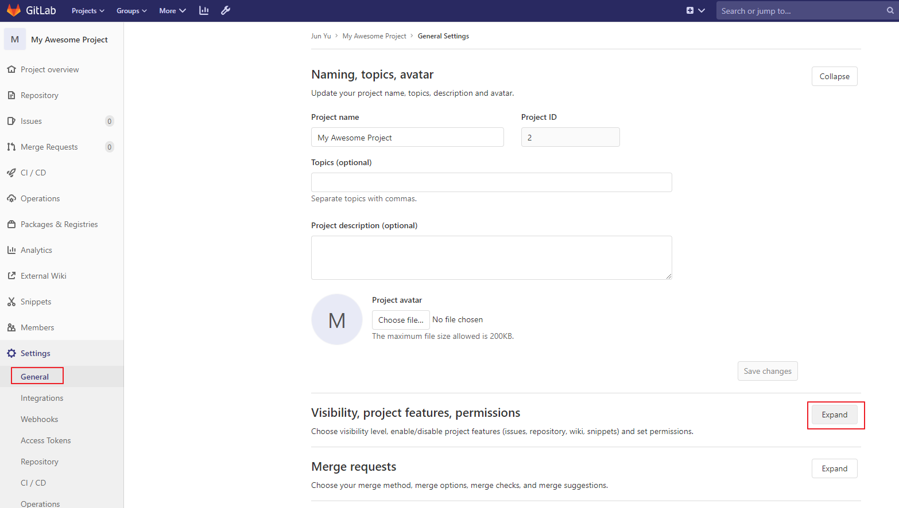
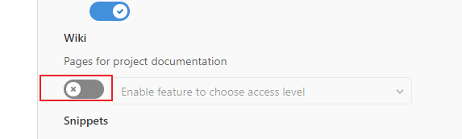
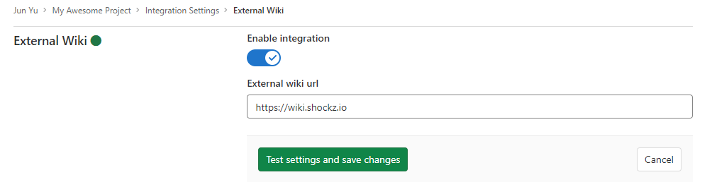
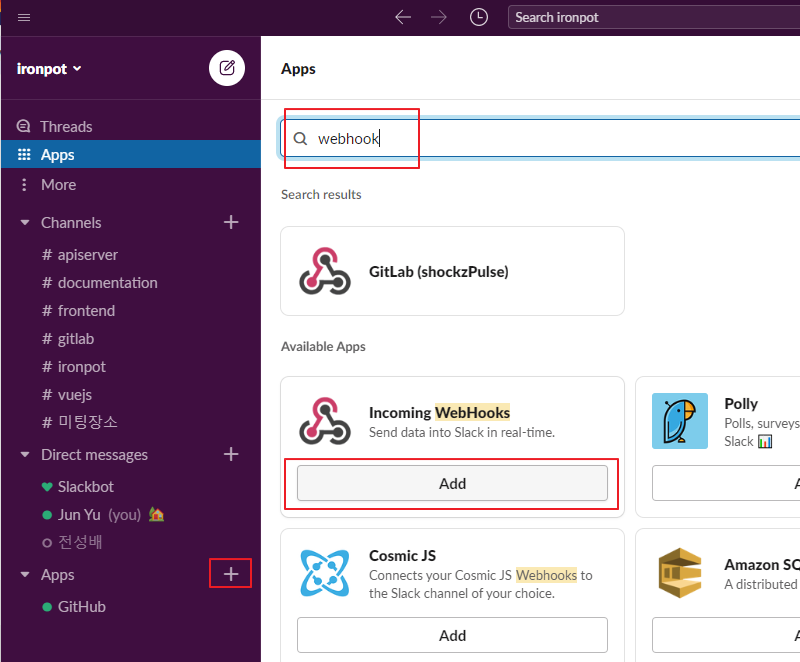

# GitLab

<TagLinks />

[[toc]]

## docker run

```bash
$ docker run --detach --publish 8001:80 --publish 8002:443 --publish 8003:22 --name gitlab --restart always --volume /home/shockz/docker/gitlab/config:/etc/gitlab --volume /home/shockz/docker/gitlab/logs:/var/log/gitlab --volume /home/shockz/docker/gitlab/data:/var/opt/gitlab gitlab/gitlab-ee:latest

# 참고 cer => crt
$ openssl x509 -in shockz.io.cer -out shockz.io.crt

# 시간대 변경
$ docker exec -it -u 0 xwiki bash
$ unlink /etc/localtime && ln -s /usr/share/zoneinfo/Asia/Seoul /etc/localtime # in xwiki shell
$ date

# gitlab.rb 설정
# 사전에 다운로드 받은 ca.cer, shockz.io.cer, shockz.io.key 파일들을 ssl 디렉토리로 복사
external_url 'https://git.shockz.io'
nginx['redirect_http_to_https'] = false
nginx['redirect_http_to_https_port'] = 80
nginx['ssl_client_certificate'] = "/etc/gitlab/ssl/ca.cer"
nginx['ssl_certificate'] = "/etc/gitlab/ssl/shockz.io.cer"
nginx['ssl_certificate_key'] = "/etc/gitlab/ssl/shockz.io.key"

# 시간대 설정
gitlab_rails['time_zone'] = 'Asia/Seoul'

# smtp 설정
gitlab_rails['smtp_enable'] = true
gitlab_rails['smtp_address'] = "smtp.daum.net"
gitlab_rails['smtp_port'] = 465
gitlab_rails['smtp_user_name'] = "shockz99"
gitlab_rails['smtp_password'] = "패스워드"
gitlab_rails['smtp_domain'] = "shockz.io"
gitlab_rails['smtp_authentication'] = "login"
gitlab_rails['smtp_enable_starttls_auto'] = false
gitlab_rails['smtp_tls'] = true

# ldap 관련 설정
gitlab_rails['ldap_enabled'] = true
gitlab_rails['ldap_servers'] = YAML.load <<-'EOS'
  main: # 'main' is the GitLab 'provider ID' of this LDAP server
    label: 'LDAP'
    host: '192.168.0.99' # NAS 주소
    port: 389
    uid: 'uid'
    bind_dn: 'uid=root,cn=users,dc=ldap,dc=com'
    password: 'Directory Server 패스워드'
    encryption: 'plain' # "start_tls" or "simple_tls" or "plain"
    verify_certificates: true
    smartcard_auth: false
    active_directory: false
    allow_username_or_email_login: false
    lowercase_usernames: false
    block_auto_created_users: false
    base: 'dc=shockz,dc=io'
    user_filter: ''
EOS
```

## NAS 역방향 프록시 설정



## 백업 & 복원

- docker 볼륨 연결 위치 (--volume /home/shockz/docker/gitlab/data:/var/opt/gitlab)
- backup 관련 설정 파일 위치 : vi /home/shockz/docker/gitlab/data/gitlab-rails/etc/gitlab.yml
```bash
backup:
  keep_time: 604800 # 1 week (second 단위)
```
> 백업위치 : /home/shockz/docker/gitlab/data/backups

- NAS rsync 활성화  
     
     
   

- rsync 를 위한 자동 로그인 설정
```bash
# on synology
$ cd /var/services/homes/shockz
$ mkdir .ssh

# on linux machine
$ ssh-keygen -t rsa
$ chmod 700 ~/.ssh && chmod 600 ~/.ssh/*
$ ssh-copy-id -i ~/.ssh/id_rsa.pub -p <synology ssh port> id@synology.address
$ ssh -p <synology ssh port> id@synology.address # synology 접속
$ chmod 700 ~/.ssh && chmod 600 ~/.ssh/*
$ chmod u=rwx,g=rx,o=rx /volume1/homes/shockz
```
- crontab 설정
```bash
# /etc/crontab
# gitlab backup
0 2 * * 7 root  docker exec -d gitlab gitlab-rake gitlab:backup:create
# rsync
30 2 * * 7 root rsync -avzO -e 'ssh -i /home/shockz/.ssh/id_rsa -p 2299' /home/shockz/docker/gitlab/data/backups/ id@synology.address:/volume1/gitlabBackup/
```
- 복원
  > [참고](https://lunightstory.tistory.com/7)

::: warning 테스트 안됨
```bash
$ docker exec -d gitlab gitlab-ctl stop unicorn
$ docker exec -d gitlab gitlab-ctl stop sidekig
$ docker exec -it gitlab gitlab-ctl status
$ docker exec -d gitlab gitlab-rake gitlab:backup:restore BACKUP=<Timestamp>_<backup_date>_<GitLab_version>
# git 을 이용한 복원 (in docker container 에서 실행)
$ sudo -u git -H bundle exec rake RAILS_ENV=production gitlab:backup:restore
```
:::

## 기타 설정

- Admin Area > Visibility and access control > default project visibility : internal
- Enabled Git Access protocols : Only HTTP(s)
- Sign-up enabled off
- 각 프로젝트 > Settings > integrations > External Wiki : https://wiki.shockz.io
- 각 프로젝트 > Settings – Visibility, project features, permissions > Wiki : off

- 기본 그룹
  - shockz.io – 전사 공통. 회사 인프라. 사내 업무관련
  - team – 팀별 그룹. 하위에 sub group으로 각 팀이 있습니다.
  - study – pet project. study project. forked, cloned.
  - project – 회사에서 진행하는 모든 프로덕트 프로젝트가 있으며, 각 프로젝트 별로 sub group이 있습니다.
- 개인별 task 프로젝트 기본 생성 원칙
- External Wiki  
     
     
     
   
- Slack notification  
     
     
     
   

## gitlab mass upload

- gitlab REST API 이용  
- [gitlab mass upload temp project](https://github.com/shockzinfinity/gitlab-mass-upload)  
- 각 폴더별 git repository 생성

## gitlab repository mirroring to github

```bash
# gitlab repo의 bare clone 생성
$ git clone --bare https://gitlab/user/gitlab-repository.git
$ cd gitlab-repository.git
# github 로 미러링
$ git push --mirror https://github.com/user/github-repository.git
# bare 클론 저장소는 삭제해도 됨
```
- 100 MB 이상의 파일이 repo 에 존재하는 경우 (github 에서 100 MB 이상은 오류 발생)
```bash
# gitlab repo 클론
$ git clone --mirror https://gitlab/user/gitlab-repository.git
$ git filter-branch --tree-filter 'git lfs track "*.{zip}"' -- --all
# BFG 이용하여 git lfs 로 변경 (java runtime 이 설치되어 있어야 하는 안타까운 현실)
$ java -jar ~/usr/bfg-repo-cleaner/bfg-1.13.0.jar --convert-to-git-lfs '*.zip'
$ cd git-repository.git
$ git push --mirror https://github.com/user/github-repository.git
# gitlab-repository.git 삭제
```
- 위의 방법 말고도 Gitlab 서버상에서 Mirror Repository 를 통해서도 가능함.  
   
   > - repository url: github repository clone.git  
   > - password 부분은 github 에서 Personal Access Token 을 발급받을때 `pulic_repo` 권한을 부여한 상태로 토큰을 생성하고 그 토큰을 넣어줘야 함

## git 원격 브랜치 삭제

```bash
$ git push origin --delete feature/toDELETEbranch
```

## .gitignore 가 제대로 동작하지 않을때

```bash
$ git rm -r --cached .
$ git add .
$ git commit -m "fixed untracked files"
```

## git 자주 사용하는 명령어

- git init : git 생성하기
- git clone git_path : 코드가져오기
- git checkout branch_name : 브랜치 선택하기
- git checkout -t remote_path/branch_name : 원격 브랜치 선택하기
- git branch branch_name : 브랜치 생성하기
- git branch -r : 원격 브랜치 목록보기
- git branch -a : 로컬 브랜치 목록보기
- git branch -m branch_name change_branch_name : 브랜치 이름 바꾸기
- git branch -d branch_name : 브랜치 삭제하기
- git push remote_name — delete branch_name : 원격 브랜치 삭제하기 ( git push origin — delete gh-pages )
- git add file_path : 수정한 코드 선택하기 ( git add * )
- git commit -m “commit_description” : 선택한 코드 설명 적기 ( git commit -m “내용”)
- git push romote_name branch_name : add하고 commit한 코드 git server에 보내기 (git push origin master)
- git pull : git서버에서 최신 코드 받아와 merge 하기
- git fetch : git서버에서 최신 코드 받아오기
- git reset — hard HEAD^ : commit한 이전 코드 취소하기
- git reset — soft HEAD^ : 코드는 살리고 commit만 취소하기
- git reset — merge : merge 취소하기
- git reset — hard HEAD && git pull : git 코드 강제로 모두 받아오기
- git config — global user.name “user_name ” : git 계정Name 변경하기
- git config — global user.email “user_email” : git 계정Mail변경하기
- git stash / git stash save “description” : 작업코드 임시저장하고 브랜치 바꾸기
- git stash pop : 마지막으로 임시저장한 작업코드 가져오기
- git branch — set-upstream-to=remote_path/branch_name : git pull no tracking info 에러해결

## bitbucket 연결시 ssh 상에서 비밀번호 캐시 저장

```bash
$ git config --global credential.helper 'cache --timeout 3600'
```

## git 계정 정보 저장 (on linux)

```bash
$ git config --global credential.helper store
$ git config --global -l
```
