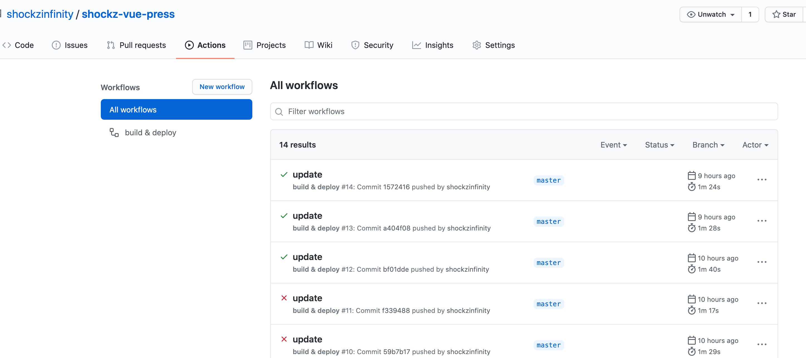
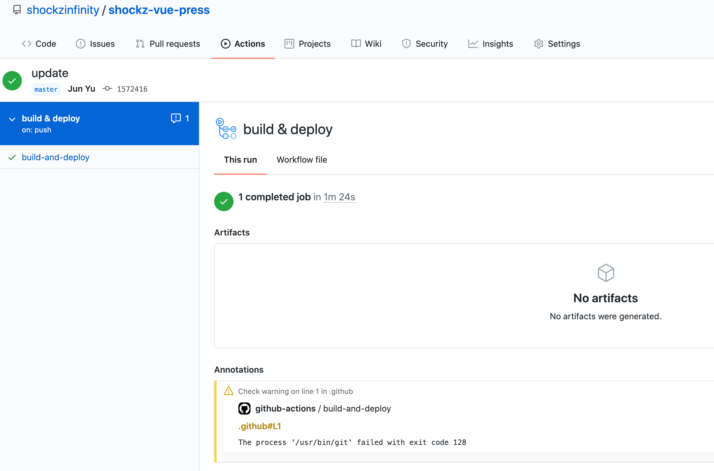
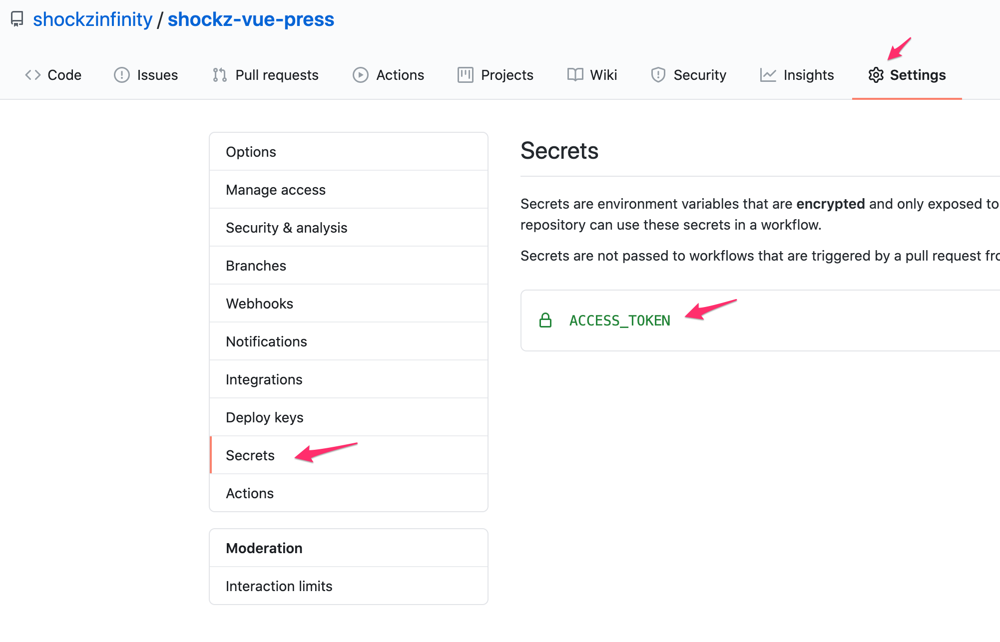
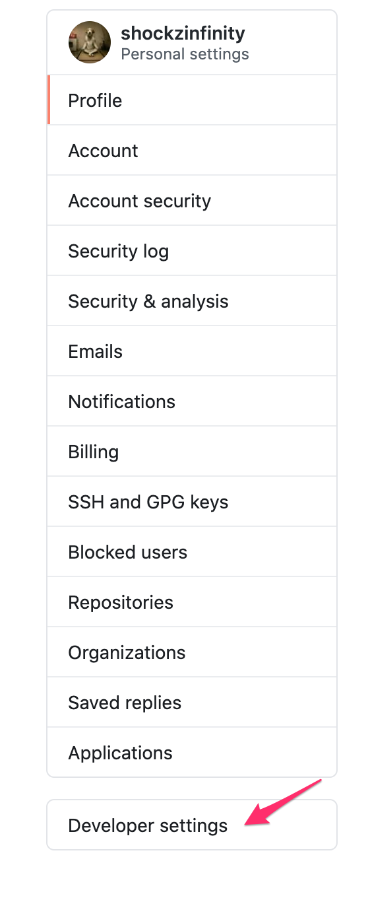
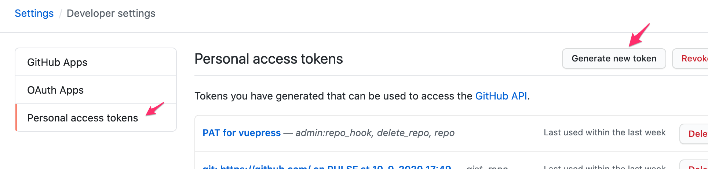
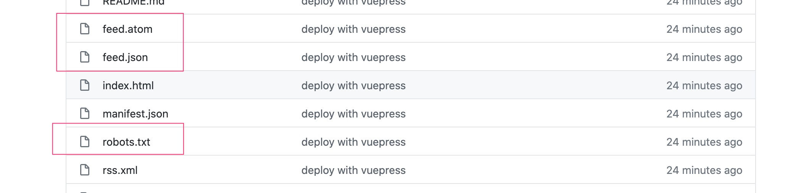
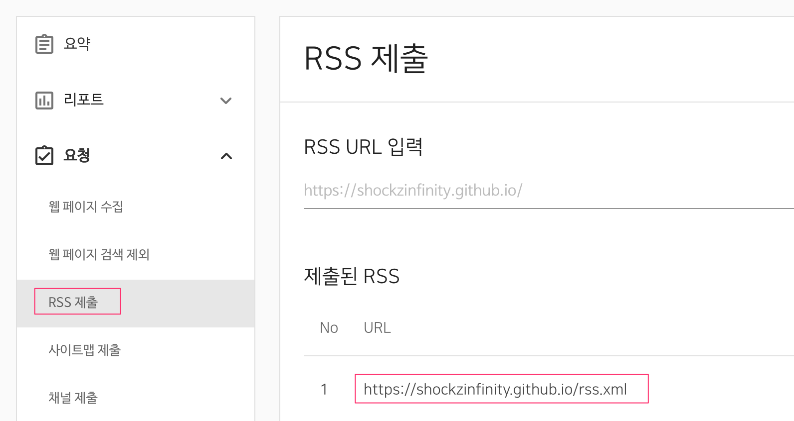

# VuePress

<TagLinks />

## Google Analytics

> [Google Analytics](https://analytics.google.com/) 에서 추적 Id 발급  
> 

```js
module.exports = {
  ...,
  plugins: [
    ...,
    "@vuepress/google-analytics",
  ],
  ...,
  ga: "추적 ID"
}
```

## 이미지 캡션

> **.vuepress/sytles/index.styl** 에 추가

```css
img + em {
  display: block;
  text-align: center;
}
```

## 각 페이지별 메타 샘플

> frontmatter

```markdown
---
title: VuePress에 검색 엔진 최적화하기
lang: ko-KR
meta:
  - name: description
    content: 검색 엔진 최적화 SEO를 알아보고 VuePress에 적용해봅니다.
  - name: keywords
    content: SEO 검색 엔진 최적화
tags: ["SEO", "검색 엔진 최적화", "VuePress"]
sidebar: auto
---
```

## 루트 페이지 locale 설정

```js
module.exports = {
  ...,
  locales: {
    '/': { lang: 'ko-KR' }
  },
}
```

## github Actions 를 이용한 자동 배포

일반적으로는 `sh deploy.sh`를 이용하여 **deploy.sh** 를 이용한 배포를 로컬에서 진행하여 github repository 의 **gh-pages** 브랜치로 배포하는 방법을 사용했었음.

하지만 이 방법은 매번 로컬에서 `deploy.sh` 를 통해 배포해야 하는 번거로움이 있다. master 브랜치에 push 하면 자동으로 deploy 되도록 해보자.

이를 자동화 하기 위해 Github Actions를 이용한다.



```docker{31-32,41}
# This is a basic workflow to help you get started with Actions

name: build & deploy # actions 의 workflow 이름

# workflow 가 동작되는 상황
# master 브랜치에 push 가 발생되는 상황에서 동작한다는 뜻
on:
  push:
    branches: [master]

# A workflow run is made up of one or more jobs that can run sequentially or in parallel
jobs:
  # This workflow contains a single job called "build"
  build-and-deploy: # job의 이름, 여러개의 job이 등록될 수 있음
    # The type of runner that the job will run on
    runs-on: ubuntu-latest # job 이 돌아가는 환경

    # Steps represent a sequence of tasks that will be executed as part of the job
    steps:
      # Checks-out your repository under $GITHUB_WORKSPACE, so your job can access it
      - uses: actions/checkout@v2 # GITHUB_WORKSPACE 로 체크아웃

      # node package 설치
      - name: install and build
        run: |
          npm install
          npm run build

      # gh-pages 로 배포 (vuepress 배포 스크립트에서 차용)
      - name: deploy build files
        env:
          ACCESS_TOKEN: ${{ secrets.ACCESS_TOKEN }} # 해당 repository 의 Secrets 의 토큰정보를 환경변수에 저장한 후
        run: |
          cd docs/.vuepress/dist
          git config --global user.email "shockzinfinity@gmail.com"
          git config --global user.name "Jun Yu"
          git init
          git add -A
          git commit -m 'deploy with vuepress'
          # 토큰정보를 바탕으로 gh-pages 브랜치에 push
          git push -f https://${ACCESS_TOKEN}@github.com/${GITHUB_REPOSITORY}.git master:gh-pages
```
[Github Actions](https://docs.github.com/en/actions)에 Workflow 를 생성한 후 위의 Workflow를 등록합니다.

::: warning
- 위의 actions 의 32번 라인의  
ACCESS_TOKEN 은 해당 repository > Settings > Secrets 에 등록되는 환경 변수를 읽어오는 부분으로서  
   

- 여기서는 **Personal Access Token** 을 발급해서 등록하여 읽어올 수 있다.  
- 41번 라인의 workflow 의 `${GITHUB_REPOSITORY}` 는 기본 환경변수.
:::
::: tip Github Personal Access Token 발급방법



- 토큰 권한은 아래를 체크해준다.  
   
:::

## sitemap 플러그인 적용

```bash
$ yarn add -D vuepress-plugin-sitemap
```
```js{5}
module.exports = {
  ...,
  plugins: [
    ...,
    ['sitemap', { hostname: 'https://shockzinfinity.github.io' }],
  ],
  ...
};
```
- vuepress 사이트 배포 후 sitemap.xml 파일 생성확인 후
- [Google Search Console](https://search.google.com/search-console) 에 sitemap 파일 등록
- 

## rss 생성

```bash
$ yarn add -D vuepress-plugin-feed
```
```js{1,7}
const feed_options = { canonical_base: 'https://shockzinfinity.github.io' };

module.exports = {
  ...,
  plugins: [
    ...,
    ['feed', feed_options],
  ]
  ...
}
```
- 각 페이지의 frontmatter 부분에 feed 관련 설정 추가 (e.g. centos.md 페이지)
```md{3-12}
---
...
feed:
  enable: true
  title: CentOS 8 설정
  description: CentOS 8 설치 후 기본적인 설정을 포함합니다.
  image: /public/img/logo.png
  author:
    -
      name: shockz
      email: shockzinfinity@gmail.com
      link: https://shockzinfinity.github.io/dev-log/centos.html
---
```
- 배포 후에 생성된 파일들 확인
   
- [네이버 웹마스터 도구](https://searchadvisor.naver.com/)에서는 rss 를 등록할 수 있음
   
