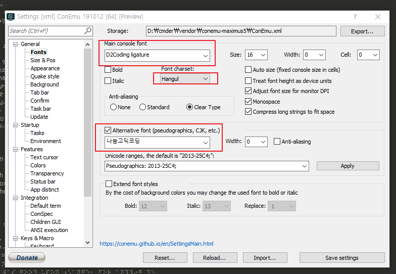
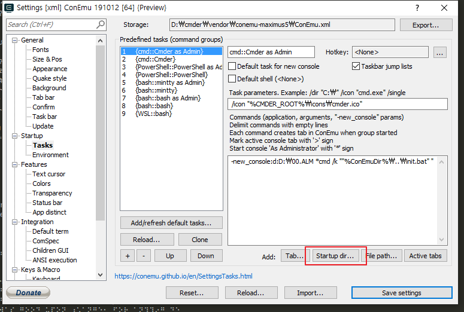
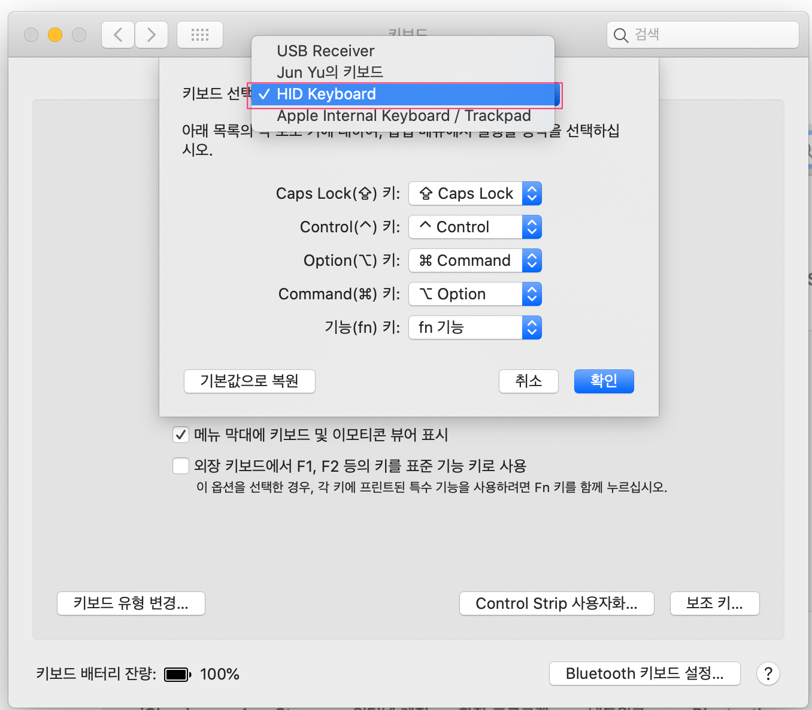

# Development Settings on Mac

<TagLinks />

[[toc]]

## 맥 터미널에서 VSCode 실행

```bash
$ vi ~/.zshrc

# ~/.zshrc
code () { VOCODE_CWD ="$PWD" open -n -b "com.microsoft.VSCode" --args $* ;}

$ source ~/.zshrc
```

## .net core sdk on mac

```bash
$ brew cask install dotnet-sdk
```

## cmder






## 전반적인 설정

> [원문](https://subicura.com/2017/11/22/mac-os-development-environment-setup.html)


## Visual Studio for Mac

[PC 및 Mac용 Visual Studio 비교](https://visualstudio.microsoft.com/ko/vs/mac/#vs_mac_table)

## brew 업데이트

```bash
$ brew update
$ brew upgrade
$ brew cleanup
$ brew doctor
```

## php 개발환경 설정

- [참고사이트](https://getgrav.org/blog/macos-catalina-apache-multiple-php-versions)

- php.ini 위치
```bash{6}
/usr/local/etc/php/5.6/php.ini
/usr/local/etc/php/7.0/php.ini
/usr/local/etc/php/7.1/php.ini
/usr/local/etc/php/7.2/php.ini
/usr/local/etc/php/7.3/php.ini
/usr/local/etc/php/7.4/php.ini
```
- `php.ini` 타임존 설정
```php{4}
[Date]
; Defines the default timezone used by the date functions
; http://php.net/date.timezone
date.timezone = Asia/Seoul
```
- php 설치 후 설정과정 중, 403 Forbidden 현상 발생 시 `httpd.conf` 변경 필요
```bash{19}
#
# DirectoryIndex: sets the file that Apache will serve if a directory
# is requested.
#
<IfModule dir_module>
    DirectoryIndex index.php index.html
</IfModule>

<FilesMatch \.php$>
    SetHandler application/x-httpd-php
</FilesMatch>

#
# The following lines prevent .htaccess and .htpasswd files from being 
# viewed by Web clients. 
#
<FilesMatch ".ht*">
    # Require all denied
    Require all granted
</FilesMatch>
```
- $ curl -L https://gist.githubusercontent.com/rhukster/f4c04f1bf59e0b74e335ee5d186a98e2/raw > /usr/local/bin/sphp
$ chmod +x /usr/local/bin/sphp

## PHP on VS Code

> 참고사이트: [php on vscode](http://blog.naver.com/PostView.nhn?blogId=haruby511&logNo=221455944336)

## VisualStudio 2019 Community

인코딩 문제 발생 시


## mac 에서 윈도우용 키보드 사용 시

> 시스템 환경설정 > 키보드




## jdk 설치

- openjdk 저장소 추가
```bash
$ brew tap AdoptOpenJDK/openjdk
```
- 설치할 자바 버전 확인  
| <center>Java version</center>          | <center>JDK</center>        | <center>JRE</center>            |
| :------------------------------------- | :-------------------------- | :------------------------------ |
| OpenJDK8 with Hotsopt JVM              | adoptopenjdk8               | adoptopenjdk8-jre               |
| OpenJDK8 with OpenJ9 JVM               | adoptopenjdk8-openj9        | adoptopenjdk8-openj9-jre        |
| OpenJDK8 with OpenJ9 JVM, large heap*  | adoptopenjdk8-openj9-large  | adoptopenjdk8-openj9-jre-large  |
| OpenJDK9 with Hotsopt JVM              | adoptopenjdk9               | n/a                             |
| OpenJDK10 with Hotsopt JVM             | adoptopenjdk10              | n/a                             |
| OpenJDK11 with Hotsopt JVM             | adoptopenjdk11              | adoptopenjdk11-jre              |
| OpenJDK11 with OpenJ9 JVM              | adoptopenjdk11-openj9       | adoptopenjdk11-openj9-jre       |
| OpenJDK11 with OpenJ9 JVM, large heap* | adoptopenjdk11-openj9-large | adoptopenjdk11-openj9-jre-large |
| OpenJDK12 with Hotsopt JVM             | adoptopenjdk12              | adoptopenjdk12-jre              |
| OpenJDK12 with OpenJ9 JVM              | adoptopenjdk12-openj9       | adoptopenjdk12-openj9-jre       |
| OpenJDK12 with OpenJ9 JVM, large heap* | adoptopenjdk12-openj9-large | adoptopenjdk12-openj9-jre-large |
| OpenJDK13 with Hotsopt JVM             | adoptopenjdk13              | adoptopenjdk13-jre              |
| OpenJDK13 with OpenJ9 JVM              | adoptopenjdk13-openj9       | adoptopenjdk13-openj9-jre       |
| OpenJDK13 with OpenJ9 JVM, large heap* | adoptopenjdk13-openj9-large | adoptopenjdk13-openj9-jre-large |

- brew cask install <version>
```bash
$ brew cask install adoptopenjdk8
$ java -version
openjdk version "1.8.0_265"
OpenJDK Runtime Environment (AdoptOpenJDK)(build 1.8.0_265-b01)
OpenJDK 64-Bit Server VM (AdoptOpenJDK)(build 25.265-b01, mixed mode)
```
