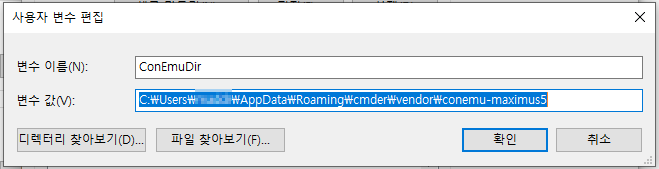

# Windows 개발 환경 구성

<TagLinks />

[[toc]]

## Cmder + Windows Terminal

- Cmder 위치
    %APPDATA%\Cmder
- 환경 변수 세팅
    CMDER_ROOT, CmdEmuDir
- UTF-8 세팅
    chcp utf-8
- 기본 환경 설정

- Windows Terminal 연계
    default setting 변경
- Windows Terminal 세팅
    기타 설정




## yarn global path 지정

```bash
$ yarn global bin
C:\Users\user\AppData\Local\Yarn\bin
```
- 해당 path를 windows path 변수에 등록


## 윈도우 10 긴 파일 이름 길이 제한 해제 설정

- gpedit.msc 실행
- `컴퓨터 구성 > 관리 템플릿 > 시스템 > 파일 시스템` 에서 `Win32 긴 경로 사용` 에서 '사용' 체크
- `gpupdate /force` 로 적용

## Powershell 관리자 권한

- 관리자 권한으로 터미널 실행
```powershell
> ExecutionPolicy
Restricted
> Set-ExecutionPolicy Unrestricted
> ExecutionPolicy
Unrestricted
```

## WSL 터미널 설정
> WSL2 Ubuntu 기준

### zsh & oh-my-zsh 설치

```bash
$ sudo apt update && sudo apt upgrade
$ sudo apt install git zsh

# chsh 수동 (필요한 경우)
$ sudo chsh -s $(which zsh)

# oh-my-zsh 설치
$ sh -c "$(curl -fsSL https://raw.githubusercontent.com/ohmyzsh/master/tools/install.sh)"
```

### zsh-completions, zsh-syntax-highlighting, zsh-autosuggestions

```bash
$ cd ~
$ git clone https://github.com/zsh-users/zsh-completions ${ZSH_CUSTOM:=~/.oh-my-zsh/custom}/plugins/zsh-completions

# .zshrc plugins 부분에 추가
plugins = (
  ...
  zsh-completions
  ...
)

$ autoload -U compinit && compinit

# zsh-syntax-highlighting
$ git clone https://github.com/zsh-users/zsh-syntax-highlighting.git ${ZSH_CUSTOM:=~/.oh-my-zsh/custom}/plugins/zsh-syntax-highlighting
# zsh-autosuggestions
$ git clone https://github.com/zsh-users/zsh-autosuggestions ${ZSH_CUSTOM:=~/.oh-my-zsh/custom}/plugins/zsh-autosuggestions

# .zshrc plugins
plugins=(
  ...
  zsh-completions
  zsh-highlighting
  zsh-autosuggestions
)
```

### powerlevel10k theme

```bash
$ git clone https://github.com/romkatv/powerlevel10k.git  $ZSH_CUSTOM/themes/powerlevel10k

# .zshrc theme
ZSH_THEME="powerlevel10k/powerlevel10k"

# NerdFonts
# https://github.com/romkatv/dotfiles-public/.local/share/fonts/NerdFonts

$ p10k configure
```

### neovim

```bash
$ sudo apt install neovim
$ curl -sLf https://spacevim.org/install.sh | bash

# .zshrc alias
alias vim="nvim"
alias vi="nvim"
alias vimdiff="nvim -d"
export EDITOR=/usr/bin/nvim

$ mkdir ~/.SpaceVim.d/colors
# ADD snazzy colorscheme download

# ~/.SpaceVim.d/init.toml 수정
[options]
  colorscheme = "snazzy-custom"
  enable_guicolors = true
  statusline_separator = "arraw"
  enable_tabline_filetype_icon = true
  enable_statusline_mode = true
  statusline_unicode_symbols = true
```

### fzf, fasd, tig, jq, neofetch

```bash
$ sudo apt install fzf fasd tig jq neofetch
```

### nvm

- `curl -o- https://raw.githubusercontent.com/nvm-sh/nvm/v0.35.3/install.sh | bash`
```bash
$ nvm --version
$ nvm ls-remote
$ nvm install v12.21.0
$ npm use v12.21.0
```

### Windows Terminal settings

- `...\AppData\Local\Packages\Microsoft.WindowsTerminal_8wekyb3d8bbwe\RoamingState\sitecore-theme` 에 `Sitecore-Dark2.png`, `sitecore-icon.png` 복사
- 참고: [https://terminalsplash.com/](https://terminalsplash.com/)
```json
{
  "defaultProfile": "{2c4de342-38b7-51cf-b940-2309a097f518}",
  "profiles": {
    "defaults": {
      // Put settings here that you want to apply to all profiles.
    },
    "list": [
      ...,
      {
        "guid": "{2c4de342-38b7-51cf-b940-2309a097f518}",
        "hidden": false,
        "fontFace": "MesloLGS NF",
        "fontSize": 9,
        "name": "Ubuntu",
        "source": "Windows.Terminal.Wsl",
        "backgroundImage": "ms-appdata:///roaming/sitecore-theme/Sitecore-Dark2.png",
        "backgroundImageOpacity": 0.80000001192092896,
        "backgroundImageStretchMode": "uniformToFill",
        "icon": "ms-appdata:///roaming/sitecore-theme/sitecore-icon.png",
        "colorScheme": "wsl"
      },
      ...
    ],
  },
    "schemes": [
    {
      "name": "Aurelia",
      "background": "#1a1a1a",
      "black": "#000000",
      "blue": "#579BD5",
      "brightBlack": "#797979",
      "brightBlue": "#9CDCFE",
      "brightCyan": "#2BC4E2",
      "brightGreen": "#1AD69C",
      "brightPurple": "#975EAB",
      "brightRed": "#EB2A88",
      "brightWhite": "#EAEAEA",
      "brightYellow": "#e9ad95",
      "cyan": "#00B6D6",
      "foreground": "#EA549F",
      "green": "#4EC9B0",
      "purple": "#714896",
      "red": "#E92888",
      "white": "#EAEAEA",
      "yellow": "#CE9178"
    },
    {
      "name": "wsl",
      "background": "#002B36",
      "black": "#002B36",
      "blue": "#268BD2",
      "brightBlack": "#657B83",
      "brightBlue": "#839496",
      "brightCyan": "#D33682",
      "brightGreen": "#B58900",
      "brightPurple": "#EEE8D5",
      "brightRed": "#CB4B16",
      "brightWhite": "#FDF6E3",
      "brightYellow": "#586E75",
      "cyan": "#2AA198",
      "foreground": "#93A1A1",
      "green": "#859900",
      "purple": "#6C71C4",
      "red": "#DC322F",
      "white": "#93A1A1",
      "yellow": "#B58900"
    }
  ],
}
```
