# Todo App Tutorial

<TagLinks />

> 부제: Todo App 을 만드는 **꽤** 복잡한 방법  
> [Github Repository](https://github.com/shockzinfinity/todo-app-complicated)

[[toc]]

---

## 개요

Todo App 은 새로운 언어 및 개발 기술을 습득하기 위해 자주 이용되는 방법 중에 하나입니다. (아마 Hello World 다음으로 가장 많지 않을까 합니다.) 인터넷상에 대충 검색해봐도 간단하게 Todo App 을 만드는 방법 Frontend, Backend 가릴 것 없이 다양한 기술 스택으로 구현하는 방법이 굉장히 많습니다.  
다만, 개인적인 생각으로는 각각의 기술로 Todo App 을 구현하는 방법은 많지만 내용들이 너무 파편화가 심한것 같습니다. 특정한 기술 및 언어를 가지고 어떻게 구현하는지에 대한 방법은 셀수 없이 많지만 정작 Todo App 을 처음부터 시작해서 마지막 배포하여 운영하는 전체 과정을 다룬 내용은 아직까지 찾지 못했습니다. (~~검색을 잘 못합니다.~~) Todo App 정도 구현하는데에 많은 방법이 필요한 것은 아니지만, 비즈니스 scope를 어떻게 정의하는지에 따라 다를 수 있다고 생각합니다.  
물론 [RealWorld](https://github.com/gothinkster/realworld)와 같은 훌륭한 프로젝트도 있습니다.  

이 Tutorial 의 목적은 다양한 기술 스택에 대해 좀 더 잘 이해하고 능숙해지고자 작성하게 됐습니다. 보유하고 있는 기술 및 아이디어의 한계로 인하여 최고의 방법으로 구현하지는 못할 수 있으나 최소한 생각거리를 제공하고 노하우를 공유하고자 하는 마음으로 작성합니다.

이 Tutorial 에서는 Todo App 이라는 비즈니스 요구사항을 닷넷 기반 혹은 관련 기술들로 구현한다고 가정하겠습니다. 전반적인 기술 스택 및 아키텍처에 대해서는 차차 도식화를 추가할 예정입니다. 여기서 다뤄지는 비즈니스 요구사항은 가정이 많습니다. 현실과 동떨어진 내용이 있을 수 있으니 양해바랍니다.

**주의**: 이 Tutorial 은 수시로 업데이트 되며 기술 스택 및 애플리케이션 아키텍처등이 예고없이 변경될 수 있습니다. 가상의 비즈니스 상황에 따라 작성하다 보니 비즈니스 요구사항은 수시로 변경될 수 있고 그에 따라 어떻게 기술 스택에 바꾸고 개선하는지에 대한 내용을 다루고자 합니다. 다만 의식의 흐름에 따라 작성하다 보니 두서 없이 내용이 전개될 수 있으니 참고해주시면 감사하겠습니다.

## Tech Stack (Prerequisite)

- API (Backend)
  - ASP.NET core 3.1
  - MS SQL Server 2019
  - Docker
  - Nginx
  - SSL
  - Seq, Serilog Logger
  - Swagger
  - Kubernetes (k8s) (upcoming)
  - DDD / CQRS (upcoming)
  - FluntValidation & Automapper (upcoming)
  - Authentication

- App (Frontend)
  - Vue.js (upcoming)

## API Step (Backend)

### Todo WebAPI(RESTful)

- [dotnet core sdk](https://dotnet.microsoft.com/download)  
   mac 혹은 linux 에서 sdk 설치에 대해서는 [dotnet core in CentOS 8 & mac](../dev-log/dotnetcore) 참조해주시기 바랍니다.
- IDE Tools:  
   [Visual Studio Code](https://code.visualstudio.com/) + C# extensions 또는  
   [Visual Studio 2019 Community](https://visualstudio.microsoft.com/ko/vs/)  
   여기서는 두 IDE 툴을 혼용해서 쓸 예정입니다. (아무래도 VSCode 가 Visual Studo 의 편의성을 아직 따라가진 못한다고 생각합니다. 물론 C# 개발에 한해서 말이죠.)
- .net core CLI 를 이용하여 프로젝트를 생성합니다. (Windows 개발 환경이라면 bash 환경을 이용할때 Git 설치 시 같이 설치되는 **Git Bash** 혹은 [Cmder](https://cmder.net/) 를 이용하시길 추천드립니다.)
```bash
$ mkdir todoCore3 && cd todoCore3
$ dotnet new sln --name todoCore3
$ dotnet new webapi --name todoCore3.Api
$ dotnet sln add todoCore3.Api/todoCore3.Api.csproj
```
- 추후 db 연결을 위하여 패키지 미리 설치하도록 하겠습니다.
- EF core 를 사용합니다.
```bash
$ dotnet add package Microsoft.EntityFrameworkCore.SqlServer
$ dotnet add package Microsoft.EntityFrameworkCore.InMemory # 간단한 테스트용도
```
- Visual Studio 혹은 VisualStudio Code 등에서 `Ctrl+F5` 로 앱 실행 후 브라우저에서 `https://localhost:5001/weatherforecast` 접속하여 테스트 해봅니다.
- `.gitignore` 추가 후 git repository 초기화합니다.
- 참고: [gitignore github](https://github.com/github/gitignore)
```bash
$ git init
# git.shockz.io 는 개인 git 서버입니다. github 주소로 대체하시면 됩니다.
$ git remote add origin https://git.shockz.io/shockz/todocore3.git
$ git add .
$ git commit -m "Initial commit"
$ git push -u origin master
$ git lfs install
$ git flow init
```
- 프로젝트 폴더의 `Startup.cs` 수정 합니다.
  - Configure 메서드 내의 **app.UseHttpsRedirection();** 제거  
     https 리디렉션은 nginx 에서 처리할 예정이므로 필요하지 않습니다.
  - ForwardHeaders 삽입 (추후 nginx reverse proxy 설정을 위해 필요합니다.)
```csharp
app.UseForwardedHeaders(new ForwardedHeadersOptions
{
    ForwardedHeaders = ForwardedHeaders.XForwardedFor | ForwardedHeaders.XForwardedProto
});
```
::: tip
여기서 만들어지는 Todo App 은 nginx reverse proxy 를 이용하여 docker container 형태로 구동이 될 예정이므로 디버깅 환경을 비슷하게 하기 위하여 Kestrel 웹 서버 방식을 사용할 예정입니다.
Kestrel 웹서버 방식으로 테스트하기 위해서는 Visual Studo 등의 디버깅 환경을 적절하게 조정해줘야 합니다. (~~IIS Express 테스트하게 되면 인증서등의 문제가 좀 귀찮아 집니다.~~)  
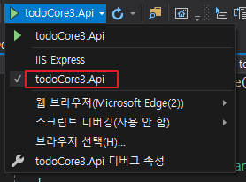  
참고: [ASP.NET Core에서 Kestrel 웹 서버 구현](https://docs.microsoft.com/ko-kr/aspnet/core/fundamentals/servers/kestrel?view=aspnetcore-3.1)
:::
- [Postman](https://www.postman.com/downloads/) 등과 같은 툴로 기본적인 테스트를 진행합니다.  
   
- 프로젝트에 `Models` 폴더를 생성하고 `TodoItem.cs` 모델을 추가합니다.
```csharp
namespace todoCore3.Api.Models
{
	public class TodoItem
	{
		public long Id { get; set; }
		public string Name { get; set; }
		public bool IsCompleted { get; set; }
	}
}
```
- 기본적인 CRUD 테스트를 위해 `TodoContext.cs` 추가합니다.
```csharp
using Microsoft.EntityFrameworkCore;

namespace todoCore3.Api.Models
{
	public class TodoContext : DbContext
	{
		public TodoContext(DbContextOptions<TodoContext> options) : base(options)
		{
		}

		public DbSet<TodoItem> TodoItems { get; set; }
	}
}
```
- 이제 SQL Server 가 필요한데 많은 예제들이 localdb 를 사용합니다.
- localdb 가 개발 및 테스트적인 측면에서는 편리한 면이 있으나 실제 프로덕션 레벨에서는 잘 사용하지 않습니다.
- 그래서, SQL Server 에 대한 DbContext 마이그레이션도 필요하므로 container 형태로 생성하겠습니다. ([mssql container 생성 참조](../dev-log/mssql))
- 기본 조건으로 생성해도 되지만 아래의 추가적인 조건들이 있습니다.
   - 테스트 및 WebAPI 코드의 connection string 단순화를 위해 docker network 생성하여 연결합니다.  
      `docker network create todo-core`
   - data 보존을 위해서 docker data volume 을 이용합니다.  
     `docker volume create sql_data`
   - 테스트의 편의성을 위해 기본 port 로 진행합니다.  
      (port 변경 시 container 간 network는 추가 작업이 필요할 수 있습니다.)
   - 물론 이 모든 것들은 향후 **docker-compose**로 대체될 예정입니다.
```bash
# network 생성
$ docker network create todo-core
$ docker network ls

# volume 생성
$ docker volume create sql_data
$ docker volume ls

# sql container run
$ docker run -d -p 1433:1433 -e "ACCEPT_EULA=Y" -e "SA_PASSWORD=y0urStrong!Password" --network=todo-core --name sql -v sql_data:/var/opt/mssql mcr.microsoft.com/mssql/server:2019-latest

# 추후 백업을 위한 디렉토리 생성
$ docker exec -d sql mkdir /var/opt/mssql/backup
```
- Api 시작 시 db migration 을 위해 기본적인 코드 수정을 진행합니다.
   - `Startup.cs` 의 `ConfigureServices()`에 **DbContext** DI(종속성 주입)
   - 프로젝트에 EntityFrameworkCore.Design 추가  
      `dotnet add package Microsoft.EntityFrameworkCore.Design`
   - ef core cli 설치
   - migration 생성은 [패키지 관리자 콘솔](https://docs.microsoft.com/ko-kr/ef/core/miscellaneous/cli/powershell)을 이용하는 방법과 CLI로 하는 방법이 있습니다. 이 Tutorial 에서는 CLI 이용합니다. (mac 이나 linux 에서 코드를 수정하는 경우도 있을 수 있으므로 CLI 방식이 더 효율적입니다.)
```csharp{14-23}
public void ConfigureServices(IServiceCollection services)
{
  services.AddDbContext<TodoContext>(opt => opt.UseSqlServer("Data Source=localhost;Database=todos;Integrated Security=false;User ID=sa;Password=y0urStrong!Password;"));
  ...
}

// container 시작 시에 자동 migration을 위해 설정
// 자동 마이그레이션을 사용하지 않을 경우 CLI 를 통해 migration 추가 및 update
// NOTE: 이 방법은 nginx 를 통한 reverse proxy 를 사용하게 되면 제거해야 함.
// docker-compose 로 api container 가 동시에 시작이 될 경우 문제가 될 수 있음
public void Configure(IApplicationBuilder app, IWebHostEnvironment env)
{
   ...
   using (var serviceScope = app.ApplicationServices.GetRequiredService<IServiceScopeFactory>().CreateScope())
   {
      var context = serviceScope.ServiceProvider.GetService<TodoContext>();

      if (context.Database.GetPendingMigrations().Any())
      {
         // DB update migrations
         context.Database.Migrate();
      }
   }
   ...
}
```
```bash
# ef core 를 위한 tool 업데이트
$ dotnet tool install --global dotnet-ef
# or
$ dotnet tool update -g dotnet-ef

# migration 생성
$ dotnet ef migrations add CreateTodoItem --project todoCore3.Api.csproj
# migration 취소
$ dotnet ef migrations remove
# db update
$ dotnet ef database update --project todoCore3.Api.csproj
```
- DB tool을 이용해 확인합니다.
   > [Azure Data Studio](https://docs.microsoft.com/ko-kr/sql/azure-data-studio/download-azure-data-studio?view=sql-server-ver15) 혹은 [SSMS](https://docs.microsoft.com/ko-kr/sql/ssms/download-sql-server-management-studio-ssms?view=sql-server-ver15)
   
   

- api Controller scaffolding (선택사항)  
   IDE 를 이용하거나 수동으로 직접 추가해도 됩니다.
```bash
$ dotnet add package Microsoft.VisualStudio.Web.CodeGeneration.Design
$ dotnet tool install --global dotnet-aspnet-codegenerator
$ dotnet tool update -g dotnet-aspnet-codegenerator
$ dotnet aspnet-codegenerator controller -name TodoItemsController -async -api -m TodoItem -dc TodoContext -outDir Controllers
```
- 코드가 제대로 반영되었는지 확인하기 위해 **TodoItems Controller**의 POST 메서드 부분을 수정해 봅니다.
```csharp{9}
// POST: api/TodoItems
[HttpPost]
public async Task<ActionResult<TodoItem>> PostTodoItem(TodoItem todoItem)
{
  _context.TodoItems.Add(todoItem);
  await _context.SaveChangesAsync();

  //return CreatedAtAction("GetTodoItem", new { id = todoItem.Id }, todoItem);
  return CreatedAtAction(nameof(GetTodoItem), new { id = todoItem.Id }, todoItem);
}
```
- Postman 에서 request body 에 아래를 추가하여 테스트 해봅니다.
```json
{
  "name": "test Todo 1",
  "IsCompleted": false
}
```
   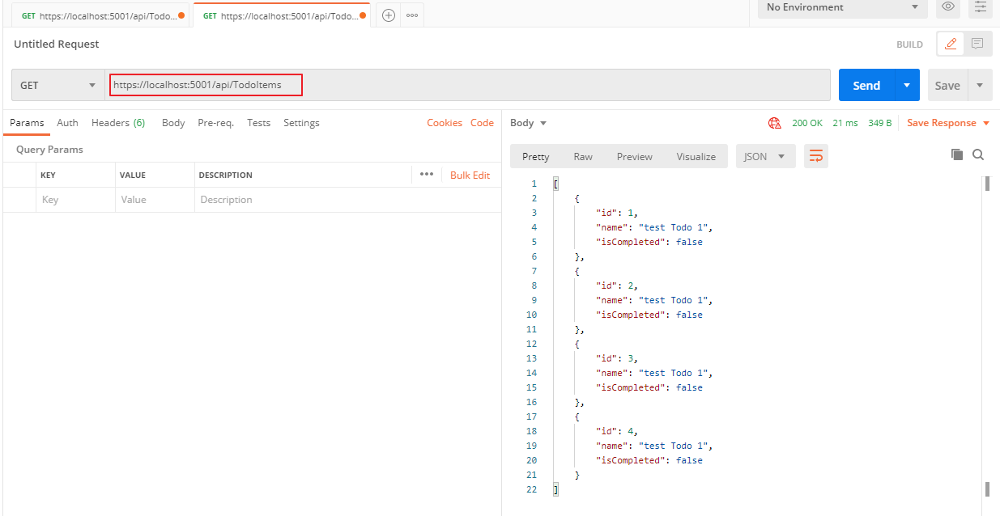
   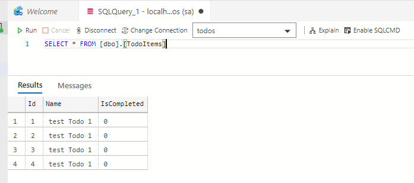

### Dockerize

여기서는 도커에 대한 세부적인 설명은 하지 않습니다. 검색해보면 굉장히 질 좋은 자료들이 많습니다. (~~역시 코딩은 구글검색으로 다 합니다.(모두의 코~딩~) 역시 개발자의 능력은 컨트롤 C + V~~)  
프로덕션 단계에서도 Docker를 이용하여 배포할 예정이므로 개발 환경 자체도 Docker 베이스로 구현하는것이 좋습니다.
- `Api.Dockerfile` 을 프로젝트 폴더에 추가합니다. .net core 를 컨테이너로 구동시키기 위해 필요합니다.
```docker
FROM mcr.microsoft.com/dotnet/core/aspnet:3.1 AS base
WORKDIR /app

FROM mcr.microsoft.com/dotnet/core/sdk:3.1 AS build
WORKDIR /src
COPY ["todoCore3.Api.csproj", "./"]
RUN dotnet restore "./todoCore3.Api.csproj"
COPY . .
WORKDIR "/src/."
RUN dotnet build "todoCore3.Api.csproj" -c Release -o /app/build

FROM build AS publish
RUN dotnet publish "todoCore3.Api.csproj" -c Release -o /app/publish

FROM base AS final
WORKDIR /app
COPY --from=publish /app/publish .
ENV ASPNETCORE_URLS http://*:5000
ENTRYPOINT ["dotnet", "todoCore3.Api.dll"]
```
- docker container 간 network 설정을 하게 되므로 연결 문자열에서 서버 연결 부분을 도커 컨테이너 이름으로 변경해줍니다.  
   `Data Source=(docker container name);Database=todos;Integrated Security=false;User ID=sa;Password=y0urStrong!Password;`
```csharp{3}
public void ConfigureServices(IServiceCollection services)
{
  services.AddDbContext<TodoContext>(opt => opt.UseSqlServer("Data Source=sql;Database=todos;Integrated Security=false;User ID=sa;Password=y0urStrong!Password;"));
  ...
}
```
- build & run
```bash
$ docker build -t todo-api -f Api.Dockerfile .
$ docker run -d -p 5000:5000 --network=todo-core --name todo-api todo-api
```
   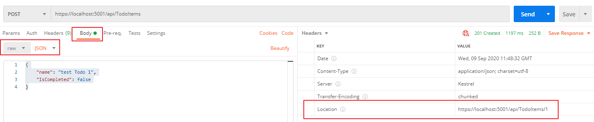
   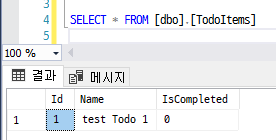

### Nginx reverse proxy

현재 Todo App 의 WebAPI 는 Kestrel 서버로 구현이 되어 있습니다. 부족한 웹서버 기능을 보완하기 위해 Nginx 를 사용하겠습니다. 또한 Nginx 를 통해 기본적인 load balancing 을 구현할 예정이므로 docker-compose 도 사용하도록 합니다.
- 솔루션 폴더에 Nginx 폴더 추가 후 `Nginx.Dockerfile`, `nginx.conf` 생성합니다.
```bash
$ mkdir Nginx && cd Nginx
$ touch Nginx.Dockerfile nginx.conf
```
- **Nginx.Dockerfile**를 추가합니다.
```docker
FROM nginx:latest

COPY nginx.conf /etc/nginx/nginx.conf
```
- **nginx.conf**를 추가해줍니다.
```bash
worker_processes auto;

events { worker_connections 2048; }

http {
  sendfile on;

  upstream web-api {
    server api_1:5000; # docker-compose 에서 사용될 service 이름
  }

  server {
    listen 80;
    server_name $hostname;
    location / {
      proxy_pass         http://web-api;
      proxy_redirect     off;
      proxy_http_version 1.1;
      proxy_cache_bypass $http_upgrade;
      proxy_set_header   Upgrade $http_upgrade;
      proxy_set_header   Connection keep-alive;
      proxy_set_header   Host $host;
      proxy_set_header   X-Real-IP $remote_addr;
      proxy_set_header   X-Forwarded-For $proxy_add_x_forwarded_for;
      proxy_set_header   X-Forwarded-Proto $scheme;
      proxy_set_header   X-Forwarded-Host $server_name;
    }
  }
}
```
- 솔루션 폴더에 `docker-compose.yml` 추가합니다.
```docker
version: "3.7"

services:
  sql:
    image: mcr.microsoft.com/mssql/server:2019-latest
    ports:
      - "1433:1433"
    volumes:
      - "sql_data:/var/opt/mssql"
    environment:
      ACCEPT_EULA: "Y"
      SA_PASSWORD: "y0urStrong!Password"
    restart: "no"

  nginx:
    depends_on:
      - sql
      - api_1
    build:
      context: ./Nginx
      dockerfile: Nginx.Dockerfile
    ports:
      - "4000:80"
    restart: "no"

  api_1:
    depends_on:
      - sql
    build:
      context: ./todoCore3.Api
      dockerfile: Api.Dockerfile
    expose:
      - "5000"
    restart: "no"

volumes:
  sql_data:
```
::: warning
[wait-for-it.sh](https://github.com/vishnubob/wait-for-it/)  
> 특정 서버의 특정 포트로 접근이 가능할때까지 프로세스를 홀딩하는 스크립트  
sql container가 초기화 될때까지 대기하고 있다가 api 가 실행되게 하기 위해서 120초 대기하다가 실행되도록 함  

- SQL server 를 컨테이너로 구동시키게 되는데 api 컨테이너들이 SQL server 접속을 시도하게 되면 api 컨테이너가 exception 발생이 많아져 구동이 안되는 경우가 생길 수 있습니다.
- 물론 이를 해결하는 방법에는 여러가지가 있습니다만 구현의 단순함을 위해 해당 SQL server 가 구동이 될때까지 기다리기 위해 **wait-for-it.sh** 를 사용합니다.

- `Api.Dockerfile`을 수정합니다.
```docker{19-21}
FROM mcr.microsoft.com/dotnet/core/aspnet:3.1 AS base
WORKDIR /app

FROM mcr.microsoft.com/dotnet/core/sdk:3.1 AS build
WORKDIR /src
COPY ["todoCore3.Api.csproj", "./"]
RUN dotnet restore "./todoCore3.Api.csproj"
COPY . .
WORKDIR "/src/."
RUN dotnet build "todoCore3.Api.csproj" -c Release -o /app/build

FROM build AS publish
RUN dotnet publish "todoCore3.Api.csproj" -c Release -o /app/publish

FROM base AS final
WORKDIR /app
COPY --from=publish /app/publish .
ENV ASPNETCORE_URLS http://*:5000
COPY ./wait-for-it.sh /wait-for-it.sh
RUN chmod +x /wait-for-it.sh
ENTRYPOINT ["/wait-for-it.sh", "sql:1433", "-t", "120", "--", "dotnet", "todoCore3.Api.dll"]
```
:::
::: danger
위에서 구현했던 db migration 부분은 문제가 있습니다.  
`docker-compose up --build` 로 최초로 실행하거나 DB 스키마가 변경되었을 경우 `TodoContext` 에 대한 DB 마이그레이션이 업데이트 되기 전인 상태가 되므로 다른 방법이 필요합니다.  `Startup.cs/Configure()` 메서드 내의 **Migration** 관련 코드를 제거하고,
컨테이너가 실행되기 전 db migration script 를 실행하는 방법으로 변경할 예정입니다.
:::
- docker-compose 로 실행합니다.
```bash
$ docker-compose up --build
```
- Postman 으로 테스트해보면,
   
   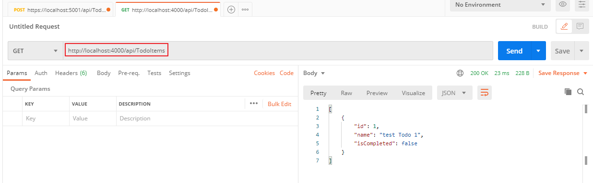
   

### SSL 적용

- dotnet SDK 를 설치하거나 Visual Studio 를 통해 디버깅을 하게 되면 보통 자체 서명 인증서 등록되어 있으므로 그것을 이용하겠습니다.  
   
   
- `localhost.pfx`로 *내보내기* 후 **Nginx** 폴더에 저장
   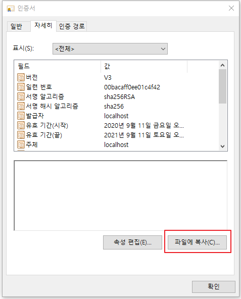
   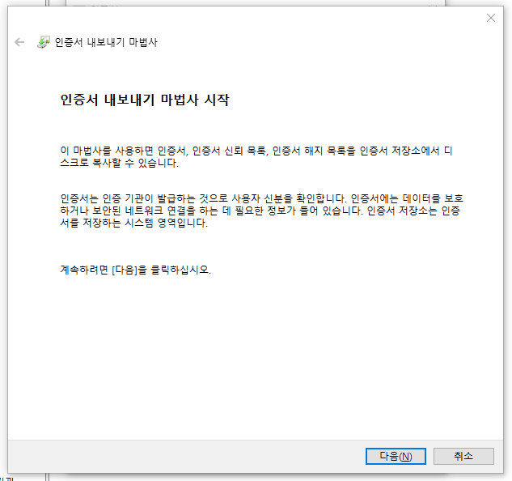
   
   
   
   
::: tip
Windows 환경에서 자체 서명 인증서 발급 방법에 대해서는 아래의 주소를 참고합니다.  
[Windows](../dev-log/ssl)  
:::
- pfx 파일에서 crt, key 파일을 추출합니다.
```bash
# 키 파일 추출
# [주의] PEM 패스워드를 지정하면, container 로 로딩시점에서 패스워드 입력을 요청하므로,
# 패스워드를 입력한 상태로 키 추출 후 패스워드 제거
$ openssl pkcs12 -in localhost.pfx -nocerts -out localhost_with_key.key
$ openssl rsa -in localhost_with_key.key -out localhost.key
# 인증서 파일 추출
$ openssl pkcs12 -in localhost.pfx -nokeys -clcerts -out localhost.crt
```
- `Nginx.Dockerfile` 에서 컨테이너 구동 시 인증서를 복사합니다.
```docker{4-5}
FROM nginx:latest

COPY nginx.conf /etc/nginx/nginx.conf
COPY localhost.crt /etc/ssl/certs/localhost.crt
COPY localhost.key /etc/ssl/private/localhost.key
```
- `nginx.conf` 에서 인증서를 적용하여 SSL로 접속되도록 수정합니다.
```bash{12-40}
worker_processes auto;

events { worker_connections 2048; }

http {
  sendfile on;

  upstream web-api {
    server api_1:5000;
  }

  server {
    listen 80;
    server_name localhost;

    location / {
      return 301 https://$host$request_uri;
    }
  }

  server {
    listen 443 ssl;
    server_name localhost;

      ssl_certificate /etc/ssl/certs/localhost.crt;
      ssl_certificate_key /etc/ssl/private/localhost.key;

    location / {
      proxy_pass         http://web-api;
      proxy_redirect     off;
      proxy_http_version 1.1;
      proxy_cache_bypass $http_upgrade;
      proxy_set_header   Upgrade $http_upgrade;
      proxy_set_header   Connection keep-alive;
      proxy_set_header   Host $host;
      proxy_set_header   X-Real-IP $remote_addr;
      proxy_set_header   X-Forwarded-For $proxy_add_x_forwarded_for;
      proxy_set_header   X-Forwarded-Proto $scheme;
      proxy_set_header   X-Forwarded-Host $server_name;
    }
  }
}
```
::: danger
현재 컨테이너 들은 4000(http), 4001(https) 프토로 매핑했기 때문에 http -> https 리디렉션이 정상적으로 동작하지 않습니다. 이는 nginx.conf 의 설정을 수정해야 하는 문제가 있습니다.
이 부분은 추후 적용할 예정입니다.  
참고: [StackOverflow](https://stackoverflow.com/questions/15429043/how-to-redirect-on-the-same-port-from-http-to-https-with-nginx-reverse-proxy)
:::

- `docker-compose.yml` 도 수정합니다.
```docker{24}
version: "3.7"

services:
  sql:
    image: mcr.microsoft.com/mssql/server:2019-latest
    ports:
      - "1433:1433"
    volumes:
      - "sql_data:/var/opt/mssql"
    environment:
      ACCEPT_EULA: "Y"
      SA_PASSWORD: "p@ssw0rd"
    restart: "no"

  nginx:
    depends_on:
      - sql
      - api_1
    build:
      context: ./Nginx
      dockerfile: Nginx.Dockerfile
    ports:
      - "4000:80"
      - "4001:443"
    restart: "no"

  api_1:
    depends_on:
      - sql
    build:
      context: ./todoCore3.Api
      dockerfile: Api.Dockerfile
    expose:
      - "5000"
    restart: "no"

volumes:
  sql_data:
```
- `docker-compose up`
```bash
$ docker-compose down
$ docker-compose build
$ docker-compose up -d
```
- 브라우저 테스트  
   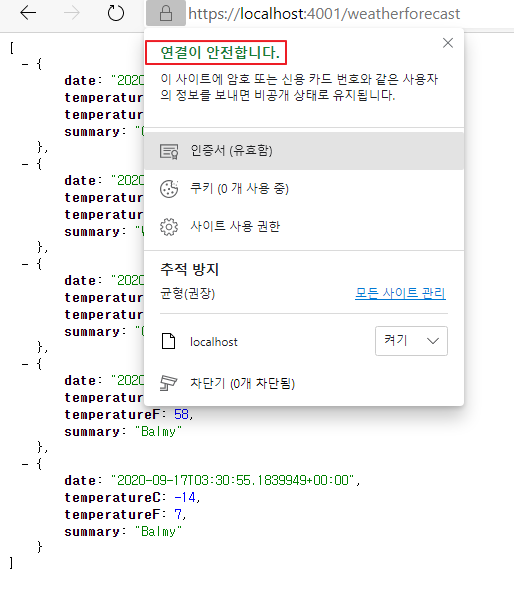
- **Postman** 테스트
   
   
   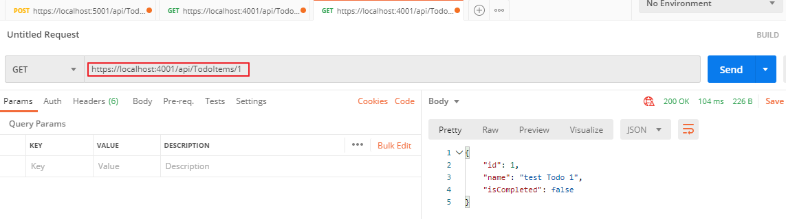

### Improvements & Fix

여기까지 만들어진 Api 에는 몇 가지 고민해야할 문제들이 있습니다. 개발 및 테스트 단계에서는 프로그래밍 방식으로 DB 마이그레이션 하는 것이 생산성 측면에서는 좋을 수 있으나 프로덕션 레벨에서는 치명적인 문제를 발생시킬 수 있습니다.  
예를 들어
   - api 인스턴스를 여러 개 실행하는 경우:  
      인스턴스들이 동시에 마이그레이션을 적용하려고 시도함으로서 실패 가능성 내포
   - CI 프로세스의 일부로서 배포 시나리오가 동작하는 경우 관리 용이성이 떨어짐
   - 사전 검증 불가능으로 인한 데이터 유실의 위험

그 외에도 각 endpoint 에 대한 과도한 정보 노출, 아키텍쳐 측면의 한계 등이 있을 수 있습니다.

일단 현재 단계에서는 아래의 부분을 개선하고, 차차 진행하면서 추가적인 이슈가 나올 경우 개선해보도록 하겠습니다.
   - SQL 스크립트를 통한 DB 마이그레이션 적용
   - 실제 도메인(*.shockz.io) 을 통한 SSL 적용
   - DTO 시나리오 적용

### SQL migration script 적용

- 마이그레이션 추가를 위해 `TodoItem` 모델에 TimeStamp 추가합니다.
```csharp{7-8}
  public class TodoItem
  {
    public long Id { get; set; }
    public string Name { get; set; }
    public bool IsCompleted { get; set; }

    [Timestamp]
    public byte[] RowVersion { get; set; }
  }
```
```bash
# 마이그레이션 추가
$ dotnet ef migrations add AddTimeStamp
# 마이그레이션 리스트
$ dotnet ef migrations list
$ dotnet ef migrations script --idempotent -o migrations01.sql
```
- `migrations01.sql` 확인  
   idempotent 옵션으로 생성했기 때문에 각 마이그레이션 체크 후 실행될 수 있도록 스크립트 생성됩니다.
```sql
IF OBJECT_ID(N'[__EFMigrationsHistory]') IS NULL
BEGIN
    CREATE TABLE [__EFMigrationsHistory] (
        [MigrationId] nvarchar(150) NOT NULL,
        [ProductVersion] nvarchar(32) NOT NULL,
        CONSTRAINT [PK___EFMigrationsHistory] PRIMARY KEY ([MigrationId])
    );
END;

GO

IF NOT EXISTS(SELECT * FROM [__EFMigrationsHistory] WHERE [MigrationId] = N'20200909112636_CreateTodoItem')
BEGIN
    CREATE TABLE [TodoItems] (
        [Id] bigint NOT NULL IDENTITY,
        [Name] nvarchar(max) NULL,
        [IsCompleted] bit NOT NULL,
        CONSTRAINT [PK_TodoItems] PRIMARY KEY ([Id])
    );
END;

GO

IF NOT EXISTS(SELECT * FROM [__EFMigrationsHistory] WHERE [MigrationId] = N'20200909112636_CreateTodoItem')
BEGIN
    INSERT INTO [__EFMigrationsHistory] ([MigrationId], [ProductVersion])
    VALUES (N'20200909112636_CreateTodoItem', N'3.1.8');
END;

GO

IF NOT EXISTS(SELECT * FROM [__EFMigrationsHistory] WHERE [MigrationId] = N'20200912110359_AddTimeStamp')
BEGIN
    ALTER TABLE [TodoItems] ADD [RowVersion] rowversion NULL;
END;

GO

IF NOT EXISTS(SELECT * FROM [__EFMigrationsHistory] WHERE [MigrationId] = N'20200912110359_AddTimeStamp')
BEGIN
    INSERT INTO [__EFMigrationsHistory] ([MigrationId], [ProductVersion])
    VALUES (N'20200912110359_AddTimeStamp', N'3.1.8');
END;

GO
```
- `Startup.cs`에서 DB migration 하는 부분은 삭제합니다.
```csharp{4-12}
public void Configure(IApplicationBuilder app, IWebHostEnvironment env)
{
  ...
  //using (var serviceScope = app.ApplicationServices.GetRequiredService<IServiceScopeFactory>().CreateScope())
  //{
  //	var context = serviceScope.ServiceProvider.GetService<TodoContext>();

  //	if (context.Database.GetPendingMigrations().Any())
  //	{
  //		context.Database.Migrate();
  //	}
  //}
  ...
}
```
- 생성된 스크립트는 [Azure Data Studio](https://docs.microsoft.com/ko-kr/sql/azure-data-studio/download-azure-data-studio?view=sql-server-ver15) 혹은 [SSMS](https://docs.microsoft.com/ko-kr/sql/ssms/download-sql-server-management-studio-ssms?view=sql-server-ver15) 등을 통해 수동으로 마이그레이션 합니다.
- 추후 production level 에서는 App Instance 실행 시점에서 마이그레이션 하는 것이 아닌 수동으로 마이그레이션 하는 것이 좋습니다.  
   [런타임에 마이그레이션 적용](https://docs.microsoft.com/ko-kr/ef/core/managing-schemas/migrations/applying?tabs=dotnet-core-cli#apply-migrations-at-runtime)
   
   
::: tip
개발 및 테스트 단계에서는 편의성을 위해 SQL Server를 1433 포트로 노출 시키지만, 프로덕션 레벨에서는 보안상의 이유로 SQL Server 를 외부에 노출시키지 않는 것이 좋습니다.  
언제든지 `docker-compose.yml` 에서 sql 서비스의 포트 매핑을 제거하고 expose로 변경하면 됩니다.
```docker{3-4}
  sql:
    image: mcr.microsoft.com/mssql/server:2019-latest
    expose:
      - "1433"
```
:::
- docker-compose 빌드 및 실행
```bash
$ docker-compose down
$ docker-compose up --build -d
```
- 마이그레이션 이후 Postman 등으로 테스트 하게 되면 추가된 필드를 확인할 수 있습니다.
   

### DTO 사용

- DTO(Data Transfer Object)를 사용하는 이유는 일반적으로 클라이언트에 보여지는 속성에 대한 제어를 하기 위함입니다.
- 추후 이 부분은 Automapper Profile 등으로 변경할 예정입니다.
- **Models** 폴더에 TodoItemDTO를 추가합니다. (전달할 데이터 속성만 정의합니다.)
```csharp
public class TodoItemDTO
{
  public long Id { get; set; }
  public string Name { get; set; }
  public bool IsComplete { get; set; }
}
```
- DTO 적용을 위하여 `TodoItemController`를 전반적으로 수정합니다.
```csharp{2,4-9,13-16,20,29,34,41-48,54-57,64-76,80-92}
...
private bool TodoItemExists(long id) => _context.TodoItems.Any(e => e.Id == id);

private static TodoItemDTO ItemToDTO(TodoItem todoItem) => new TodoItemDTO
{
  Id = todoItem.Id,
  Name = todoItem.Name,
  IsComplete = todoItem.IsCompleted
};

// GET: api/TodoItems
[HttpGet]
public async Task<ActionResult<IEnumerable<TodoItemDTO>>> GetTodoItems()
{
  return await _context.TodoItems.Select(x => ItemToDTO(x)).ToListAsync();
}

// GET: api/TodoItems/5
[HttpGet("{id}")]
public async Task<ActionResult<TodoItemDTO>> GetTodoItem(long id)
{
  var todoItem = await _context.TodoItems.FindAsync(id);

  if (todoItem == null)
  {
    return NotFound();
  }

  return ItemToDTO(todoItem);
}

// PUT: api/TodoItems/5
[HttpPut("{id}")]
public async Task<IActionResult> UpdateTodoItem(long id, TodoItemDTO todoItemDTO)
{
  if (id != todoItemDTO.Id)
  {
    return BadRequest();
  }

  var todoItem = await _context.TodoItems.FindAsync(id);
  if (todoItem == null)
  {
    return NotFound();
  }

  todoItem.Name = todoItemDTO.Name;
  todoItem.IsCompleted = todoItemDTO.IsComplete;

  try
  {
    await _context.SaveChangesAsync();
  }
  catch (DbUpdateConcurrencyException) when (!TodoItemExists(id))
  {
    return NotFound();
  }

  return NoContent();
}

// POST: api/TodoItems
[HttpPost]
public async Task<ActionResult<TodoItem>> CreateTodoItem(TodoItemDTO todoItemDTO)
{
  var todoItem = new TodoItem
  {
    IsCompleted = todoItemDTO.IsComplete,
    Name = todoItemDTO.Name
  };

  _context.TodoItems.Add(todoItem);
  await _context.SaveChangesAsync();

  return CreatedAtAction(nameof(GetTodoItem), new { id = todoItem.Id }, ItemToDTO(todoItem));
}

// DELETE: api/TodoItems/5
[HttpDelete("{id}")]
public async Task<IActionResult> DeleteTodoItem(long id)
{
  var todoItem = await _context.TodoItems.FindAsync(id);
  if (todoItem == null)
  {
    return NotFound();
  }

  _context.TodoItems.Remove(todoItem);
  await _context.SaveChangesAsync();

  return NoContent();
}
...
```
- Postman 으로 확인해보면 DTO를 통해 데이터가 전달되는 것을 확인할 수 있습니다.
   

### general domain ssl 적용 (shockz.io)

- 상용 도메인을 구입하여 사용하고 있는 경우라면 해당 도메인에 대한 인증서를 구매하여 사용하고 있을 수 있습니다.
- 제가 사용하는 **shockz.io** 도메인은 Let's Encrypt WildCard SSL 을 사용하고 있습니다. (~~물론 무료 입니다.~~) 갱신이 귀찮아  Synology NAS 에서 자동 갱신하고 있습니다.
- [Synology NAS에서 인증서 적용](../dev-log/synology)
- Synology NAS의 기본 인증서 위치는 `/usr/syno/etc/certificate/_archive/DEFAULT` 파일에 기록되어 있습니다. Synology NAS에 ssh 로 연결하여 내용을 확인한 후 해당 디렉토리에서 `fullchain.pem`, `privkey.pem` 파일만 복사해서 사용하도록 합니다..
- 상용 도메인 인증서를 가지고 있는 경우는 발급받는 사이트에서 안내해주는 방법으로 사용하시기 바랍니다.
- `Nginx/Nginx.Dockerfile`, `Nginx/nginx.conf` 에서 ssl 관련부분을 수정합니다.
```docker{4-5}
FROM nginx:latest

COPY nginx.conf /etc/nginx/nginx.conf
COPY fullchain.pem /etc/ssl/certs/fullchain.pem
COPY privkey.pem /etc/ssl/private/privkey.pem
```
```bash
# nginx.conf
    ssl_certificate /etc/ssl/certs/fullchain.pem;
    ssl_certificate_key /etc/ssl/private/privkey.pem;
```

### load balancing with docker-compose

- 현재까지는 **api_1** 으로만 테스트 하는 상황이었기 때문에 load balancing을 테스트할 수 없었습니다.
- load balancing을 테스트 하기 위해서는 좀 더 정교한 방법이 필요하나 현 단계에서는 구현의 단순함을 위해 docker-compose 상의 upstream 을 늘리는 방법을 택합니다.
- 추후 Kubernetes 등을 통해 Auto-scaling 등을 구현할 예정입니다.
- `docker-compose`, `nginx.conf` 를 수정하여 api_1 과 같이 api_2, api_3을 추가합니다.
```docker{4-6,17-35}
  nginx:
    depends_on:
      - sql
      - api_1
      - api_2
      - api_3
    build:
      context: ./Nginx
      dockerfile: Nginx.Dockerfile
    ports:
      - "4000:80"
      - "4001:443"
    restart: "no"

  ...

  api_2:
    depends_on:
      - sql
    build:
      context: ./todoCore3.Api
      dockerfile: Api.Dockerfile
    expose:
      - "5000"
    restart: "no"

  api_3:
    depends_on:
      - sql
    build:
      context: ./todoCore3.Api
      dockerfile: Api.Dockerfile
    expose:
      - "5000"
    restart: "no"
```
- `nginx.conf`에 upstream 부분에 api_2, api_3을 추가합니다.
```bash{3-4}
  upstream web-api {
    server api_1:5000;
    server api_2:5000;
    server api_3:5000;
  }
```
- `$ docker-compose up --build -d`로 확인합니다.
   
   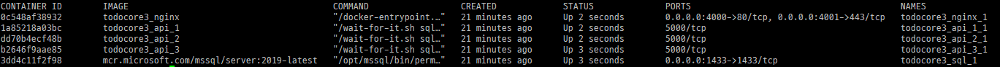
   
::: tip
docker 컨테이너들이 자동 시작되도록 하기 위해서는 다음의 옵션 중에 하나를 선택할 수 있습니다.
> docker-compose restart 옵션  
   - no: 수동으로 재시작합니다.
   - always: 수동으로 끄기 전까지는 항상 재시작됩니다.
   - on-failure: 오류가 있을 시에 재시작합니다.
```docker{3}
  api_3:
    ...
    restart: "always"
```
:::

### logging

이 시점에서 api 내부의 logging 을 추가하는 것이 좋습니다. 추후 프로덕션 환경을 위해서라도 logging 은 초반부터 정리하고 가는 것이 좋기 때문입니다.  
logging 은 .net core 의 기본 로거도 있고 전통적으로 사용되는 여러가지 외부 라이브러리들 (NLog, log4net 등)이 있으나, 여기서는 다음의 로거를 사용할 예정입니다.
- [Serilog](https://serilog.net/)
- [Seq](https://datalust.co/seq)

**Serilog** 는 api 내부의 세부적인 로깅을 위해서 사용하며 **Seq** 는 로그 검색 및 비주얼화를 위해 사용됩니다.

- **Seq** Logger는 컨테이너로 띄우고 `http://localhost:5340` 으로 접속하여 확인할 수 있습니다.
```bash
$ docker volume create seq_data # 로깅 데이터 저장을 위한 볼륨 생성
$ docker run --name seq -d --restart unless-stopped -e ACCEPT_EULA=Y -v seq_data:/data --network=todo-core -p 5340:80 -p 5341:5341 datalust/seq:latest
```
::: warning
Todo api 와는 별개의 container 로 동작되므로 컨테이너 간 네트워크 연결을 위해 Todo api와 같은 네트워크로 설정합니다.(**--network=todo-core**)
:::

- **Serilog** 적용시에는 몇 가지 고려사항이 있습니다.
  - 보통 logger 에 대한 세부적인 설정들을 appsettings.json 과 같은 파일에 기록하여 사용하게 되는데, app 이 실행되면서 Configuration을 읽어오는 과정을 거쳐야 하기 때문에 최대한 초기에 configuration 을 로드 해야 합니다.
  - .net core 에서는 일반적으로 `Startup()` 이 실행되는 시점에서는 Configuration 로딩이 마무리가 되지만 `Startup()` 에서 Logger를 세팅할 경우 app 진입 시점의 로깅이 빠지는 상황이 발생할 수 있습니다.
  - 또한, configuration 파일의 스키마 혹은 단순 JSON syntax 오류, configuration 파일 단순 누락, JSON syntax 오류, 어셈블리 로딩 이슈 등의 문제가 발생할때 logging 이 되지 않는 상황이 발생할 수 있습니다.
  - Logger는 가능하면 로깅하고자 하는 대상보다 먼저 세팅이 되어야 하며 종속성으로부터 최대한 자유로워야 합니다.
  - Serilog 의 sample 을 비교하는 것도 도움이 될것입니다.
    - [Inline initialization](https://github.com/serilog/serilog-aspnetcore/blob/71165692d5f66c811c3b251047b12c259ac2fe23/samples/InlineInitializationSample/Program.cs#L20)
    - [Early initailization](https://github.com/serilog/serilog-aspnetcore/blob/71165692d5f66c811c3b251047b12c259ac2fe23/samples/EarlyInitializationSample/Program.cs#L12)
  - 위의 방법 말고도 한가지 대안이 더 있습니다.
  - 현재 app 이 container 상에서 구동이 되기 때문에 container가 올라가는 시점에서 환경변수로 Logger configuration 을 지정하여 Logger를 초기화 하는 방법이 있습니다.
    ```csharp{2}
    .WriteTo.Seq(
      Environment.GetEnvironmentVariable("SEQ_URL") ?? "http://localhost:5341"
    )
    ```
  - 하지만 여기서는 구현의 단순함을 위하여 `appSettings.json` 을 사용하겠습니다.
  - [간단한 serilog 예제](https://github.com/shockzinfinity/simple-serilog-seq)

- **Serilog** 관련 패키지를 추가합니다.
```bash
$ dotnet add package Serilog.AspNetCore
$ dotnet add package Serilog.Seq
$ dotnet add package Serilog.Sinks.Seq
```

- `Program.cs` 을 수정합니다.
```csharp{3-8,12-23,25-27,29-37,42}
public class Program
{
  public static IConfiguration Configuration { get; } = new ConfigurationBuilder()
    .SetBasePath(Directory.GetCurrentDirectory())
    .AddJsonFile("appsettings.json", optional: false, reloadOnChange: true)
    .AddJsonFile($"appsettings.{Environment.GetEnvironmentVariable("ASPNETCORE_ENVIRONMENT") ?? "Production"}.json", optional: true)
    .AddEnvironmentVariables()
    .Build();

  public static void Main(string[] args)
  {
    Log.Logger = new LoggerConfiguration()
      .MinimumLevel.Override("Microsoft.AspNetCore", LogEventLevel.Warning)
      .Enrich.FromLogContext()
      .WriteTo.Console()
      .WriteTo.File(
        new RenderedCompactJsonFormatter(),
        "./logs/log.json",
        rollingInterval: RollingInterval.Day,
        rollOnFileSizeLimit: true, // maximum 1GB, could be null
        retainedFileCountLimit: 31) // number of files, could be null
      .WriteTo.Seq(Configuration.GetValue<string>("SEQ_URL"))
      .CreateLogger();

    try
    {
      Log.Information("Starting up...");
      CreateHostBuilder(args).Build().Run();
    }
    catch (Exception ex)
    {
      Log.Fatal(ex, "Application start-up failed.");
    }
    finally
    {
      Log.CloseAndFlush();
    }
  }

  public static IHostBuilder CreateHostBuilder(string[] args) =>
    Host.CreateDefaultBuilder(args)
        .UseSerilog()
        .ConfigureWebHostDefaults(webBuilder =>
        {
          webBuilder.UseStartup<Startup>();
        });
}
```
- `appsettings.json` 에 .net core logger 설정은 제거합니다. (appsettings.Development.json 은 선택사항)
```json
"Logging": {
  "LogLevel": {
    "Default": "Information",
    "Microsoft": "Warning",
    "Microsoft.Hosting.Lifetime": "Information"
  }
},
```
- `appsettings.json`에 **SEQ_URL** 추가
```json{3}
{
  "AllowedHosts": "*",
  "SEQ_URL": "http://seq:5341" // seq 는 container 이름입니다.
}
```
- Request logging 을 위해 `Startup.cs` 에 logging 추가
```csharp{4}
public void Configure(IApplicationBuilder app, IWebHostEnvironment env)
{
  ...
  app.UseSerilogRequestLogging();
  ...
}
```
- 현재 Seq Logger 는 docker-compose 외부의 컨테이너로 띄운 상태이므로 컨테이너 간 통신을 위하여 네트워크 조인이 필요하므로 `docker-compose.yml`에 network 부분 추가하여 연결합니다.
```docker{2-5}
...
networks:
  default:
    external:
      name: "todo-core"
...
```
- `docker-compose up --build -d` 로 컨테이너를 작동시킨 후 **seq logger (http://localhost:5340)** 로 접속하여 확인합니다
   

### Swagger (OpenAPI)

API 를 개발할때 중요한 요소 중 하나가 **문서화** 입니다. 개발자 혹은 기계들에게 접근성과 가독성을 제공하는 것이 중요하기 때문입니다. 특히 개발자에게 문서화는 중요한 도전과제이기도 합니다.(~~문서화가 제일 힘든듯...~~) API spec, Help page, Guide 등은 다른 개발자와 소통할 수 있는 중요한 주제이기 때문에 이번 섹션에서는 문서화를 다룹니다. 추후 API 변경이 있을때마다 스펙문서를 조정해야 하기 때문에 코드와 결합이 되어 있는 것이 좋습니다. 문서의 디자인의 변경이 필요한 경우를 제외하고는 대부분 자동생성이 가능하기 때문에 **디자이느님**의 가르침이 있기 전까지는 해당 문서는 자동 생성하는 방법을 택하는 것이 좋습니다.

OpenAPI Specification 으로도 알려져 있는 [Swagger](https://swagger.io/)의 .NET 구현체인 [Swashbuckle.AspNetCore](https://github.com/domaindrivendev/Swashbuckle.AspNetCore) 를 적용하도록 하겠습니다.

- 프로젝트에 Swashbuckle.AspNetCore 를 추가합니다.
```bash
$ dotnet add package Swashbuckle.AspNetCore
```
- `Startup.cs` 에 Swagger Middleware 를 추가합니다.
```csharp{6-9}
public void ConfigureServices(IServiceCollection services)
{
  services.AddDbContext<TodoContext>(opt => opt.UseSqlServer("Data Source=sql;Database=todos;Integrated Security=false;User ID=sa;Password=********"));
  services.AddControllers();

  services.AddSwaggerGen(c =>
  {
    c.SwaggerDoc("v1", new OpenApiInfo { Title = "Todo API", Version = "v1" });
  });
}
```
- **Startup/Configure()** 메서드에서 Swagger UI 를 활성화 시킵니다.
```csharp{4,6-11}
public void Configure(IApplicationBuilder app, IWebHostEnvironment env)
{
  ...
  app.UseStaticFiles(); // Swagger UI 가 Static files를 사용하므로 추가

  app.UseSwagger(); // JSON endpoint 로 생성된 Swagger 활성화
  app.UseSwaggerUI(c =>
  {
    c.SwaggerEndpoint("/swagger/v1/swagger.json", "Todo API v1");
    c.RoutePrefix = string.Empty; // https://localhost:4001/ 로 접속했을때 나오게 하기 위해...
  });
  ...
}
```
   - 4번 라인의 경우 swagger는 기본적으로 런타임에서 생성되는 json 기반으로 동작되기 때문에 정적파일에 대한 경로가 필요하므로 추가합니다.  
     [ASP.NET Core의 정적 파일](https://docs.microsoft.com/ko-kr/aspnet/core/fundamentals/static-files?view=aspnetcore-3.1)
   - 6번 ~ 11번 라인은 swagger 를 사용하기 위한 미들웨어 추가와 엔드포인트를 위한 라인입니다. `https://localhost:4001`로 접속하면 swagger api spec 이 나옵니다.
     > route prefix 를 기본값으로 사용할때 swagger ui 는 `https://localhost:4001/swagger/` 입니다.

위의 코드로 기본적인 API 스펙문서가 생성되지만 좀 더 풍부한 스펙 문서화를 위해 몇가지 더 추가하도록 하겠습니다.

- `Startup/ConfigureServices()` 에서 SwaggerDoc 부분을 보강합니다.
```csharp
services.AddSwaggerGen(c =>
{
  c.SwaggerDoc("v1", new OpenApiInfo
  {
    Version = "v1",
    Title = "ToDo API",
    Description = "Todo App 을 만드는 꽤 복잡한 방법에 대한 ASP.NET Core WebAPI",
    TermsOfService = new Uri("http://todo.shockz.io/terms"),
    Contact = new OpenApiContact
    {
      Name = "shockz",
      Email = string.Empty, // 스팸은 먹는겁니다.
      Url = new Uri("https://twitter.com/somebody"), // 트위터를 안써봐서...
    },
    License = new OpenApiLicense
    {
      Name = "MIT",
      Url = new Uri("https://github.com/shockzinfinity/todo-app-complicated/blob/2c4c937fa9ecfca72e37ba4e79581e2eabe4e9b8/LICENSE#L1")
    }
  });
});
```


- 각 엔드포인트의 XML 주석을 표현하기 위해서 다음과 같이 작업합니다.
   1. 프로젝트 빌드시에 XML generate 되도록 합니다.
   2. 각 컨트롤러의 메서드에서 XML 주석을 통하여 내용을 보강합니다.
```csharp
<PropertyGroup>
    <GenerateDocumentationFile>true</GenerateDocumentationFile>
    <NoWarn>$(NoWarn);1591</NoWarn>
</PropertyGroup>
```
> - public type 과 members 가 주석이 없으면 **warning code: 1591** 을 발생시키게 되는데, **<NoWarn>$(NoWarn);1591</NoWarn>** 이 해당 warning 을 없애줍니다.
> - 코드 내부에서 warning 을 제거하기 위해서는 **#pragma warning** 프리프로세서를 사용합니다. 예를 들어 Program 클래스 전체에 대한 warning 메시지 제거를 위해서는 다음과 같이 사용합니다.
```csharp{3,16}
namespace todoCore3.Api
{
#pragma warning disable CS1591
  public class Program
  {
    ...
    public static void Main(string[] args)
    {
      ...
    }

    public static IHostBuilder CreateHostBuilder(string[] args) => {
      ...
    }
  }
#pragma warning restore CS1591
}
```
- swagger 가 생성된 XML 주석 파일을 사용하게 위해서는 다음과 같이 코드를 `AddSwaggerGen()` 메서드 내부에 추가합니다.
```csharp{1-18}
/// <summary>
/// Todo item 을 생성합니다.
/// </summary>
/// <remarks>
/// Sample request:
///
///		POST api/TodoItems
///		{
///			"name": "Item no 1",
///			"isCompleted": false
///		}
///
/// </remarks>
/// <param name="todoItemDTO"></param>
/// <returns>생성된 Todo item</returns>
/// <response code="201">생성된 Todo item</response>
/// <response code="400">todo item 이 null 일 경우</response>
/// <returns></returns>
// POST: api/TodoItems
[HttpPost]
public async Task<ActionResult<TodoItem>> CreateTodoItem(TodoItemDTO todoItemDTO)
{
  ...
}
```


- data annotations 으로 모델에도 적용이 가능합니다.
```csharp{5,8,19,22}
public class TodoItem
{
  public long Id { get; set; }

  [Required]
  public string Name { get; set; }

  [DefaultValue(false)]
  public bool IsCompleted { get; set; }

  [Timestamp]
  public byte[] RowVersion { get; set; }
}

public class TodoItemDTO
{
  public long Id { get; set; }

  [Required]
  public string Name { get; set; }

  [DefaultValue(false)]
  public bool IsComplete { get; set; }
}
```


- Http Status Code 에 따른 주석 추가도 가능합니다.
```csharp{2-3}
[HttpPost]
[ProducesResponseType(StatusCodes.Status201Created)]
[ProducesResponseType(StatusCodes.Status400BadRequest)]
public async Task<ActionResult<TodoItem>> CreateTodoItem(TodoItemDTO todoItemDTO)
{
  ...
}
```

### CQRS

이번 섹션에서 다룰 주제는 CQRS 입니다. 생소할 수 있는 단어이기에 약간 설명을 해야할 것 같습니다. 단어의 설명에 앞서 주의점이 있습니다.

여기에 적용되는 CQRS 는 선택사항 입니다. 굳이 적용해야할 이유도 별로 없으며 Todo App 정도를 만드는데 있어 좀 과할 수 있습니다. 또한 CQRS는 특정 기술이라기 보다는 패턴이라고 보는 것이 더 적절한 설명이 될 것 같습니다. 즉, 필수사항이 아니란 애기입니다.

그럼에도 불구하고 CQRS 를 적용하는 이유는 아래에 추가적인 설명을 더 하겠지만, 비즈니스 애플리케이션에서 비즈니스를 표현하는데에 있어 많은 장점들을 제공해줄 수 있다고 생각하고 있으며 특히 변화하는 비즈니스의 복잡성을 낮추는데 있어서 상당한 도움이 된다고 개인적으로 믿고 있기 때문입니다. (~~개발자는 기술의 복잡성은 이해가 빠르지만 비즈니스의 복잡성은... 후~~~)

CQRS 라는 단어는 **Command and Query Responsibility Segregation** 의 약자입니다. 단어 자체로만 해석하면 **명령과 조회에 대한 책임을 분리**한다는 뜻입니다. 그리고 CQRS 는 특정 기술을 이야기하는 것이 아닌 단순한 패턴이라고 보는 것이 좋습니다. 보통 CQRS 를 적용할 때는 DDD 와 같이 언급되는 경우가 많은데, 꼭 DDD 의 하위 패턴이거나 구현체를 뜻하지도 않습니다.

전통적으로 비즈니스 애플리케이션에서는 비즈니스를 표현한다는 것은 데이터의 결과로 표현되는 경우가 많습니다.(~~보통 SI 에서 그렇습니다.~~) 즉, 어떠한 객체 혹은 데이터의 상태라고 볼 수 있습니다. 데이터는 CRUD (Create, Read, Update, Delete)로 설명할 수 있는데, CRUD 중에서 압도적으로 많은 비중이 Read (SELECT) 입니다. 상대적으로 CUD 는 객체의 상태를 변경하는 트랜잭션에서 사용하게 되고, 대부분 SELECT 라고 봐도 무방합니다. 여기서 CUD 와 R 을 분리하여 애플리케이션의 성능을 올리고 복잡성을 낮출 수 있다면 좋을 것 같다는 생각을 할 수 있습니다. (~~이 패턴이 이렇게해서 탄생되었다라는 뜻은 아닙니다.~~)

CQRS 에 대한 내용은 꽤 방대해질 수 있는 주제이므로 추후 다른 포스트에서 좀 더 다루기로 하겠습니다. CQRS 는 보통 ES (Event Sourcing) 와 같이 구현되는 경우가 많습니다. 간단하게 CQRS / ES 의 장단점을 정리하고 Todo Api 에 CQRS 를 적용해 보겠습니다.

**CQRS / ES 장점**
- 성능과 확장성을 개선하고 동시성 문제를 처리하기 적합
- 상대적으로 덜 복잡한 도메인 모델과 단순한 쿼리 모델 구현 가능
- 교착상태 제거
- Audit trail 및 특정 시점의 객체(데이터) 상태 추적 가능
- 테스트 용이
- 비즈니스 유연성 증가

**CQRS / ES 단점**
- 읽기/쓰기 모델 동기화
- 유지 보수 및 관리 비용이 상대적으로 증가
- 개발자 러닝커브 증가

::: tip CQRS 참고자료
- [CQRS by Martin Fowler](https://martinfowler.com/bliki/CQRS.html)
- [CQRS, Task Based UIs, Event Sourcing agh! by Greg Young](http://codebetter.com/gregyoung/2010/02/16/cqrs-task-based-uis-event-sourcing-agh/)
- [Event Sourcing by Martin Fowler](https://martinfowler.com/eaaDev/EventSourcing.html)
- [이벤트 소싱 패턴](https://docs.microsoft.com/ko-kr/azure/architecture/patterns/event-sourcing)
- [DDD 및 CQRS 패턴을 사용하여 마이크로 서비스에서 비즈니스 복잡성 처리](https://docs.microsoft.com/ko-kr/dotnet/architecture/microservices/microservice-ddd-cqrs-patterns/)
:::

#### Api 적용

## Upcoming next

- FluntValidation & Automapper
- Kubernetes(k8s)
- Authentication
- Frontend (Vue.js)

## Reference

- [RealWorld](https://github.com/gothinkster/realworld)
- [자습서: ASP.NET Core를 사용하여 웹 API 만들기](https://docs.microsoft.com/ko-kr/aspnet/core/tutorials/first-web-api?view=aspnetcore-3.1&tabs=visual-studio)
- [마이그레이션 적용](https://docs.microsoft.com/ko-kr/ef/core/managing-schemas/migrations/applying?tabs=dotnet-core-cli)
- [자습서: 마이그레이션 기능 사용 - ASP.NET MVC 및 EF Core 사용](https://docs.microsoft.com/ko-kr/aspnet/core/data/ef-mvc/migrations?view=aspnetcore-3.1)
