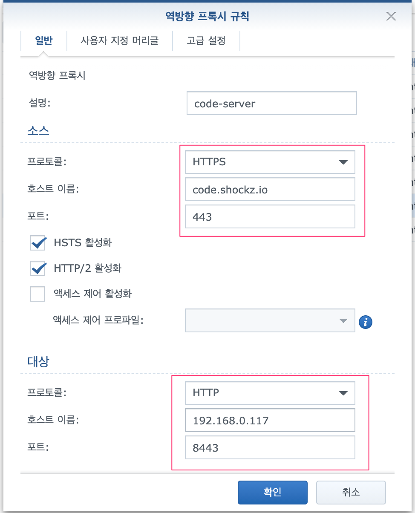
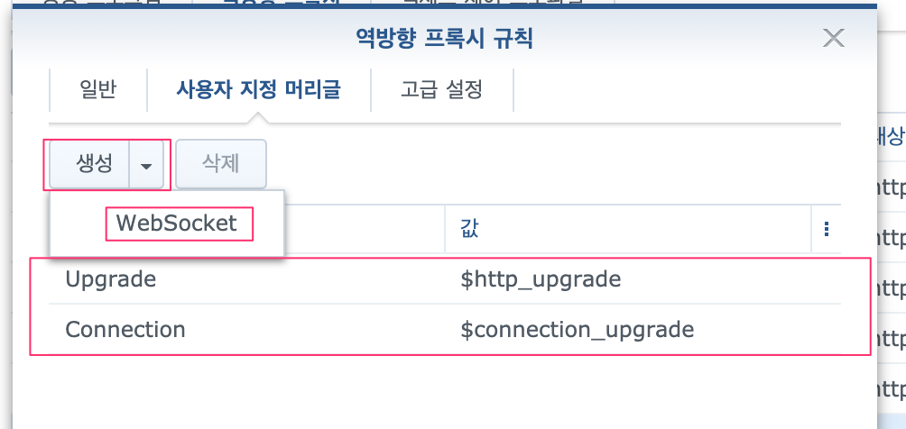
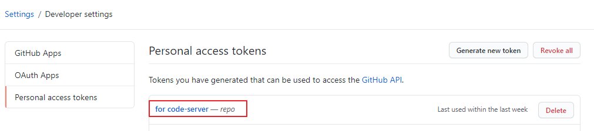
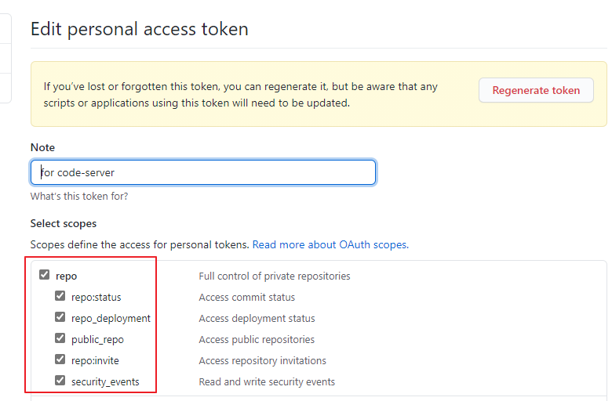

# code-server

<TagLinks />

[[toc]]

## 관련 링크

::: tip
[linuxserver/code-server](https://www.linuxserver.io/)
[cdr/code-server](https://github.com/cdr/code-server)

- 여기서는 linuxserver.io docker 이미지를 사용함
:::

## Docker run

```bash
$ sudo firewall-cmd --permanent --add-port=8443/tcp
$ docker create --name=code-server --net=host --env-file="./.env" -v /home/shockz/docker/code-server/config:/config --restart unless-stopped linuxserver/code-server
$ docker start code-server
```

- env 파일 예시
```bash
$ vi .env
PASSWORD=******** # 원하는 패스워드
SUDO_PASSWORD=******** # code-server 내부적으로 sudo 사용 시 패스워드
PUID=$UID
PGID=$(id -g $USER)
TZ=Asia/Seoul
```

## Synology reverse proxy 설정

- NAS 상에서 nginx reverse proxy 설정이 되어 있다는 가정하에 code-server 는 http 상으로 서비스하고, 인증서 처리는 NAS nginx 에 맡김.  


::: warning
- Synology NAS nginx 를 이용하여 reverse proxy 할 경우 아래 처럼 WebSocket 관련 헤더를 추가해줘야 함

:::

## 확장 설치

- code-server 터미널을 이용하여 설치
```bash
$ code-server --install-extension <extension identifier>
```

## github 연동

- container 를 이용하여 code-server 를 띄운 상황이므로 github 인증 기능이 원할하지 않을 수 있음
- github.com > Settings > Developer settings > Personal Access Tokens (PATs) 에서 토큰을 추가하여 입력하면 해결 가능



## ubuntu package 로 설치하는 방법

```bash
$ wget https://github.com/cdr/code-server/releases/download/v3.7.2/code-server-3.7.2-linux-amd64.tar.gz
$ tar xvfz code-server-3.7.2-linux-amd64.tar.gz
$ mkdir -p ~/.config/code-server
$ curl https://gist.githubusercontent.com/shockzinfinity/aad803519b04c6bd06c9424f43f00233/raw/147d3e425744c8327efd62f750c7b18dbe463405/config.yaml -o ~/.config/code-server/config.yaml
$ mkdir ~/project
$ sudo curl https://gist.githubusercontent.com/shockzinfinity/227a0f2ef792fdbe01063c72f564ba7a/raw/7a06277a3f38c90543259aea9198d7ad22ebce2e/codeserver.service -o /lib/systemd/system/codeserver.service
$ sudo systemctl start codeserver
$ sudo systemctl enable codeserver
```
- `code-server/config.yaml` 수정
```bash
bind-addr: 0.0.0.0:8080
auth: password
password: ********
cert: false
```
- 필요에 따라 `codeserver.service` 파일 수정
```bash{7,11}
[Unit]
Description=Code Server IDE
After=network.target

[Service]
Type=simple
User=shockz
Restart=on-failure
RestartSec=10
WorkingDirectory=/home/shockz/code-server-3.7.2-linux-amd64
ExecStart=/home/shockz/code-server-3.7.2-linux-amd64/code-server --port 8080 /home/shockz/docker/deepo/data

StandardOutput=file:/var/log/code-server-output.log
StandardError=file:/var/log/code-server-error.log

[Install]
WantedBy=multi-user.target
```
