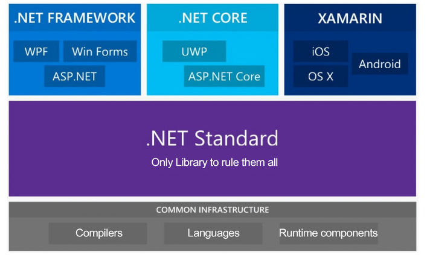

# dotnet core in CentOS 8 & mac

<TagLinks />

[[toc]]

## .net framework Stack



## runtime 및 sdk 설치

```bash
# centos
$ dnf info dotnet-runtime-3.1
$ dnf install dotnet-runtime-3.1
$ dnf info aspnetcore-runtime-3.1
$ dnf install aspnetcore-runtime-3.1
$ dnf info dotnet-sdk-3.1
$ dnf install dotnet-sdk-3.1

$ dotnet --version
$ dotnet --info

# mac
$ brew cask install dotnet-sdk
$ dotnet --version
# other sdk version
$ brew tap isen-ng/dotnet-sdk-versions
$ brew cask install <version>
$ dotnet --list-sdks
```

## project skeleton scaffolding

```bash
$ mkdir todoApi
$ dotnet new sln --name todoApi
$ dotnet new webapi -o todoApi.Api
$ dotnet sln add todoApi.Api
$ cd todoApi.Api
$ dotnet add package Microsoft.EntityFrameworkCore.SqlServer
$ dotnet add package Microsoft.EntityFrameworkCore.InMemory
$ cd ..
$ code .

# scaffolding tools install
$ dotnet add package Microsoft.VisualStudio.Web.CodeGeneration.Design
$ dotnet add package Microsoft.EntityFrameworkCore.Design
$ dotnet tool install --global dotnet-aspnet-codegenerator
$ dotnet tool update -g dotnet-aspnet-codegenerator
# async endpoint, TodoItem 모델 사용, TodoContext db 컨텍스트 사용, Controllers 폴더 하위에 생성
$ dotnet aspnet-codegenerator controller -name TodoItemsController -async -api -m TodoItem -dc TodoContext -outDir Controllers
# dotnet ef core tool install
$ dotnet tool install --global dotnet-ef
$ dotnet ef
```

## test repository

> [test repository](https://github.com/shockzinfinity/dotnetcore-dockerized.git)

```bash
$ mkdir HelloAspNetCore3 && cd HelloAspNetCore3
$ dotnet new sln --name HelloAspNetCore3
$ dotnet new webapi --name HelloAspNetCore3.Api
$ dotnet sln add HelloAspNetCore3.Api/HelloAspNetCore3.Api.csproj
```

> add forwarded headers in `Startup.cs`

```csharp
// Starup.cs Configure(), remove app.UseHttpsRedirection(), then add followed code
app.UseForwardedHeaders(new ForwardedHeadersOptions
{
  ForwardedHeaders = ForwardedHeaders.XForwardedFor | ForwardedHeaders.XForwardedProto
})
```

> add `Api.Dockerfile` to the project folder

```docker
FROM mcr.microsoft.com/dotnet/core/aspnet:3.0-alpine AS base
WORKDIR /app

FROM mcr.microsoft.com/dotnet/core/sdk:3.0-alpine AS build
WORKDIR /src
COPY ["HelloAspNetCore3.Api.csproj", "./"]
RUN dotnet restore "./HelloAspNetCore3.Api.csproj"
COPY . .
WORKDIR "/src/."
RUN dotnet build "HelloAspNetCore3.Api.csproj" -c Release -o /app/build

FROM build AS publish
RUN dotnet publish "HelloAspNetCore3.Api.csproj" -c Release -o /app/publish

FROM base AS final
WORKDIR /app
COPY --from=publish /app/publish .
ENV ASPNETCORE_URLS http://*:5000
ENTRYPOINT ["dotnet", "HelloAspNetCore3.Api.dll"]
```

```bash
$ docker build -t hello-aspnetcore3 -f Api.Dockerfile . # on Api.Dockerfile location
$ docker run -d -p 5000:5000 --name hello-aspnetcore3 hello-aspnetcore3
$ docker ps -a
```

> browse **[http://localhost:5000/weatherforecast](http://localhost:5000/weatherforecast)**

```bash
$ docker rm -f hello-aspnetcore3
$ docker rmi hello-aspnetcore3
```

> add **Nginx** folder to the solution folder, and then add `Nginx.Dockerfile`, `nginx.conf`  
> **Nginx.Dockerfile**

```docker
FROM nginx:latest

COPY nginx.conf /etc/nginx/nginx.conf
```

> **nginx.conf**

```bash
worker_processes auto;

events { worker_connections 2048; }

http {

    sendfile on;

    upstream web-api {
        server api:5000;
    }

    server {
        listen 80;
        server_name $hostname;
        location / {
            proxy_pass         http://web-api;
            proxy_redirect     off;
            proxy_http_version 1.1;
            proxy_cache_bypass $http_upgrade;
            proxy_set_header   Upgrade $http_upgrade;
            proxy_set_header   Connection keep-alive;
            proxy_set_header   Host $host;
            proxy_set_header   X-Real-IP $remote_addr;
            proxy_set_header   X-Forwarded-For $proxy_add_x_forwarded_for;
            proxy_set_header   X-Forwarded-Proto $scheme;
            proxy_set_header   X-Forwarded-Host $server_name;
        }
    }
}
```

> add docker-compose.yml to the solution folder.

```docker
version: "3.7"

services:

  reverseproxy:
    build:
      context: ./Nginx
      dockerfile: Nginx.Dockerfile
    ports:
      - "80:80"
    restart: always

  api:
    depends_on:
      - reverseproxy
    build:
      context: ./HelloAspNetCore3.Api
      dockerfile: Api.Dockerfile
    expose:
      - "5000"
    restart: always
```

```bash
$ docker-compose up --build -d
```

## SSL 적용

::: warning
SSL 인증서 발급은 [#SSL](./ssl) 참조
:::

> https redirection 및 proxy 적용  
> `localhost.crt`, `localhost.key` 는 빌드 시 복사

```bash
worker_processes auto;

events { worker_connections 2048; }

http {
  sendfile on;

  upstream web-api {
    server api:5000;
  }

  server {
    listen 80;
    server_name localhost;

    location / {
      return 301 https://$host$request_uri;
    }
  }

  server {
    listen 443 ssl;
    server_name localhost;

    ssl_certificate /etc/ssl/certs/localhost.crt;
    ssl_certificate_key /etc/ssl/private/localhost.key;

    location / {
      proxy_pass          http://web-api;
      proxy_redirect      off;
      proxy_http_version  1.1;
      proxy_cache_bypass  $http_upgrade;
      proxy_set_header    Upgrade $http_upgrade;
      proxy_set_header    Connection keep-alive;
      proxy_set_header    Host $host;
      proxy_set_header    X-Real-IP $remote_addr;
      proxy_set_header    X-Forwarded-For $proxy_add_x_forwarded_for;
      proxy_set_header    X-Forwarded-Proto $scheme;
      proxy_set_header    X-Forwarded-Host $server_name;
    }
  }
}
```

> **Nginx.Dockerfile**

```docker
FROM nginx:latest

COPY nginx.conf /etc/nginx/nginx.conf
COPY localhost.crt /etc/ssl/certs/localhost.crt
COPY localhost.key /etc/ssl/private/localhost.key
```

> **docker-compose.yml**

```docker
version: "3.7"

services:
  reverseproxy:
    build:
      context: ./Nginx
      dockerfile: Nginx.Dockerfile
    ports:
      - "80:80"
      - "443:443"
    restart: always

  api:
    depends_on:
      - reverseproxy
    build:
      context: ./HelloAspNetCore3.Api
      dockerfile: Api.Dockerfile
    expose:
      - "5000"
    restart: always
```

## net core item template update

```bash
$ dotnet new -i Microsoft.DotNet.Common.ItemTemplates::3.1.9
  복원할 프로젝트를 확인하는 중...
  /Users/shockz/.templateengine/dotnetcli/v3.1.402/scratch/restore.csproj을(를) 2.33 sec 동안 복원했습니다.

사용법: new [options]

옵션:
  -h, --help          Displays help for this command.
  -l, --list          Lists templates containing the specified name. If no name is specified, lists all templates.
  -n, --name          The name for the output being created. If no name is specified, the name of the current directory is used.
  -o, --output        Location to place the generated output.
  -i, --install       Installs a source or a template pack.
  -u, --uninstall     Uninstalls a source or a template pack.
  --nuget-source      Specifies a NuGet source to use during install.
  --type              Filters templates based on available types. Predefined values are "project", "item" or "other".
  --dry-run           Displays a summary of what would happen if the given command line were run if it would result in a template creation.
  --force             Forces content to be generated even if it would change existing files.
  -lang, --language   Filters templates based on language and specifies the language of the template to create.
  --update-check      Check the currently installed template packs for updates.
  --update-apply      Check the currently installed template packs for update, and install the updates.


Templates                                         Short Name               Language          Tags
----------------------------------------------------------------------------------------------------------------------------------
Console Application                               console                  [C#], F#, VB      Common/Console
Class library                                     classlib                 [C#], F#, VB      Common/Library
WPF Application                                   wpf                      [C#]              Common/WPF
WPF Class library                                 wpflib                   [C#]              Common/WPF
WPF Custom Control Library                        wpfcustomcontrollib      [C#]              Common/WPF
WPF User Control Library                          wpfusercontrollib        [C#]              Common/WPF
Windows Forms (WinForms) Application              winforms                 [C#]              Common/WinForms
Windows Forms (WinForms) Class library            winformslib              [C#]              Common/WinForms
Worker Service                                    worker                   [C#]              Common/Worker/Web
Unit Test Project                                 mstest                   [C#], F#, VB      Test/MSTest
NUnit 3 Test Project                              nunit                    [C#], F#, VB      Test/NUnit
NUnit 3 Test Item                                 nunit-test               [C#], F#, VB      Test/NUnit
xUnit Test Project                                xunit                    [C#], F#, VB      Test/xUnit
Razor Component                                   razorcomponent           [C#]              Web/ASP.NET
Razor Page                                        page                     [C#]              Web/ASP.NET
MVC ViewImports                                   viewimports              [C#]              Web/ASP.NET
MVC ViewStart                                     viewstart                [C#]              Web/ASP.NET
Blazor Server App                                 blazorserver             [C#]              Web/Blazor
Blazor WebAssembly App                            blazorwasm               [C#]              Web/Blazor/WebAssembly
ASP.NET Core Empty                                web                      [C#], F#          Web/Empty
ASP.NET Core Web App (Model-View-Controller)      mvc                      [C#], F#          Web/MVC
ASP.NET Core Web App                              webapp                   [C#]              Web/MVC/Razor Pages
ASP.NET Core with Angular                         angular                  [C#]              Web/MVC/SPA
ASP.NET Core with React.js                        react                    [C#]              Web/MVC/SPA
ASP.NET Core with React.js and Redux              reactredux               [C#]              Web/MVC/SPA
Razor Class Library                               razorclasslib            [C#]              Web/Razor/Library/Razor Class Library
ASP.NET Core Web API                              webapi                   [C#], F#          Web/WebAPI
ASP.NET Core gRPC Service                         grpc                     [C#]              Web/gRPC
dotnet gitignore file                             gitignore                                  Config
global.json file                                  globaljson                                 Config
NuGet Config                                      nugetconfig                                Config
Dotnet local tool manifest file                   tool-manifest                              Config
Web Config                                        webconfig                                  Config
Solution File                                     sln                                        Solution
Protocol Buffer File                              proto                                      Web/gRPC

Examples:
    dotnet new mvc --auth Individual
    dotnet new --help
```
