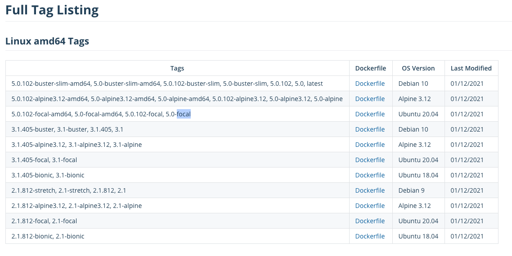

# ef core

<TagLinks />

[[toc]]

## ef core tool 설치
> docker 로 .net core app 을 실행 시에 ef core migration 이 필요한 경우가 있음  
> csproj에 ef core tool 을 포함시킬 경우는

```bash
$ dotnet add package Microsoft.EntityFrameworkCore.Design # project 에 직접 포함 (패키지 관리자 콘솔용)
# or
$ dotnet tool install --global dotnet-ef # cli 방식
```

## ef core migration

> migration 생성 및 업데이트

```bash
$ dotnet ef migrations add AddColumn --project coreTodoApi.csproj
$ dotnet ef database update --project coreTodoApi.csproj
```

> scaffolding
```bash
$ dotnet ef dbcontext scaffold "Server=localhost;Database=todos;Integrated Security=false;User ID=sa;Password=y0urStrong!Password;" Microsoft.EntityFrameworkCore.SqlServer -o Models
$ dotnet ef dbcontext scaffold "Server=localhost;Database=todos;Integrated Security=false;User ID=sa;Password=y0urStrong!Password;" Microsoft.EntityFrameworkCore.SqlServer -o Models -t TodoItems -t 테이블명 --context-dir Models -c TodoContext --context-namespace Todo.Api
```

> api 등이 시작되는 시점에서 db migration 하도록 설정하기 위해서는

```csharp
// Startup.cs
public void ConfigureServices(IServiceCollection services)
{
  //   services.AddDbContext<TodoContext>(opt => opt.UseInMemoryDatabase("TodoList"));
  services.AddDbContext<TodoContext>(opt => opt.UseSqlServer("connectionString"));
  services.AddControllers();
}

public void Configure(IApplicationBuilder app, IWebHostEnvironment env)
{
  // DbContext migrate
  if(app.ApplicationServices.GetService<TodoContext>().Database.GetPendingMigrations().Any())
  {
    app.ApplicationServices.GetService<TodoContext>().Database.Migrate();
  }
}
```

## ef core 로 sql server 연결 시 오류
> A connection was successfully established with the server, but then an error occurred during the pre-login handshake. (provider: SSL Provider, error: 31 - Encryption(ssl/tls) handshake failed)

### 현상

- .net core 앱을 dockerizing 할 경우, 보통 다음과 같이 `Dockerfile` 을 작성한다.
```docker
FROM mcr.microsoft.com/dotnet/aspnet:5.0 AS base
WORKDIR /app

FROM mcr.microsoft.com/dotnet/sdk:5.0 AS build
WORKDIR /src
COPY ["sample.api.csproj", "./"]
RUN dotnet restore "./sample.api.csproj"
COPY . .
WORKDIR "/src/."
RUN dotnet build "sample.api.csproj" -c Release -o /app/build

FROM build AS publish
RUN dotnet publish "sample.api.csproj" -c Release -o /app/publish

FROM base AS final

LABEL maintainer="Jun Yu <shockzinfinity@gmail.com>"

WORKDIR /app
COPY --from=publish /app/publish .
ENV ASPNETCORE_URLS http://*:5001

ENTRYPOINT ["dotnet", "sample.api.dll"]
```
- base 및 build 이미지를 .net standard 5.0 은 `mcr.microsoft.com/dotnet/aspnet:5.0`, .net core 3.1 은 `mcr.microsoft.com/dotnet/aspnet:3.1` 등으로 사용하여 dockerizing 하게 되는데,
- 기본 태그의 이미지는 container 의 size 를 줄이기 위해 buster 나 buster-slim 이다. ([dotnet tag](https://hub.docker.com/_/microsoft-dotnet-sdk?tab=description))

- 해당 태그는 Ubuntu 20.04 등을 사용하여 빌드된 이미지 이다.
- Ubuntu 20.04 가 되면서 기본 openssl security level 변경되어 다음과 같은 에러가 발생할 수 있다.
```bash
System.Data.SqlClient.SqlException (0x80131904): A connection was successfully established with the server, but then an error occurred during the pre-login handshake. (provider: SSL Provider, error: 31 - Encryption(ssl/tls) handshake failed)
```

### 해결

- 이 에러를 해결하기 위해서는 `Dockerfile` 에서 base 이미지를 하위 버전은 리눅스 이미지 (Ubuntu 18.04 를 base로 하는 `3.1-bionic`)를 사용하도록 하거나, ENTRYPOINT 전에 `/etc/ssl/openssl.cnf` 를 조정해줘야 한다.
- [https://itectec.com/ubuntu/ubuntu-ubuntu-20-04-how-to-set-lower-ssl-security-level/#](https://itectec.com/ubuntu/ubuntu-ubuntu-20-04-how-to-set-lower-ssl-security-level/#)
- [https://askubuntu.com/questions/1233186/ubuntu-20-04-how-to-set-lower-ssl-security-level](https://askubuntu.com/questions/1233186/ubuntu-20-04-how-to-set-lower-ssl-security-level)
- 그래서 다음과 같이 조치하도록 한다.
```docker{5}
...
WORKDIR /app
COPY --from=publish /app/publish .
ENV ASPNETCORE_URLS http://*:5001
RUN sed -i 's/DEFAULT@SECLEVEL=2/DEFAULT@SECLEVEL=1/g' /etc/ssl/openssl.cnf
ENTRYPOINT ["dotnet", "sample.api.dll"]
```
- openssl 의 SECLEVEL 을 조정함으로서 SSL 관련 오류를 우회한다.
::: tip
- 관련 정보
  - [Ubuntu 20.04 openssl의 key길이 문제(SECLEVEL)](https://ivorycirrus.github.io/TIL/openssl-seclevel/)
  - [디피 헬만 키 (Diffie-Hellman Key) 를 2048 bit 로 바꿔야 하는 이유](https://rsec.kr/?p=242)
:::

## Reference
- [package management console](https://docs.microsoft.com/ko-kr/ef/core/miscellaneous/cli/powershell)
- [cli](https://docs.microsoft.com/ko-kr/ef/core/miscellaneous/cli/dotnet)
- [리버스엔지니어링](https://docs.microsoft.com/ko-kr/ef/core/managing-schemas/scaffolding?tabs=dotnet-core-cli)
