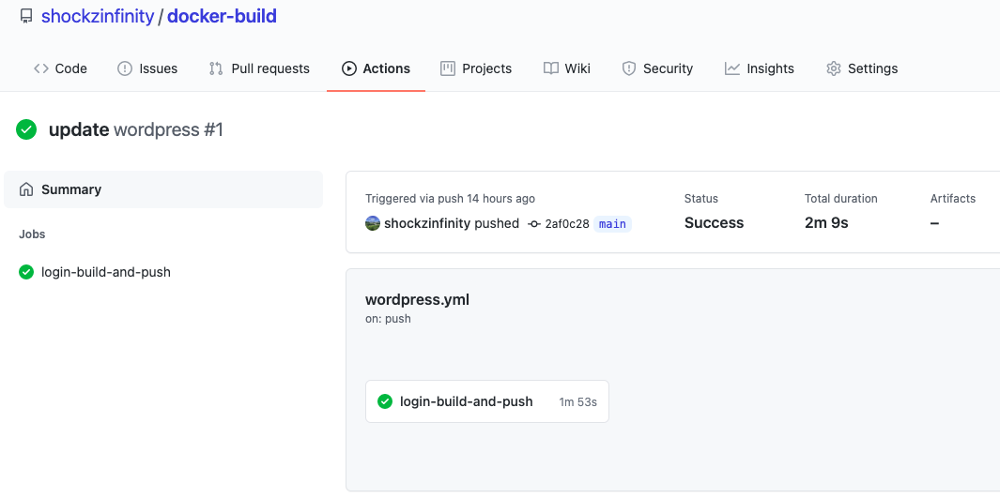

# GitHub

<TagLinks />

---

[[toc]]

---

## GitHub Actions 를 활용한 Github Container Registry 에 Docker image 배포
  > 원문:
  > - [Migrating my Docker images to the GitHub Container Registry](https://www.mediaglasses.blog/2020/09/27/migrating-my-docker-images-to-the-github-container-registry/)
  > 
  > 참고 URL:
  > - [Github Actions를 이용한 CI/CD 구축](https://velog.io/@chrishan/Github-Actions%EB%A5%BC-%EC%9D%B4%EC%9A%A9%ED%95%9C-CICD)  
  > - [깃허브 컨테이너 레지스트리 베타 오픈 및 사용법](https://www.44bits.io/ko/post/news--github-container-registry-beta-release)
  > 
  > GitHub Repo: [shockzinfinity/docker-build](https://github.com/shockzinfinity/docker-build)

### Scenario

  github repository 에 코드를 commit 하면 github actions 의 workflow 에 의해 ghcr.io(github container registry) 에 docker image 를 upload 되는 과정을 설명합니다.

  여기서는 wordpress 기준으로 설명합니다.

  `/.github/workflows/wordpress.yml`
```yml
name: wordpress
on:
  push:
    branches: main
    paths:
      - "!**"
      - "wordpress/**"
jobs:
  login-build-and-push:
    runs-on: ubuntu-latest
    steps:
      - name: Checkout
        uses: actions/checkout@v2
      - name: Set up Docker Buildx
        uses: docker/setup-buildx-action@v1
        with:
          driver-opts: image=moby/buildkit:master
      - name: Get current date
        id: date
        run: echo "::set-output name=date::$(date +'%Y%m%d%H%M')"
      - name: Login to the GitHub Container Registry
        uses: docker/login-action@v1
        with:
          registry: ghcr.io
          username: ${{ github.repository_owner }}
          password: ${{ secrets.CR_PAT }}
      - name: Build and push image
        id: docker_build
        uses: docker/build-push-action@v2
        with:
          push: true
          context: ./${{ github.workflow }}/
          file: ./${{ github.workflow }}/Dockerfile
          tags: |
            ghcr.io/${{ github.repository_owner }}/${{ github.workflow }}:latest
            ghcr.io/${{ github.repository_owner }}/${{ github.workflow }}:${{ steps.date.outputs.date }}
      - name: Image digest
        run: echo ${{ steps.docker_build.outputs.digest }}
```

### Naming the Workflow

```yml
name: wordpress
```
  workflow 이름을 지정해서 `github.workflow` 와 같이 변수로 활용

### When do run the job?

```yml
on:
  push:
    branches: main
    paths:
      - "!**"
      - "wordpress/**"
```
  **main** 브랜치에 **push** 이벤트 발생 시에 동작하도록 설정

  **paths** 부분은 해당 repository 에서 각 디렉토리 별로 이미지를 빌드하기 위해서 workflow 이름과 같은 디렉토리의 내용만 실행하기 위해서 해당 디렉토리만 빌드하기 위해 필요한 부분
  
  `github.workflow` 변수를 활용할 수 없어서 하드코딩된 부분

### Defining the job

```yml
jobs:
  login-build-and-push:
    runs-on: ubuntu-latest
    steps:
```
  job 정의 부분으로서 ubuntu 머신을 이용하여 빌드

### Step #1

```yml
      - name: Checkout
        uses: actions/checkout@v2
```
  repository 체크 아웃

### Step #2

```yml
      - name: Set up Docker Buildx
        uses: docker/setup-buildx-action@v1
        with:
          driver-opts: image=moby/buildkit:master
```
  **Docker Buildx** 를 활용하여 빌드하겠다는 것으로 추후 빌드된 이미지를 두개의 tag 로 push 하기 위해서 buildx 플러그인을 사용

### Step #3

```yml
      - name: Get current date
        id: date
        run: echo "::set-output name=date::$(date +'%Y%m%d%H%M')"
```
  tagging 을 위한 current date 저장

### Step #4

```yml
      - name: Login to the GitHub Container Registry
        uses: docker/login-action@v1
        with:
          registry: ghcr.io
          username: ${{ github.repository_owner }}
          password: ${{ secrets.CR_PAT }}
```
  ghcr.io 에 로그인하기 위해 username, password 를 지정

  secrets.CR_PAT 는 해당 repository > settings 에서 PAT(Personal Access Token) 을 등록하여 사용

### Step #5

```yml
      - name: Build and push image
        id: docker_build
        uses: docker/build-push-action@v2
        with:
          push: true
          context: ./${{ github.workflow }}/
          file: ./${{ github.workflow }}/Dockerfile
          tags: |
            ghcr.io/${{ github.repository_owner }}/${{ github.workflow }}:latest
            ghcr.io/${{ github.repository_owner }}/${{ github.workflow }}:${{ steps.date.outputs.date }}
```
  context 와 file 은 docker build 를 위해 지정

### Step #6

```yml
      - name: Image digest
        run: echo ${{ steps.docker_build.outputs.digest }}
```
  최종 결과 출력




## GitHub Container Registry 에 업로드 하기 위한 준비

- github.com > Settings > Developer settings > Personal access tokens 에서
- delete:packages, workflow, write:packages 의 권한으로 GH_TOKEN.txt 로 로컬에 저장

- `docker push` 가 가능해짐
```bash
$ cat -p ~/Desktop/GH_TOKEN.txt| docker login ghcr.io -u shockzinfinity --password-stdin

# 윈도우즈의 경우는
$ cat %HOME%/Desktop/{token.filename} | docker login ghcr.io -u shockzinfinity --password-stdin
```
- 
