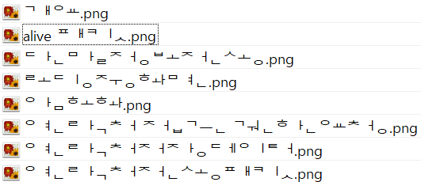

# Path Polisher

<TagLinks />



## Cause

- 맥 OS는 Unicode NFD(Normalization Form D) 로 파일명 저장
- 윈도우즈는 Unicode NFC(Normalization Form C) 로 파일명 저장

> NFC(Normalization Form C): 한글 음절을 하나의 문자로 합친 형태.

> NFD(Normalization Form D): 한글 음절을 초성, 중성, 종성으로 분리된 형태.

## Repository

- [Github repository](https://github.com/shockzinfinity/PathPolisher.git)

## Usage

### by source

```bash
$ dotnet publish
$ cd ./PathPolisher/bin/Release/net9.0/win-x64/publish
# default: current directory
$ pathpolisher --directory <target directory> # e.g. c:/users/username/documents
```

### by dotnet tool

```bash
$ dotnet pack
# install dotnet global tool
$ dotnet tool install --global --add-source ./nupkg PathPolisher
# default: current directory
$ polish --directory <target directory> # e.g. c:/users/username/documents
```

```bash
# uninstall
$ dotnet tool uninstall -g PathPolisher
```

## Misc

> build 를 위한 `.csproj` 설정

- for build

```xml
<PropertyGroup>
...
<RuntimeIdentifier>win-x64</RuntimeIdentifier>
<SelfContained>true</SelfContained>
<PublishSingleFile>true</PublishSingleFile>
<IncludeAllContentForSelfExtract>true</IncludeAllContentForSelfExtract>
...
</PropertyGroup>
```

- for dotnet tool

```xml
<PropertyGroup>
...
<PackAsTool>true</PackAsTool>
<ToolCommandName>polish</ToolCommandName>
<PackageOutputPath>./nupkg</PackageOutputPath>
...
</PropertyGroup>
```

## Reference

- [자습서: 시작 System.CommandLine](https://learn.microsoft.com/ko-kr/dotnet/standard/commandline/get-started-tutorial)
