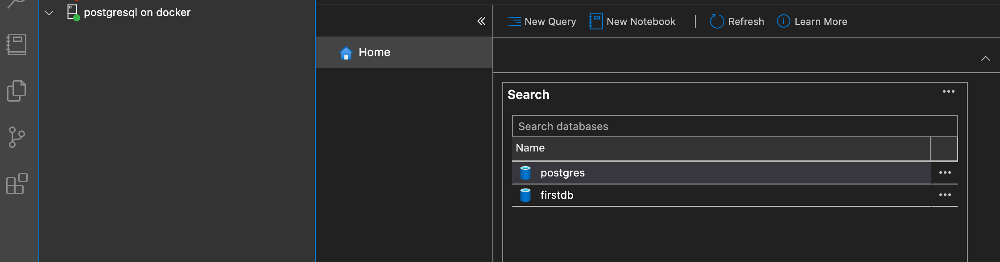

# PostgreSQL 관련

<TagLinks />

[[toc]]

## docker 설치

```bash
$ docker pull postgres:latest
$ docker run --name pgsql -d -p 5432:5432 -e POSTGRES_PASSWORD=postgresql postgres
```

- [Azure Data Studio](https://docs.microsoft.com/ko-kr/sql/azure-data-studio/download-azure-data-studio?view=sql-server-ver15) 로 연결 테스트  
  
