# Synology

<TagLinks />

[[toc]]

## 도메인 연결 및 DNS Setting

1. [whois](https://whois.co.kr) 등에서 도메인 구입 ([shockz.io](https://shockz.io) 구입 3년)
2. 네임서버 변경 (ns.shockz.io)  
   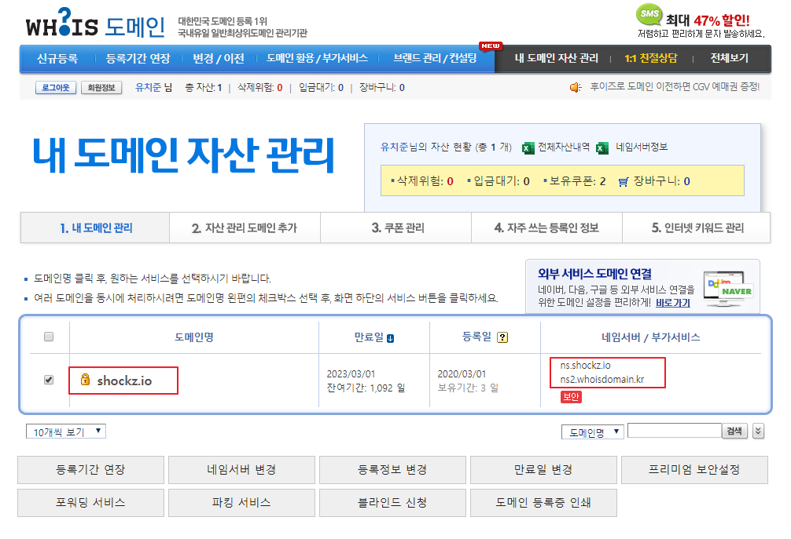 _도메인 추가_
3. Synology NAS 에서 DNS Server 설치  
   
4. 마스터 영역 및 기타 관련 항목 설정  
   \_acme-challenge.shockz.io 레코드는 Wildcard SSL 인정서를 발급받기 위한 인증용 TXT 레코드  
   MX 레코드는 [다음스마트워크](http://mail2.daum.net/hanmailex/domain.html)의 메일서비스 이용을 위한 레코드
   
   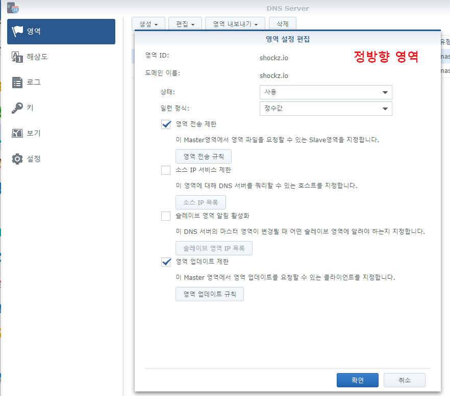
   
   
   
5. putty를 이용한 synology root 접근  
   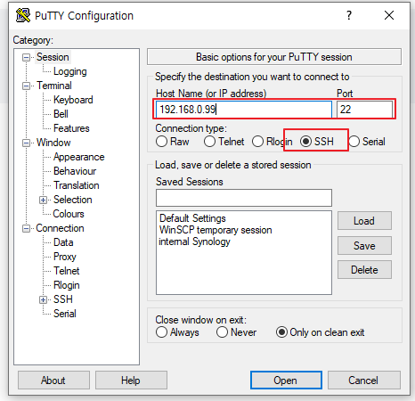
   
   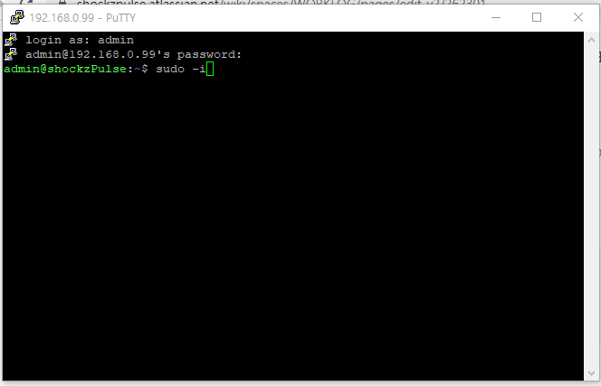
   
6. 인증서 발급 (Let's Encrypt무료 와일드카드)  
   [Let's Encrypt SSL 인증서 적용](#lets-encrypt-ssl-인증서-적용) 참조
7. SSL 설정 - 인증서 항목에서 [구성] 클릭 후 각 항목 인증서 변경  
   
8. SSL 적용 확인  
   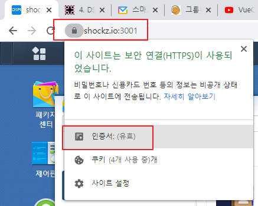
   
   

## Let's Encrypt SSL 인증서 적용

> acme.sh 이용

```bash
$ wget https://raw.githubusercontent.com/acmesh-official/acme.sh/master/acme.sh
$ chmod a+x acme.sh

# 2021-09-13 [추가] acme.sh 최근에서는 계정 등록한 이후 사용할 수 있도록 변경된 듯
$ ./acme.sh --register-account -m your@email.com
$ ./acme.sh --issue --dns --force -d shockz.io -d *.shockz.io --yes-I-know-dns-manual-mode-enough-go-ahead-please
# TXT 레코드에 등록해야 할 코드가 출력됨 -> DNS TXT 레코드에 추가 혹은 갱신 필요

# Domain: 확인
# TXT Value: 확인
# DNS TXT 레코드 변경 후 확인
$ nslookup
$ set type=txt
$ _acme-challenge.shockz.io
$ ./acme.sh --renew --dns --force -d shockz.io -d *.shockz.io --yes-I-know-dns-manual-mode-enough-go-ahead-please
```

> ca.cer, shockz.io.key, shockz.io.cer 다운로드 후
>   
>   
> 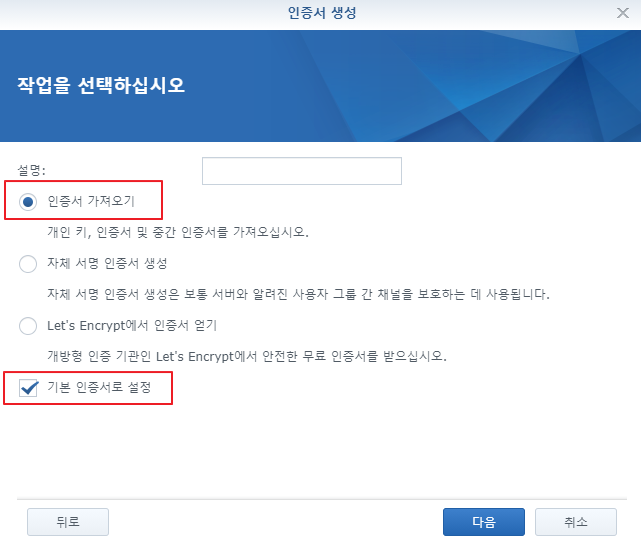  
> 

> 작업스케줄러 등록 (인증서 갱신, 매주 금)
>   
> 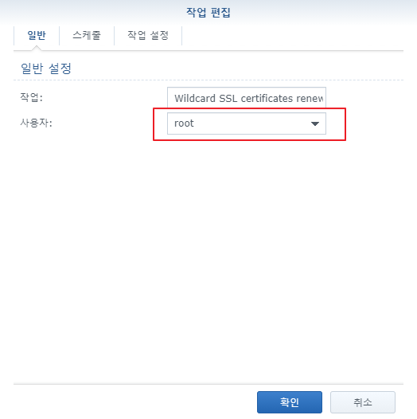  
> 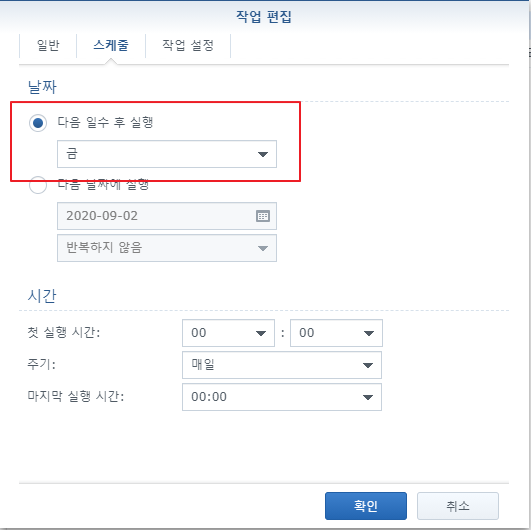  
> 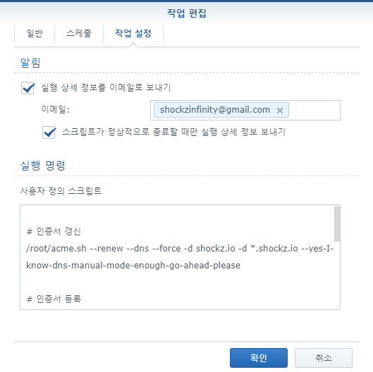  
> 스크립트 내용은 아래 작업 스케줄러 최종 스크립트 참조
> UI를 통한 인증서 갱신은 자동으로 역방향 프록시에 적용됨.

## Let's Encrypt SSL Reverse Proxy 적용

- 인증서 갱신 이후 `/usr/syno/etc/certificate/_archive/DEFAULT` 에만 적용하게 되면 Synology Reverse Proxy 는 자동 적용되지 않음
- 개별적으로 적용해야 함

```bash
# 예시
$ for reverse in `ls -l /usr/syno/etc/certificate/ReverseProxy/ | grep "^d" | awk '{ print $9 }'`; do
> cp -f /root/.acme.sh/shockz.io/shockz.io.cer /usr/syno/etc/certificate/ReverseProxy/$reverse/cert.pem
> cp -f /root/.acme.sh/shockz.io/ca.cer /usr/syno/etc/certificate/ReverseProxy/$reverse/chain.pem
> cp -f /root/.acme.sh/shockz.io/fullchain.cer /usr/syno/etc/certificate/ReverseProxy/$reverse/fullchain.pem
> cp -f /root/.acme.sh/shockz.io/shockz.io.key /usr/syno/etc/certificate/ReverseProxy/$reverse/privkey.pem
> done
```

- Synology 작업 스케줄러 최종 스크립트

```bash
# 인증서 갱신
/root/acme.sh --renew --dns --force -d shockz.io -d *.shockz.io --yes-I-know-dns-manual-mode-enough-go-ahead-please

# 인증서 등록
cp -f /root/.acme.sh/shockz.io/shockz.io.cer /usr/syno/etc/certificate/_archive/`cat /usr/syno/etc/certificate/_archive/DEFAULT`/cert.pem
cp -f /root/.acme.sh/shockz.io/ca.cer /usr/syno/etc/certificate/_archive/`cat /usr/syno/etc/certificate/_archive/DEFAULT`/chain.pem
cp -f /root/.acme.sh/shockz.io/fullchain.cer /usr/syno/etc/certificate/_archive/`cat /usr/syno/etc/certificate/_archive/DEFAULT`/fullchain.pem
cp -f /root/.acme.sh/shockz.io/shockz.io.key /usr/syno/etc/certificate/_archive/`cat /usr/syno/etc/certificate/_archive/DEFAULT`/privkey.pem

# reverse proxy 에 적용
for reverse in `ls -l /usr/syno/etc/certificate/ReverseProxy/ | grep "^d" | awk '{ print $9 }'`; do cp -f /root/.acme.sh/shockz.io/shockz.io.cer /usr/syno/etc/certificate/ReverseProxy/$reverse/cert.pem; cp -f /root/.acme.sh/shockz.io/ca.cer /usr/syno/etc/certificate/ReverseProxy/$reverse/chain.pem; cp -f /root/.acme.sh/shockz.io/fullchain.cer /usr/syno/etc/certificate/ReverseProxy/$reverse/fullchain.pem; cp -f /root/.acme.sh/shockz.io/shockz.io.key /usr/syno/etc/certificate/ReverseProxy/$reverse/privkey.pem; done

# nginx 재시작
# DSM 6.x
/usr/syno/sbin/synoservicectl --reload nginx
# DSM 7.0
/usr/syno/bin/synosystemctl restart nginx
```

## 참고

- [시놀로지 NAS, Let's Encrypt WildCard SSL 적용](https://eunpoong.tistory.com/1185)
- [시놀로지에 Let's Encrypt 와일드카드 인증서 적용하기](https://blog.naver.com/jcjee2004/221831609605)

## NFS 설정

- NFS 사용 설정
  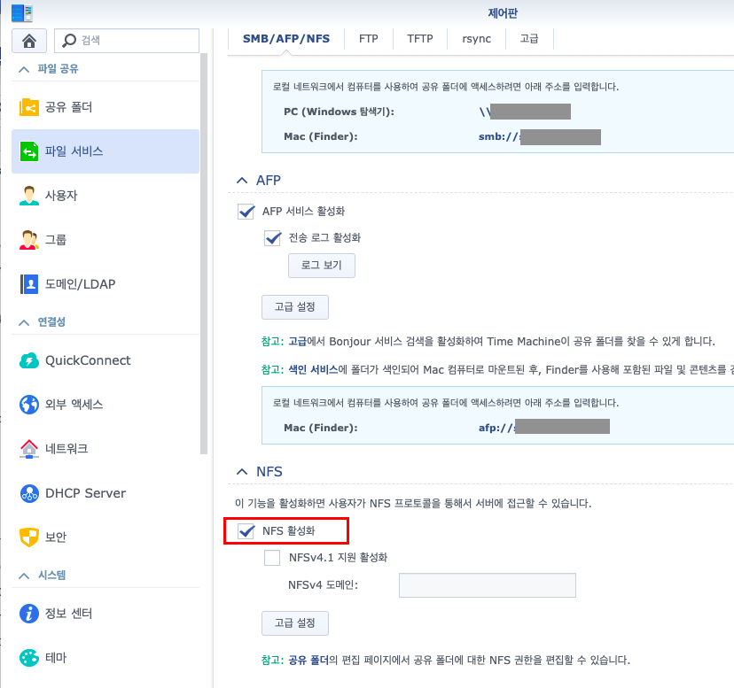
- 하위 폴더 접근 및 권한을 위해 해당 항목 체크
  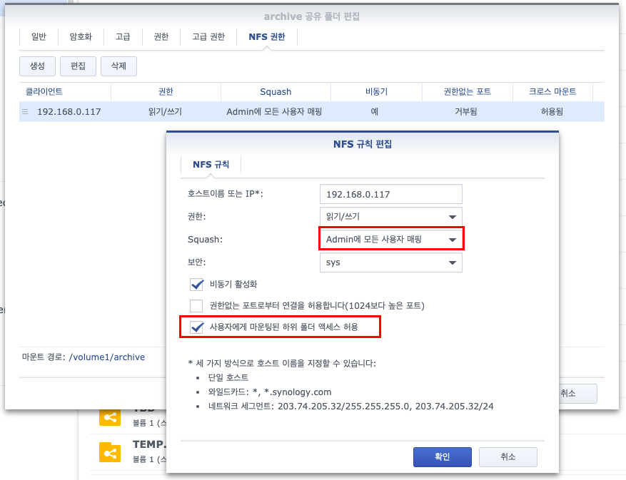
- 접근하고자 하는 리눅스 서버 상에서 마운트

```bash
$ showmount -e 192.168.0.99
$ sudo mount 192.168.0.99:/volume1/archive nas-archive
```

## 공유 링크 관리자


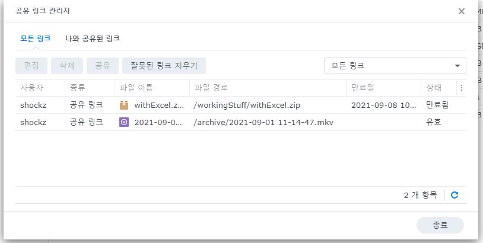

## sudo 없이 docker 명령어 사용

```bash
$ sudo synogroup --add docker username
$ sudo chown root:docker /var/run/docker.sock
```

## GitLab with synology docker [예정]

- Model: DS718+
- RAM: 10G
- DSM 7.0 기준
- docker 이미지 다운로드
- reverse proxy settings
