# WordPress 관련 기록

<TagLinks />

[[toc]]

## Wordpress containerize

**docker** 및 **docker-compose** 이 설치되어 있다는 가정하에 시작

구성환경
  - Wordpress
  - Nginx
  - MariaDB
  - phpMyAdmin
  - Redis
  - Wordpress plugin: [W3 Total Cache](https://wordpress.org/plugins/w3-total-cache/), [Autoptimize](https://wordpress.org/plugins/autoptimize/)

> [Repository](https://github.com/shockzinfinity/wordpress-redis)

> 참고사이트: [How To Install WordPress With Docker Compose](https://www.digitalocean.com/community/tutorials/how-to-install-wordpress-with-docker-compose)

### 1. 준비사항

- 워드프레스를 구동하기 위한 도메인 - 여기서는 **wordpress.shockz.io** (DNS 설정완료) 로 구동
- certbot 을 통해 인증서 발급 및 자동갱신을 할 예정이므로 80, 443 port 를 오픈할 수 있는 여건이어야 함.

### 2. 관련 디렉토리 생성

- 작업 시작 디렉토리: 각 유저 홈 디렉토리 - 여기서는 `/home/shockz` 기준
```bash
# wordpress redis 작업 기준 디렉토리
$ mkdir wordpress-redis && cd wordpress-redis
# php 설정파일용
$ mkdir php
# nginx 설정파일용
$ mkdir nginx-conf
# ssl 인증서 관련 (certbot 이용)
$ mkdir certbot-etc
# db 데이터저장용
$ mkdir dbdata
# redis data 저장용
$ mkdir dataredis
# wordpress 데이터 저장용, W3 Total Cache 가 권한이 필요한 경우가 많음
$ mkdir wordpress && chmod 777 wordpress
```

### 3. ssl 생성을 위한 certbot nginx.conf 생성

- `nginx-conf/nginx.conf` 생성 (certbot ssl 갱신용 설정)
```bash{5}
server {
        listen 80;
        listen [::]:80;

        server_name wordpress.shockz.io;

        index index.php index.html index.htm;

        root /var/www/html;

        location ~ /.well-known/acme-challenge {
                allow all;
                root /var/www/html;
        }

        location / {
                try_files $uri $uri/ /index.php$is_args$args;
        }

        location ~ .php$ {
                try_files $uri =404;
                fastcgi_split_path_info ^(.+.php)(/.+)$;
                fastcgi_pass wordpress:9000;
                fastcgi_index index.php;
                include fastcgi_params;
                fastcgi_param SCRIPT_FILENAME $document_root$fastcgi_script_name;
                fastcgi_param PATH_INFO $fastcgi_path_info;
        }

        location ~ /.ht {
                deny all;
        }

        location = /favicon.ico {
                log_not_found off; access_log off;
        }
        location = /robots.txt {
                log_not_found off; access_log off; allow all;
        }
        location ~* .(css|gif|ico|jpeg|jpg|js|png)$ {
                expires max;
                log_not_found off;
        }
}
```

### 4. 워드프레스 용 php.ini 설정

- `php/php.ini` 생성
```php  
short_open_tag = On
memory_limit = 256M
cgi.fix_pathinfo = 0
upload_max_filesize = 100M
post_max_size = 101M
max_execution_time = 360
date.timezone = Asia/Seoul
expose_php = off
```

### 5. 환경파일 생성 (.env)

- `wordpress-redis` 디렉토리에 `.env` 생성
```bash
MYSQL_ROOT_PASSWORD=your_root_password
MYSQL_USER=your_wordpress_database_user
MYSQL_PASSWORD=your_wordpress_database_password
```

- `.gitignore` 에 `.env` 등록하여 git repository 에 들어가지 않도록 설정

### 6. php 도커 이미지 설정

- php 공식 이미지 사용
   > [php7.4-fpm-alpine official image](https://github.com/docker-library/wordpress/blob/master/php7.4/fpm-alpine/Dockerfile)
```bash
$ wget https://raw.githubusercontent.com/docker-library/wordpress/master/php7.4/fpm-alpine/Dockerfile
```

- 공식 이미지의 `Dockerfile` 에 redis 추가 (34, 35번 라인)
```docker
pecl install imagick-3.4.4 redis;
docker-php-ext-enable imagick redis;
```

- `docker-entrypoint.sh` 파일 다운로드
```bash
$ wget https://raw.githubusercontent.com/docker-library/wordpress/master/php7.4/fpm-alpine/docker-entrypoint.sh
$ chmod +x docker-entrypoint.sh
```

- build
```bash
$ docker build -t wordpress-fpm-alpine-redis:1.0 .
```

### 7. 워드프레스 docker-compose 설정

- `wordpress-redis/docker-compose.yml` 생성
```docker{19,67}
version: '3'

services:
  db:
    image: mariadb:latest
    container_name: db
    restart: unless-stopped
    env_file: .env
    environment:
      - MYSQL_DATABASE=wordpress
    volumes:
      - ./dbdata:/var/lib/mysql
    networks:
      - app-network

  wordpress:
    depends_on:
      - db
    image: wordpress-fpm-alpine-redis:1.0
    container_name: wordpress
    restart: unless-stopped
    env_file: .env
    environment:
      - WORDPRESS_DB_HOST=db:3306
      - WORDPRESS_DB_USER=$MYSQL_USER
      - WORDPRESS_DB_PASSWORD=$MYSQL_PASSWORD
      - WORDPRESS_DB_NAME=wordpress
    volumes:
      - ./wordpress:/var/www/html
      - ./php/php.ini:/usr/local/etc/php/php.ini
    networks:
      - app-network

  redis:
    container_name: redis
    image: redis:latest
    restart: unless-stopped
    volumes:
      - ./dataredis:/data
    networks:
      - app-network

  webserver:
    depends_on:
      - wordpress
    image: nginx:alpine
    container_name: webserver
    restart: unless-stopped
    ports:
      - "80:80"
      - "443:443"
    volumes:
      - ./wordpress:/var/www/html
      - ./nginx-conf:/etc/nginx/conf.d
      - ./certbot-etc:/etc/letsencrypt
    networks:
      - app-network

  certbot:
    depends_on:
      - webserver
    image: certbot/certbot
    container_name: certbot
    volumes:
      - ./certbot-etc:/etc/letsencrypt
      - ./wordpress:/var/www/html
    command: certonly --webroot --webroot-path=/var/www/html --email shockz@shockz.io --agree-tos --no-eff-email --staging -d wordpress.shockz.io

  phpmyadmin:
    image: phpmyadmin/phpmyadmin
    container_name: phpmyadmin
    ports:
      - "8081:80"
    environment:
      - PMA_HOST=db
    restart: always
    depends_on:
      - db
    networks:
      - app-network

volumes:
  certbot-etc:
  wordpress:
  dbdata:
  nginx-conf:
  dataredis:

networks:
  app-network:
    driver: bridge
```
```bash
$ docker-compose up -d
$ docker-compose ps
```
::: tip
`docker-compose ps` 로 확인할 때 certbot 은 Exit 0 나오는 이유는 certbot 을 통해 인증서 테스트만을 구동했기 때문
```bash
$ docker-compose logs certbot
```
certbot-etc/live/wordpress.shockz.io 디렉토리에서 발급된 테스팅 인증서 확인 가능
현재까진 --staging 으로 발급했기 때문에 테스트 통과된 인증서가 저장되어 있음
:::

- SSL 인증서 발급을 위한 `docker-compose.yml` 수정
::: warning
1. 보유하고 있는 Wildcard SSL 등을 사용하는 경우라면 `docker-compose.yml` 에서 certbot 서비스 제거하고 추후 `nginx.conf` 에서 ssl 인증서 관련 경로를 수정하면 됨
2. 이전 과정에서 **--staging** 부분을 **--force-renewal** 로 교체하여 실제 인증서 발급
:::
```docker{10}
...
  certbot:
    depends_on:
      - webserver
    image: certbot/certbot
    container_name: certbot
    volumes:
      - ./certbot-etc:/etc/letsencrypt
      - ./wordpress:/var/www/html
    command: certonly --webroot --webroot-path=/var/www/html --email shockz@shockz.io --agree-tos --no-eff-email --force-renewal -d wordpress.shockz.io
...
```
```bash
$ docker-compose up --force-recreate  --no-deps certbot
```

### 8. nginx ssl 설정

- 발급된 인증서를 사용하기 위해 `nginx-conf/nginx.conf` 수정
```bash
$ docker-compose stop webserver
# ssl options 파일 다운로드
$ curl -sSLo nginx-conf/options-ssl-nginx.conf https://raw.githubusercontent.com/certbot/certbot/master/certbot-nginx/certbot_nginx/_internal/tls_configs/options-ssl-nginx.conf
# 기존 설정 삭제 후 nginx.conf 생성
$ rm nginx-conf/nginx.conf
$ touch nginx-conf/nginx.conf
$ vi nginx-conf/nginx.conf
```
```bash{5,20,29-31,39-40}
server {
        listen 80;
        listen [::]:80;

        server_name wordpress.shockz.io;

        location ~ /.well-known/acme-challenge {
                allow all;
                root /var/www/html;
        }

        location / {
                rewrite ^ https://$host$request_uri? permanent;
        }
}

server {
        listen 443 ssl http2;
        listen [::]:443 ssl http2;
        server_name wordpress.shockz.io;

        index index.php index.html index.htm;

        root /var/www/html;

        server_tokens off;
        client_max_body_size 100M;

        ssl_certificate /etc/letsencrypt/live/wordpress.shockz.io/fullchain.pem;
        ssl_certificate_key /etc/letsencrypt/live/wordpress.shockz.io/privkey.pem;
        ssl_trusted_certificate /etc/letsencrypt/live/wordpress.shockz.io/chain.pem;
        include /etc/nginx/conf.d/options-ssl-nginx.conf;

        add_header X-Frame-Options "SAMEORIGIN" always;
        add_header X-XSS-Protection "1; mode=block" always;
        add_header X-Content-Type-Options "nosniff" always;
        add_header Referrer-Policy "no-referrer-when-downgrade" always;
        add_header Content-Security-Policy "default-src * data: 'unsafe-eval' 'unsafe-inline'" always;
        # add_header Strict-Transport-Security "max-age=31536000; includeSubDomains; preload" always;
        # enable strict transport security only if you understand the implications

        location / {
                try_files $uri $uri/ /index.php$is_args$args;
        }

        location ~ .php$ {
                try_files $uri =404;
                fastcgi_split_path_info ^(.+.php)(/.+)$;
                fastcgi_pass wordpress:9000;
                fastcgi_index index.php;
                include fastcgi_params;
                fastcgi_param SCRIPT_FILENAME $document_root$fastcgi_script_name;
                fastcgi_param PATH_INFO $fastcgi_path_info;
        }

        location ~ /.ht {
                deny all;
        }

        location = /favicon.ico {
                log_not_found off; access_log off;
        }
        location = /robots.txt {
                log_not_found off; access_log off; allow all;
        }
        location ~* .(css|gif|ico|jpeg|jpg|js|png)$ {
                expires max;
                log_not_found off;
        }
}
```
::: danger
39번 라인의 HSTS(HTTP Strict Transport Security) 헤더 설정 부분은 충분히 테스트한 후 활성화 해야함. 한번 적용되면 해당 브라우저에서는 80포트로 접속이 안됨.
:::
```bash
$ docker-compose up -d --force-recreate --no-deps webserver
```

- `https://wordpress.shockz.io` 에 접속하여 언어 및 아이디/비밀번호 설정 마무리
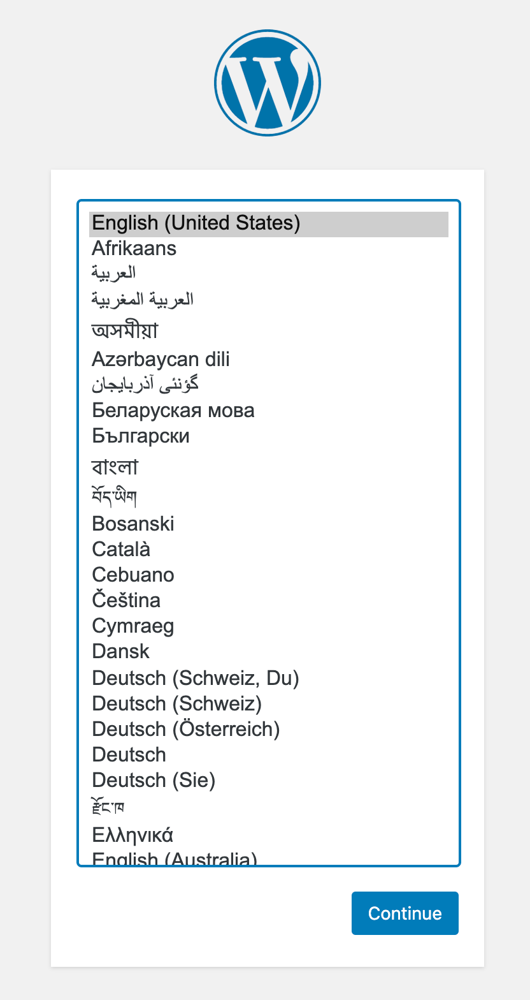

- SSL 인증서 갱신을 위한 `wordpress-redis/ssl_renew.sh` 생성
```bash{6}
#!/bin/bash

COMPOSE="/usr/local/bin/docker-compose --no-ansi"
DOCKER="/usr/bin/docker"

cd /home/shockz/wordpress-redis/
$COMPOSE run certbot renew --no-random-sleep-on-renew --dry-run && $COMPOSE kill -s SIGHUP webserver
$DOCKER system prune -af
```
```bash
$ chmod +x ssl_renew.sh
$ crontab -e
```
```bash
* * * * * /home/shockz/wordpress-redis/ssl_renew.sh >> /var/log/cron.log 2>&1
```
- cron 작업을 통해 재갱신 시도가 이뤄짐. log 확인
```bash
$ tail -f /var/log/cron.log
```

- 로그에서 재갱신 성공을 확인 후 crontab 을 수정하여 주기설정 (매일 12시 재갱신)
```bash
0 12 * * * /home/shockz/wordpress-redis/ssl_renew.sh >> /var/log/cron.log 2>&1
```

- `ssl_renew.sh` 는 다음과 같이 수정
```bash{6,7}
#!/bin/bash

COMPOSE="/usr/local/bin/docker-compose --no-ansi"
DOCKER="/usr/bin/docker"

cd /home/shockz/wordpress-redis/
$COMPOSE run certbot renew && $COMPOSE kill -s SIGHUP webserver
$DOCKER system prune -af
```

- crontab 을 통해 주기적으로 재갱신 작업이 이뤄지기 때문에 `docker-compose.yml` 의 certbot 서비스의 **--force-renewal** 은 필요치 않고 **docker-compose** 재기동 시 **renew** 하는 것으로 수정
```docker{10}
...
  certbot:
    depends_on:
      - webserver
    image: certbot/certbot
    container_name: certbot
    volumes:
      - ./certbot-etc:/etc/letsencrypt
      - ./wordpress:/var/www/html
    command: renew
...
```

### 9. 워드프레스 redis 캐시 설정

- W3 Total Cache 및 Autoptimizer 설치
   > W3 Total Cache 의 Minify 기능은 Autoptimizer 로 대체하여 사용 (W3 Total Cache minify 가 문제가 많다고 함)
::: warning
W3 Total Cache 메시지 중 웹서버 재시작 메시지 나오면 웹서버 재시작
```bash
$ docker-compose up -d --force-recreate --no-deps webserver
```
:::

- W3 Total Cache 의 Page Cache, Object Cache, Database Cache 활성화 및 redis 지정
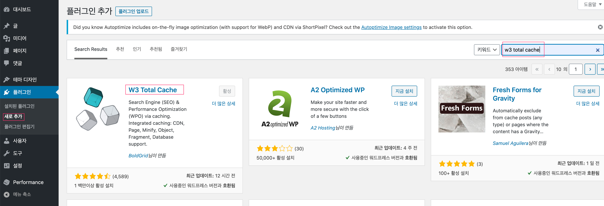
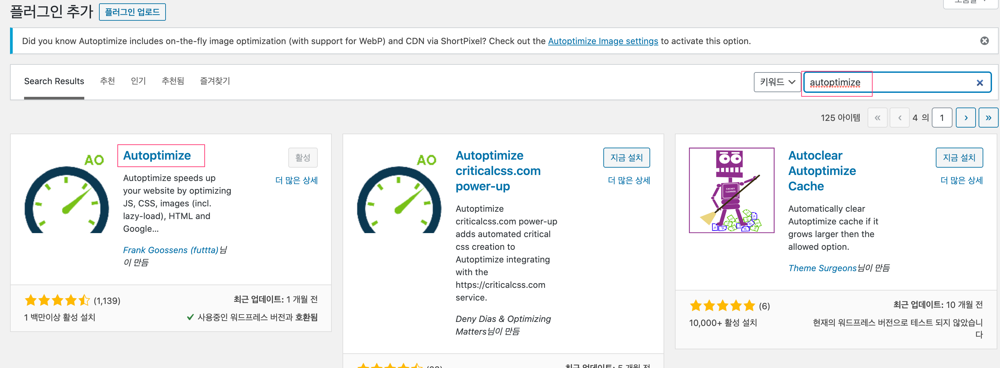
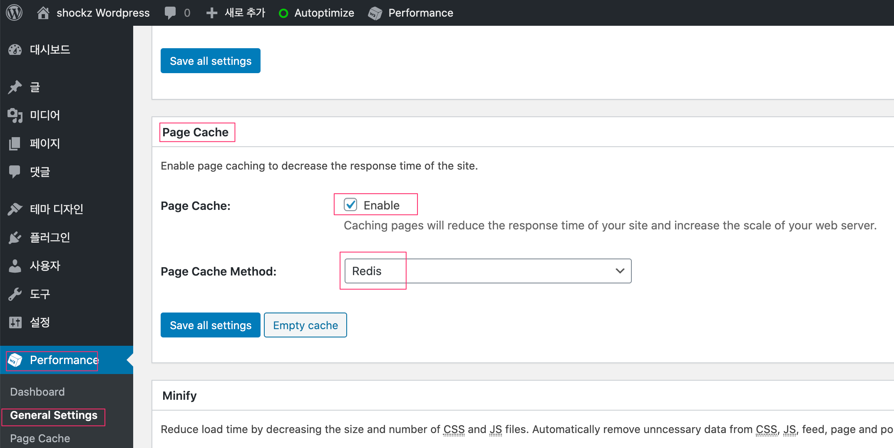
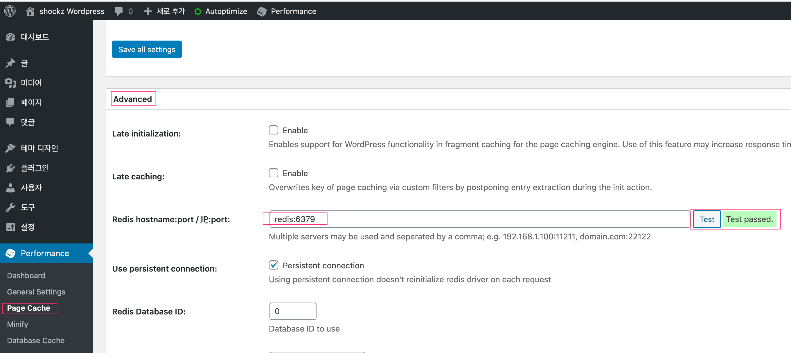
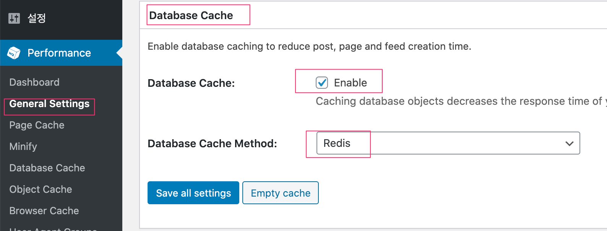
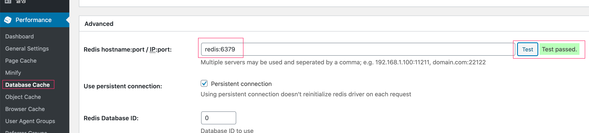
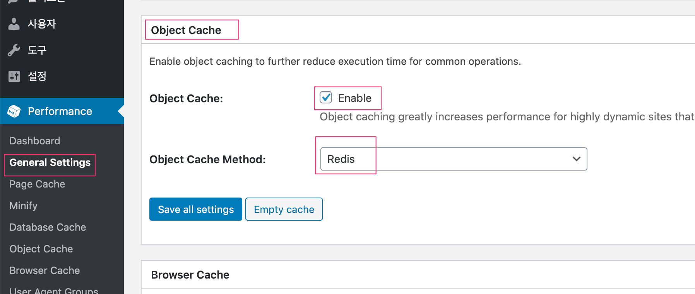
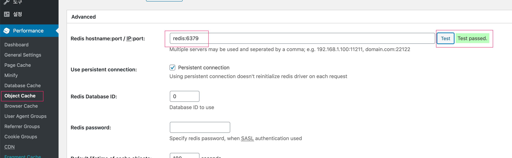

## wordpress 플러그인 개발용 설정 (macOS 기준)

- localhost 에 wordpress-redis 를 이용하여 플러그인 개발 환경 설정
- certbot 을 사용하지 않고 localhost 인증서 사용 (재갱신 X)

### 1. localhost 인증서 추출

- **키체인 접근** 실행 후 **localhost** 인증서 확인
   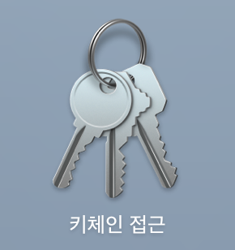  
   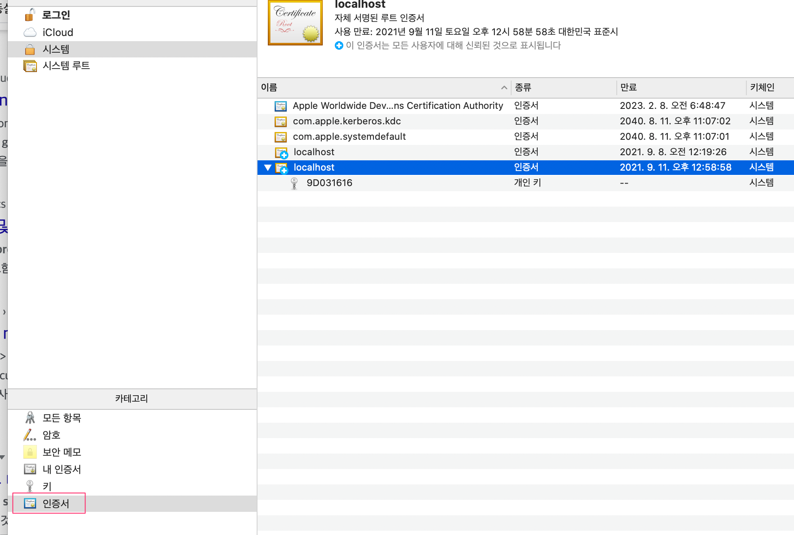

- p12 로 추출 후 PEM 변환
   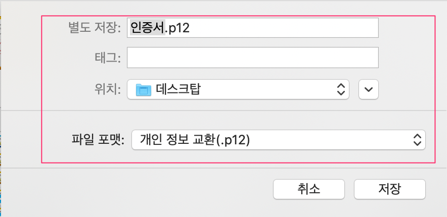
```bash
# 편의상 기존 디렉토리 이용
$ cd certbot-etc
$ openssl pkcs12 -in localhost.p12 -out localhost.crt.pem -clcerts -nokeys
$ openssl pkcs12 -in localhost.p12 -out localhost.key.pem -nocerts -nodes
```
::: tip
```bash
# certificate in localhost.crt.pem
$ openssl pkcs12 -in localhost.p12 -out localhost.crt.pem -clcerts -nokeys
# private key in localhost.key.pem
$ openssl pkcs12 -in localhost.p12 -out localhost.key.pem -nocerts -nodes
# certificate 와 private key 를 한 파일에 넣을 경우 (password 없이)
$ openssl pkcs12 -in localhost.p12 -out localhost.pem --nodes
# password 있는 상태로 추출은
$ openssl pkcs12 -in localhost.p12 -out localhost.pem
# command line 상에서 직접 입력할 경우
$ openssl pkcs12 -in localhost.p12 -out localhost.crt.pem -clcerts -nokeys -passin 'pass:p@ssw0rd'
```
:::

- `nginx.conf` 수정
```bash{5,20,29-31}
server {
        listen 80;
        listen [::]:80;

        server_name localhost;

        location ~ /.well-known/acme-challenge {
                allow all;
                root /var/www/html;
        }

        location / {
                rewrite ^ https://$host$request_uri? permanent;
        }
}

server {
        listen 443 ssl http2;
        listen [::]:443 ssl http2;
        server_name localhost;

        index index.php index.html index.htm;

        root /var/www/html;

        server_tokens off;
        client_max_body_size 100M;

        ssl_certificate /etc/letsencrypt/localhost/localhost.crt.pem;
        ssl_certificate_key /etc/letsencrypt/localhost/localhost.key.pem;
        #ssl_trusted_certificate /etc/letsencrypt/localhost/chain.pem;
        include /etc/nginx/conf.d/options-ssl-nginx.conf;
        ...
}
```

### 2. docker-compose.yml 수정

- `docker-compose.yml` 의 services 하위의 **certbot** 구간 삭제
- build & up
```bash
$ docker build -t wordpress-fpm-alpine-redis:1.0 .
$ docker-compose up -d
```
- `https://localhost` 접속 후 설정 마무리

::: tip
- 이미 80, 443 포트가 사용중이어서 `docker-compose up -d` 실패하는 경우, 아래의 사항들 확인 필요
```bash
# 80 포트 사용중인 프로세스 확인
$ lsof -i :80
# apache 가 기동 중일 경우
$ apachectl -k stop
# or brew service 로 등록되어 있는 경우
$ sudo brew services stop httpd
```
:::

## Tip

### plugin deactivate

[https://kinsta.com/knowledgebase/disable-wordpress-plugins/](https://kinsta.com/knowledgebase/disable-wordpress-plugins/)


### DB 상 패스워드 변경

```sql
-- admin id change
UPDATE wp_users 
SET user_pass = MD5('패스워드')
WHERE ID = 1
```

### 워드프레스 퍼미션 관련

- [php7.4-fpm-alpine official image](https://github.com/docker-library/wordpress/blob/master/php7.4/fpm-alpine/Dockerfile) 이미지를 사용중이므로, www-data 에 대한 공식 uid/gid 가 `82` 로 맞춰줘야 할 경우가 있으므로, 권한 문제 발생시 `chown -R 82:82 wordpress` 를 통해 퍼미션 문제 해결

### wp-admin bar customize

- wordpress 사이트를 개발용과 운영용으로 구분하면서 매번 주소 확인이 잘 안되서 실수하는 경우가 있다.
- 실수를 줄이기 위해서 시각적인 효과를 고민하다가 top banner 를 admin bar 에 적용할까 하다가 단순한 방법으로 적용한다.

```php
// 전역적으로 적용하기 위해 CSS 를 변경하기 위함
// Theme 에서 Additional CSS 로 적용하게 되면 front 쪽만 수정되고, back office 쪽은 적용이 안되므로, function.php 기능 추가 형태로 작업
// path: 사이트메인디렉토리/wp-includes/functions.php

function style_tool_bar() {
	echo '
		<style type="text/css">
			#wpadminbar {
				background: red;
			}
		</style>';
}

add_action( 'admin_head', 'style_tool_bar' );
add_action( 'wp_head', 'style_tool_bar' );
```
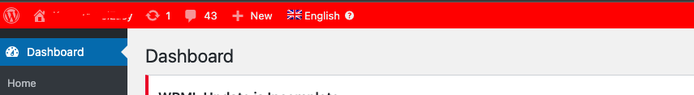
