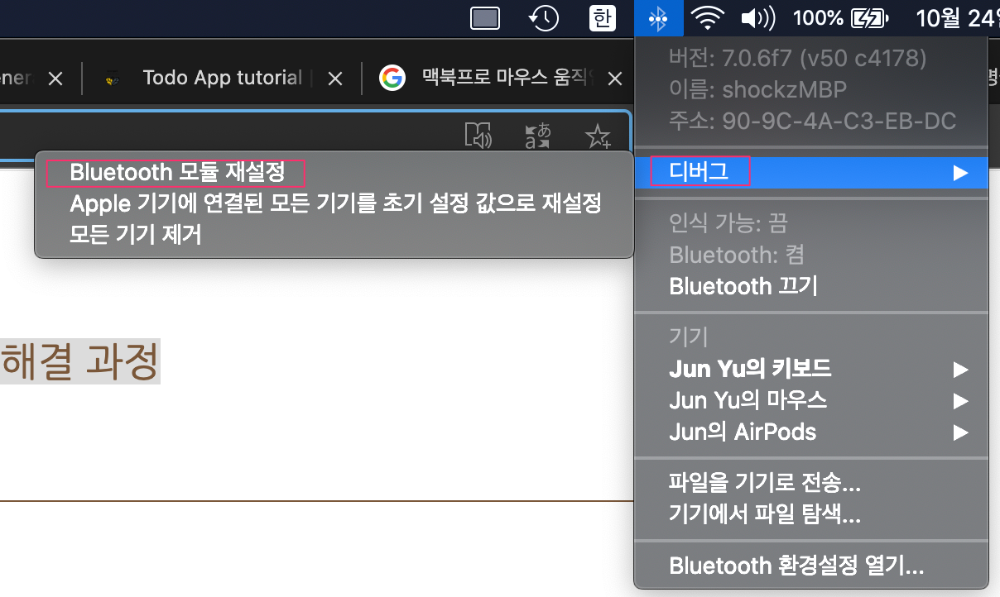
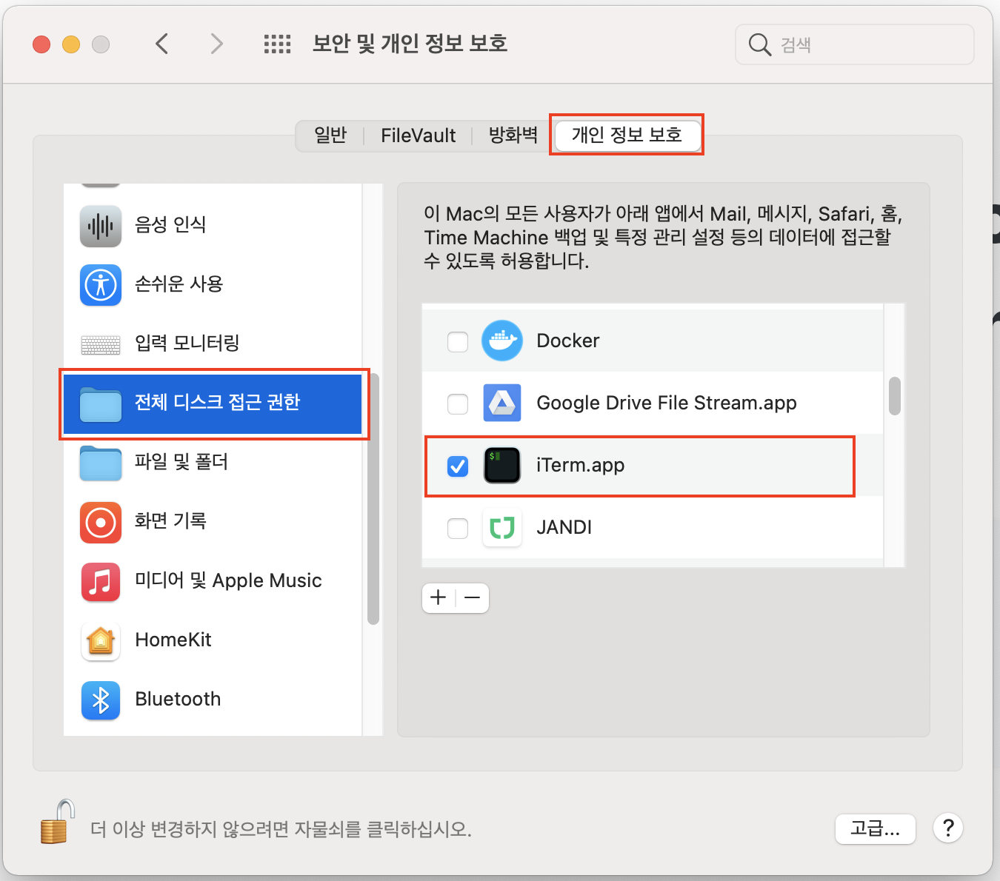
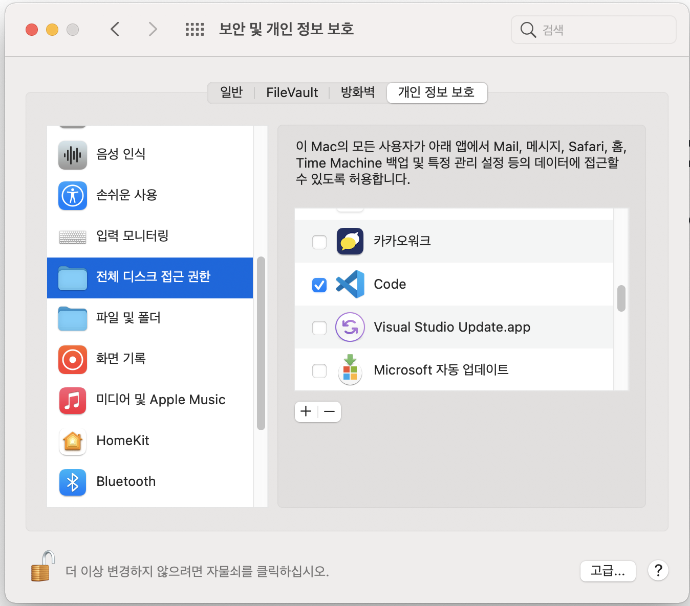
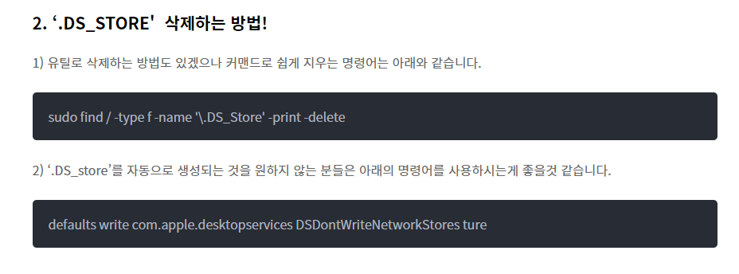

# mac 사용상 문제해결

<TagLinks />

[[toc]]

## 마우스 끊김/버벅임 현상 해결과정

- [맥 OS에서 일반 무선 마우스 끊김/버벅임 현상 해결 과정](https://korog.tistory.com/2)
- 나의 경우는 블루투스 초기화
  > \<Shift\> \+ \<Option\> 키 누른 상태로 `Bluetooth` 아이콘 클릭
  > 

## Operation Not Permitted

- vscode 로 python 작업 시, 스크립트 실행 중 `Operation Not Permitted` 에러가 계속 나올 경우
- Mac OSX 의 SIP (System Integrity Protection) 때문에 발생하는 문제라고 함.
- `보안 및 개인 정보 보호 탭 > 개인 정보 보호 > 전체 디스크 접근 권한`에서 Terminal, iTerm, vscode 등 필요한 앱에 권한 할당
  
  

## .DS_STORE 파일 삭제



## D2Coding Font install

- [https://github.com/naver/d2codingfont/releases](https://github.com/naver/d2codingfont/releases)
- Finder 적용

```bash
# D2Coding apply
$ defaults write com.apple.finder NSSystemFont -string D2Coding;killall Finder

# rollback
$ defaults delete com.apple.finder NSSystemFont;killall Finder
```
