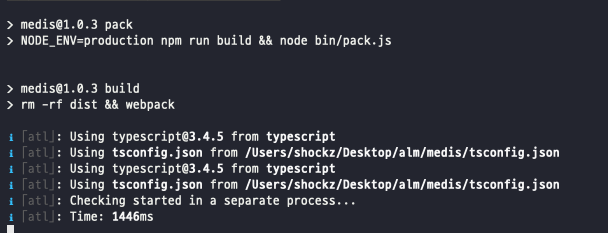
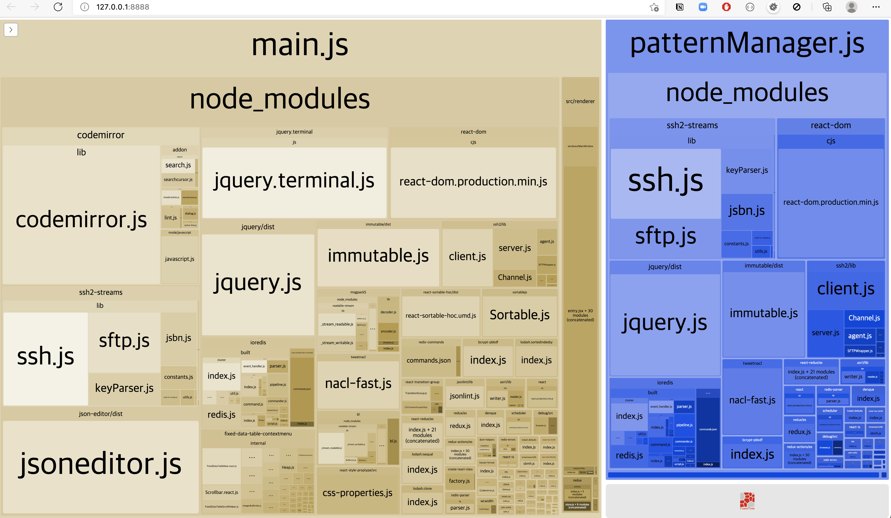
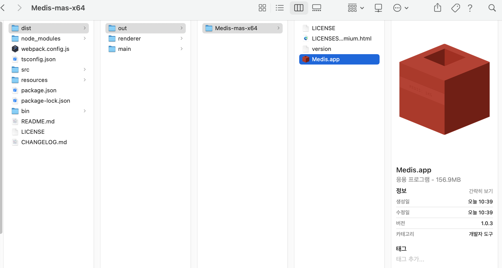
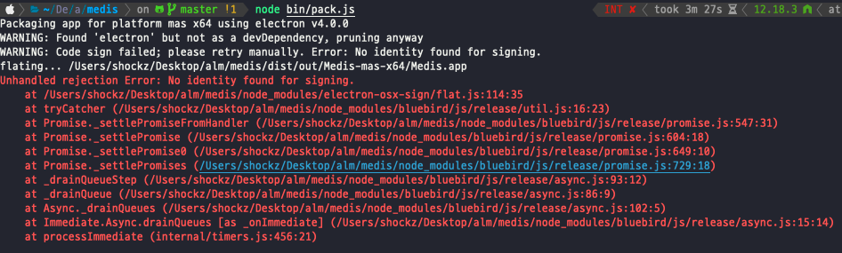

# Development tool install & configuration

<TagLinks />

[[toc]]

## Medis

> Redis client GUI (free)

> git: [https://github.com/luin/medis](https://github.com/luin/medis.git)

```bash
# git clone
$ git clone https://github.com/luin/medis.git
$ npm install
# compile assets
$ npm run pack
```

::: tip

- 컴파일 하게 되면 Webpack Bundle Analyzer 가 구동된다. (Ctrl-C 해서 구동 중단해도 상관없음)
  
  
  :::

```bash
# 실행 방법
$ npm start

# 패키징 해서 app 형태로 실행
$ node bin/pack.js
$ cd dist/out/Medis-mas-x64

# Medis.app 실행
```


::: tip

- `node bin/pack.js` 를 실행하게 되면 signing 관련 에러를 만나게 됨.
- 단독 사용이므로 무시해도 관계 없음
  
  :::
