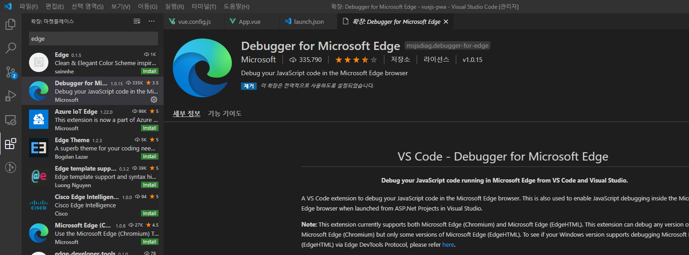
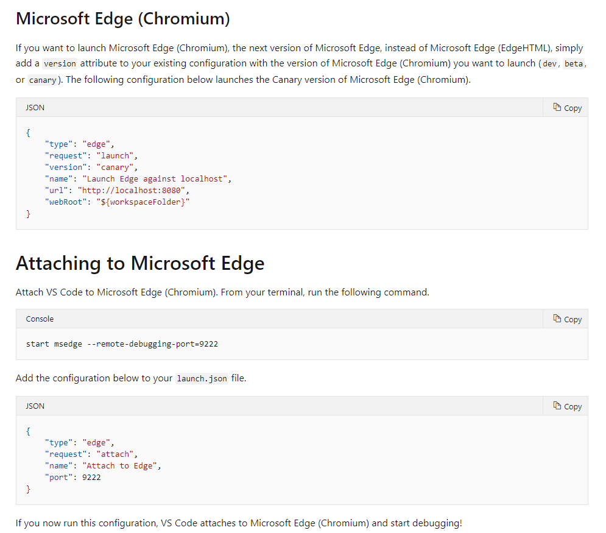

# Using edge debugger in vscode

<TagLinks />

[[toc]]

## setting

> Vue CLI 3 기준
> _vue.config.js_ 에 추가
> [Debugging in VS Code](https://kr.vuejs.org/v2/cookbook/debugging-in-vscode.html)

```javascript
module.exports = {
  configureWebpack: {
    devtool: 'source-map',
  },
};
```

> VSCode 에 확장 설치  
> 

> _{root}/.vscode/lanunch.json_ 에 설정  
>   
> 

```bash
$ yarn serve # http://localhost:8080
```

> vscode debugger 시작
