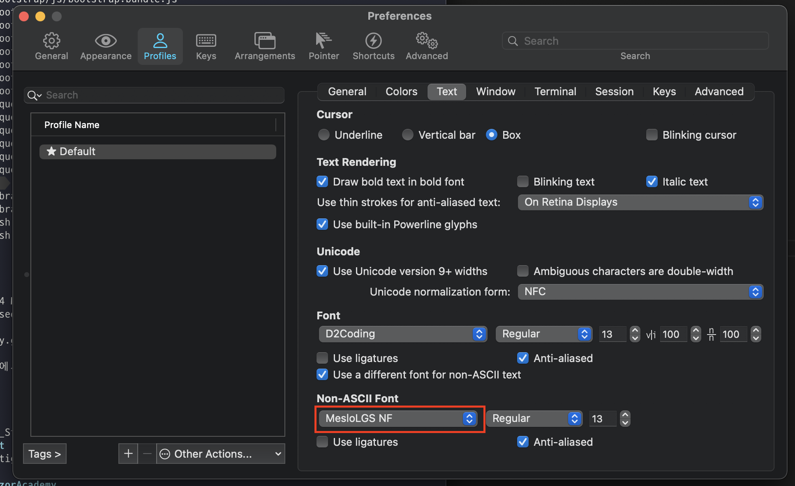
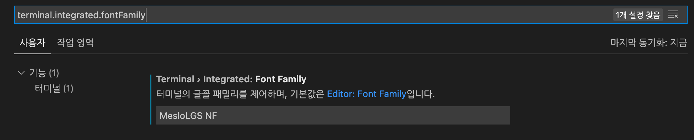

# VisualStudio Code

<TagLinks />

[[toc]]

## 열려있는 편집기 안보이게 처리

```json
"explorer.openEditors.visible": 0
```

## ssh 연결시 key 파일 지정

```
Host api.shockz.io
  HostName api.shockz.io
  User user
  IdentityFile ~/Desktop/AWS-keypair/dev.key.pem
```

## terminal 사용 시 아이콘 깨지는 현상 해결

- iTerm 등에서 사용하는 폰트가 VSCode 에 지정되어 있지 않아서 생기는 현상 - 현재 `MesloLGS NF` 사용중
  
- VSCode 설정에서 검색: `terminal.integrated.fontFamily`
  
