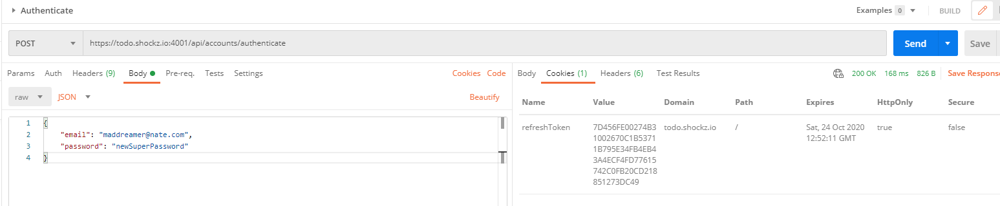

# Auth API tutorial

<TagLinks />

---

[[toc]]

---

[Github Repository](https://github.com/shockzinfinity/signup-verification-test)

## 기능 정의

- Email sign up and verification
- JWT authentication with refresh token
- Role based authorization (User, Admin)
- Forgot password and reset password
- Account management
- Swagger

## 필요 사항

- SMTP setting
- HTTP only cookie (prevent XSS)
- Refresh token rotation (prevent CSRF)
- Secret key for generating a JWT signing

## Postman 테스팅

### Register a new account

> 따로 role 명시되어 있지 않을 경우, 첫번째 등록된 이메일이 Admin 권한을 가짐.

```json
{
  "gender": "male",
  "firstName": "Jun",
  "lastName": "Yu",
  "email": "maddreamer@naver.com",
  "password": "my-super-secret-password",
  "confirmPassword": "my-super-secret-password",
  "acceptTerms": true
}
```


### Verify an account

> 이메일을 통해 확인한 토큰으로 이메일 인증

```json
{
  "token": "6F5ABE621398231BA103351806A6BEDA4D86E2CA9DB456B1B25096D040A2B907450647D82B5F6723"
}
```


### Access an account with forgotten password

> 비밀번호 재설정 메일 발송

```json
{
  "email": "maddreamer@nate.com"
}
```


### Reset the password of an account

```json
{
  "token": "FA858667CDA02501F5A975C38CC346A6EDEF7158DE4AD38A505544269CEA9DEBE47D67EB5C8783A0",
  "password": "newSuperPassword",
  "confirmPassword": "newSuperPassword"
}
```


### Authenticate to get a JWT token and a refresh token

```json
{
  "email": "maddreamer@nate.com",
  "password": "newSuperPassword"
}
```




### Get a list of all accounts (Admin)


### Update an account

```json
{
  "firstName": "Jun(nate)",
  "lastName": "Yu(nate)"
}
```


### Use a refresh token to get a new JWT token

> 발급받은 jwt token 을 이용해 refresh token 을 재발급 받을 수 있다.
>  > 

### Revoke a refresh token

> refresh token 취소하면서 refresh token 은 다시 http only cookie 로 다시 전달된다.

```json
{
  "token": "C90FAE4789BB4CFE1EEF6BFF1020AFDA0E52BB8FBE3F26850F3A6688CD1B8CA8388CA152762BE0F4"
}
```


### Delete an account


::: warning
현재는 테스트를 위해 Gmail smtp 를 사용하고 있으나 추후 smtp 에 대한 근본적인 해결책이 필요한 상황입니다.  
현재의 Tutorial 은 docker 컨테이너를 통해 nginx reverse proxy 에 api 가 구동되는 구조인데, Mailkit smtp client 상에서 ssl handshake 문제가 발생하고 있습니다.  
임시적으로 해결하기 위해 Gmail smtp 의 보안수준을 낮추고, `EmailService` 에서 ssl handshake 관련 예외를 회피하도록 구성되어 있습니다.  


```csharp{6-7}
public void Send(string to, string subject, string html, string from = null)
{
  ...
  using (var smtp = new SmtpClient())
  {
    smtp.CheckCertificateRevocation = false;
    smtp.ServerCertificateValidationCallback = (s, c, h, e) => true;
    smtp.Connect(_appSettings.SmtpHost, _appSettings.SmtpPort, SecureSocketOptions.Auto);
    smtp.Authenticate(_appSettings.SmtpUser, _appSettings.SmtpPassword);
    smtp.Send(email);
    smtp.Disconnect(true);
  }
}
```

:::
