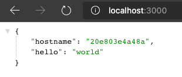
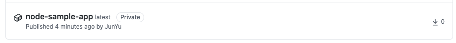
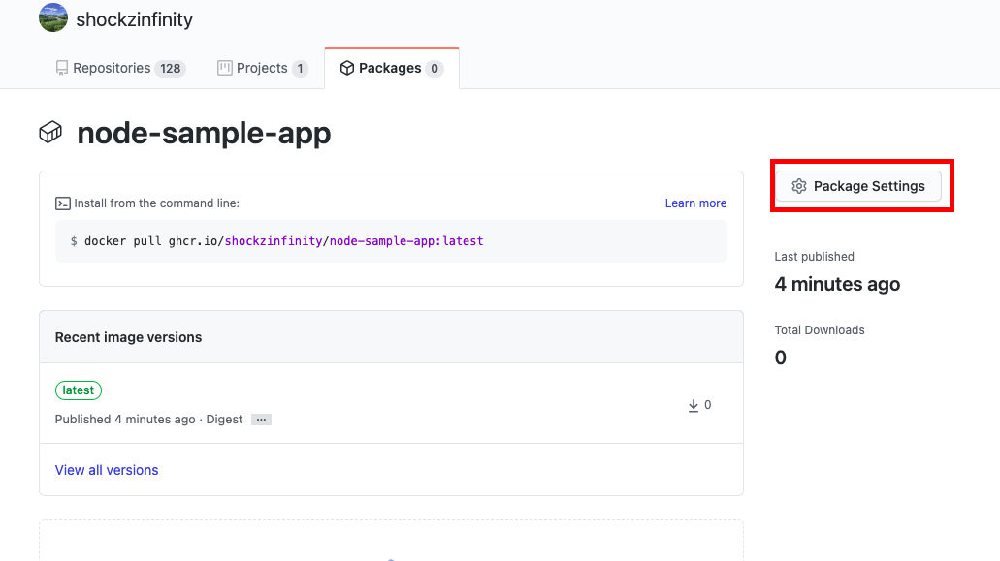
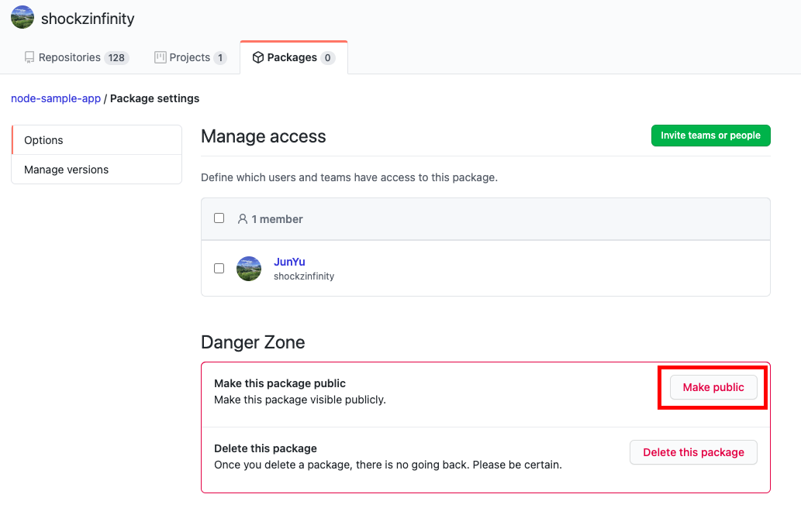

# node.js sample app for test

<TagLinks />

---

[[toc]]

## Steps

- [fastify.io](https://fastify.io) 를 이용한 sample app

```bash
$ mkdir node-sample-app
$ yarn init -y
$ yarn add fastify
$ curl -sLf -o .gitignore https://raw.githubusercontent.com/github/gitignore/master/Node.gitignore # gitignore 받기, .DS_Store 제외 추가
$ git init
$ touch app.js
```

- `app.js` 파일 내용 편집 (fastify.io quick start 참조)

```js
const os = require('os');

// Require the framework and instantiate it
const fastify = require('fastify')({ logger: true });

// Declare a route
fastify.get('/', async (request, reply) => {
  return { hostname: os.hostname(), hello: 'world' };
});

// Run the server!
const start = async () => {
  try {
    await fastify.listen(3000, '0.0.0.0');
    fastify.log.info(`server listening on ${fastify.server.address().port}`);
  } catch (err) {
    fastify.log.error(err);
    process.exit(1);
  }
};
start();
```

- 접속 테스트 (http://localhost:3000 접속)

```bash
$ node app.js
```

- Dockerfile 생성

```dockerfile
FROM node:12-alpine

COPY ./package* /app/
WORKDIR /app
RUN npm install

COPY . /app
EXPOSE 3000
CMD node app.js
```

- `.dockerignore` 추가

```bash
node_modules
```

- 이미지 빌드

```bash
$ docker build -t sample .
$ docker run -p 3000:3000 sample
```



- ghcr.io 에 업로드
  ::: tip
- 사전에 토큰 및 로그인이 되어 있어야 함. (참조: [GitHub 로그인](https://shockzinfinity.github.io/dev-log/github.html#github-container-registry-%E1%84%8B%E1%85%A6-%E1%84%8B%E1%85%A5%E1%86%B8%E1%84%85%E1%85%A9%E1%84%83%E1%85%B3-%E1%84%92%E1%85%A1%E1%84%80%E1%85%B5-%E1%84%8B%E1%85%B1%E1%84%92%E1%85%A1%E1%86%AB-%E1%84%8C%E1%85%AE%E1%86%AB%E1%84%87%E1%85%B5))
  :::

```bash
# tagging
$ docker tag sample ghcr.io/shockzinfinity/node-sample-app:latest
# push
$ docker push ghcr.io/shockzinfinity/node-sample-app:latest
```

- 추후 사용시 다운로드 받아서 사용 (단, 해당 이미지가 private 로 되어 있을 경우는 github 로그인 혹은 토큰이 있을 경우에만 사용이 가능합니다.)
- public 으로의 설정은 해당 이미지의 repository 에서 설정 가능
  
  
  
